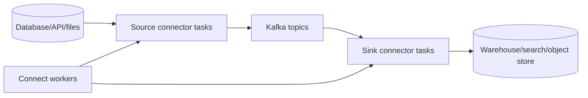

# Kafka Connect Overview

Kafka Connect is a runtime and API for moving data between Kafka and external
systems using reusable connectors. It removes repeated plumbing for offsets,
parallel tasks, configuration, lifecycle, and common data conversion.



It is suitable for integration data movement. Domain validation, orchestration,
stateful multi-topic joins, and complex business side effects usually belong in an
application or Kafka Streams topology.

## Worker, Connector, And Task

| Component | Responsibility |
|---|---|
| worker | runs the Connect runtime and REST API |
| connector | owns configuration and divides work |
| task | performs a unit of source or sink data movement |
| plugin | connector/converter/transform implementation loaded by workers |

Increasing `tasks.max` is only a requested upper bound. Actual parallelism depends
on connector implementation, source shards/tables, destination partitions, Kafka
partitions, and external-system limits.

## Source And Sink

Source connector flow:

```text
external position -> poll source -> SourceRecord -> converter -> Kafka record
                         `-> source offset persisted by Connect
```

Sink connector flow:

```text
Kafka partitions -> SinkRecord batch -> external write -> consumer offset commit
```

Connect usually provides at-least-once delivery. Recovery around a lost
acknowledgment or failed offset commit can repeat data. The destination needs
idempotent upsert/keys, deduplication, or connector-specific exactly-once support
where formally documented.

## Standalone Versus Distributed Mode

| Standalone | Distributed |
|---|---|
| one worker process | worker group coordinates connectors/tasks |
| local config/offset files | compacted internal Kafka topics |
| local development and simple testing | normal production choice |
| no worker failover | task reassignment and REST-managed configs |

Distributed mode uses internal topics for connector configurations, source
offsets, and status. Protect them with replication, compaction, ACLs, monitoring,
and stable naming. Losing them can lose management state or force unsafe re-reads.

## Converters Are Not Serializers

Converters translate between Connect's structured data model (`Schema` plus value)
and Kafka bytes. Serializers/deserializers are Kafka client APIs used by ordinary
producers and consumers.

Common converter choices include JSON, Avro, Protobuf, and JSON Schema. The
converter and Schema Registry compatibility policy must match downstream contract
expectations. A schema-less JSON converter is convenient but weakens governance.

## Single Message Transforms

SMTs make small, stateless, per-record changes such as:

- rename or remove fields;
- add static metadata;
- route topics from a field or table name;
- extract a nested field;
- mask a value where the transform is designed for it.

Do not build a long hidden business pipeline from SMTs. They are difficult to test,
observe, version, and reuse for stateful or multi-record logic.

## Connector Configuration

Representative distributed-mode REST request:

```json
{
  "name": "orders-jdbc-sink",
  "config": {
    "connector.class": "example.JdbcSinkConnector",
    "topics": "orders.projection",
    "tasks.max": "4",
    "key.converter": "org.apache.kafka.connect.storage.StringConverter",
    "value.converter": "example.JsonSchemaConverter",
    "errors.tolerance": "none"
  }
}
```

Actual properties are plugin-specific. Pin the connector version, review its
license and compatibility, and keep secrets outside version-controlled JSON.

## REST Lifecycle

Use the Connect REST API to create/update configurations, inspect connector and task
status, pause/resume, restart failed components, and delete connectors. Production
automation should be declarative and idempotent; avoid hand-edited connector state
that cannot be reproduced.

## Connect Versus Alternatives

| Requirement | Better starting point |
|---|---|
| standard database CDC | Connect/Debezium |
| bulk sink to supported warehouse | Connect sink |
| complex domain rule and database transaction | application consumer |
| multi-topic windowed join | Kafka Streams |
| one-off finite migration | batch tool may be simpler |
| unsupported proprietary protocol with rich logic | custom application or carefully built connector |

## Interview Questions

**Worker versus connector versus task?** Workers host the runtime, a connector owns
configuration and work division, and tasks execute parallel data movement.

**Why can `tasks.max=20` still run one task?** The connector/source may expose only
one work unit or the implementation may not support that parallelism.

**Converter versus serializer?** A converter maps Connect data and schema to bytes;
a serializer is a Kafka producer API abstraction.

**Where are offsets kept?** Distributed workers persist Connect offset state in an
internal Kafka topic; source connectors also map positions from the external system.

**When should Connect be avoided?** When data movement is inseparable from complex
business transactions or stateful processing.

## Revision Checkpoint

Draw source and sink flows including the external position, Connect offset, Kafka
offset, task, converter, and failure windows. Explain which component owns each.

## Official References

- [Kafka Connect documentation](https://kafka.apache.org/documentation/#connect)
- [Kafka Connect user guide](https://kafka.apache.org/documentation/#connect_user)
- [Kafka Connect configuration](https://kafka.apache.org/documentation/#connectconfigs)

## Recommended Next

Continue with [Kafka Connect CDC And Production](./KAFKA-CONNECT-CDC-PRODUCTION.md).

