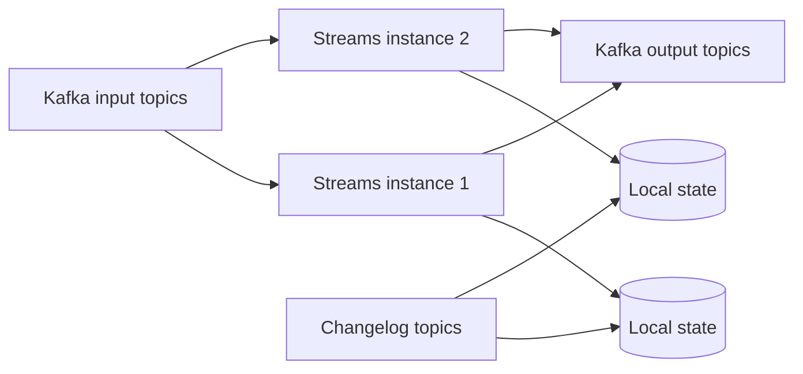

# Kafka Streams Overview

Kafka Streams is a Java library for building applications that continuously read
Kafka records, transform or aggregate them, and usually write results back to
Kafka. It runs inside the application process; it is not a separate processing
cluster that you submit jobs to.



## When To Use It

Use Kafka Streams for continuous Kafka-to-Kafka computation:

- filtering, mapping, branching, and enrichment;
- grouping and aggregation;
- stream-stream and stream-table joins;
- time windows and late-event handling;
- materialized state and interactive queries;
- event-driven projections whose source and durable output are Kafka.

Use an ordinary Spring Cloud Stream/Spring Kafka consumer when the main job is a
business side effect such as charging a payment or updating a relational database.
Use Kafka Connect when the main job is standardized movement between Kafka and an
external system.

## The Three Main Data Models

| Model | Meaning | Example |
|---|---|---|
| `KStream<K,V>` | every record is an event | every order status change |
| `KTable<K,V>` | latest value for each key | current customer profile |
| `GlobalKTable<K,V>` | full table copied to every instance | small country-code reference |

A `KTable` update replaces the current value for a key in the table view, though
the source topic still follows its configured retention/compaction behavior.
`GlobalKTable` avoids co-partitioning for lookup joins but multiplies storage and
restore traffic by application instance, so it suits bounded reference data.

## First Topology

```java
@Bean
KStream<String, OrderCreated> highValueOrders(StreamsBuilder builder) {
    KStream<String, OrderCreated> orders = builder.stream(
            "orders.created",
            Consumed.with(Serdes.String(), orderSerde()));

    orders.filter((orderId, order) ->
                    order.total().compareTo(new BigDecimal("10000")) >= 0)
            .mapValues(this::toHighValueOrder)
            .to("orders.high-value",
                    Produced.with(Serdes.String(), highValueOrderSerde()));

    return orders;
}
```

Essential configuration:

```properties
application.id=order-risk-topology-v1
bootstrap.servers=kafka-1:9092,kafka-2:9092
```

`application.id` names the logical Streams application. Instances with the same ID
cooperate and divide input partitions. Changing it creates new consumer groups,
internal topic names, and state identity; treat it as a migration, not a cosmetic
rename.

## Topology And Tasks

A topology is the directed graph of sources, processors, state stores, and sinks.
Kafka Streams divides it into tasks based primarily on input partitions. Instances
and stream threads execute those tasks. Scaling beyond available tasks does not add
active processing capacity.

```text
topology -> sub-topologies -> tasks -> stream threads -> application instances
```

Inspect `Topology#describe()` during review. It reveals generated processors,
stores, changelog topics, and repartition boundaries that may not be obvious from
fluent DSL code.

## Keys Are Architecture

Grouping and joining operate by key. A key-changing operation may require data to
be repartitioned so all records for the new key reach the same task.

```java
orders.selectKey((orderId, order) -> order.customerId())
      .groupByKey()
      .count(Materialized.as("orders-by-customer"));
```

That repartition costs network, broker storage, latency, and recovery time. Define
the business key early and inspect generated internal topics.

## Serdes

A Serde combines serializer and deserializer behavior. Configure defaults only for
types truly shared across the topology; otherwise specify Serdes at source,
group/join, and sink boundaries. Schema compatibility and null/tombstone behavior
must be tested across rolling deployments.

## Stateless Versus Stateful

| Stateless | Stateful |
|---|---|
| `filter`, `map`, `mapValues`, branch | aggregate, count, reduce, join, window |
| record processed independently | result depends on previous records |
| no durable local store required | local store plus changelog commonly required |
| recovery is simpler | state restoration determines recovery time |

## Spring Cloud Stream Kafka Streams Binder

The binder can connect functional beans using `KStream`, `KTable`, or
`GlobalKTable` parameters to destinations and manage Spring integration around the
topology. Native Kafka Streams concepts still control state, repartitioning,
windows, processing guarantees, and restoration.

Choose the binder when its binding conventions and configuration model help the
team. Choose direct Spring Kafka/Kafka Streams configuration when topology-level
control and native APIs are clearer.

## Interview Questions

**Is Kafka Streams a server?** No. It is a library embedded in each application
instance; Kafka coordinates input partitions and stores durable topics.

**KStream versus KTable?** A stream models every event; a table models the latest
value by key and emits change updates.

**Why did a repartition topic appear?** A key-changing operation followed by a
key-based aggregation or join required records to be redistributed by the new key.

**What caps parallelism?** The number of executable tasks derived from source
partitions, plus available stream threads and instances.

**When should Kafka Streams not be used?** When the primary action is an external
side effect or simple source/sink movement and its stateful topology model adds no
value.

## Revision Checkpoint

Draw a topology with source, key change, repartition, aggregation store, changelog,
and output. Explain which data lives locally, which data is durable in Kafka, and
what happens when an instance dies.

## Official References

- [Kafka Streams documentation](https://kafka.apache.org/documentation/streams/)
- [Kafka Streams core concepts](https://kafka.apache.org/documentation/streams/core-concepts/)
- [Spring Cloud Stream Kafka Streams binder](https://docs.spring.io/spring-cloud-stream/reference/kafka/kafka-streams-binder/index.html)

## Recommended Next

Continue with [Stateful Processing And Production Operations](./KAFKA-STREAMS-STATEFUL-PRODUCTION.md).

