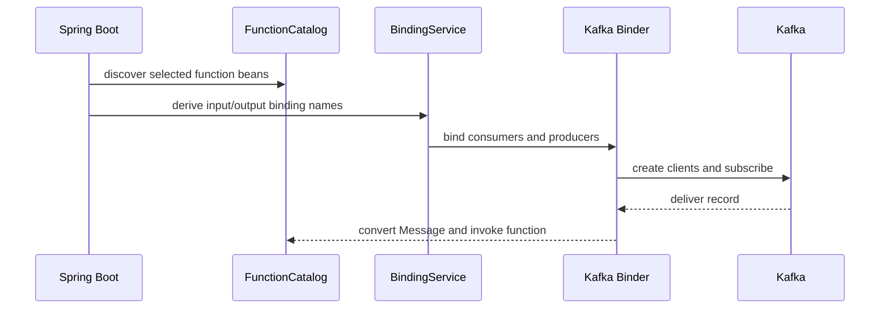

# Spring Cloud Stream Functions Bindings And Internals

Use the Spring Cloud release train compatible with the project's Spring Boot
version. Let dependency management select coordinated versions instead of pinning
Spring Cloud Stream and binder artifacts independently.

```xml
<dependency>
  <groupId>org.springframework.cloud</groupId>
  <artifactId>spring-cloud-stream-binder-kafka</artifactId>
</dependency>
```

## A Complete Function

```java
public record OrderCreated(
        UUID eventId,
        UUID orderId,
        BigDecimal total,
        Instant occurredAt,
        int schemaVersion) {}

public record PaymentRequested(UUID orderId, BigDecimal amount) {}

@Bean
Function<Message<OrderCreated>, Message<PaymentRequested>> requestPayment() {
    return input -> MessageBuilder
            .withPayload(new PaymentRequested(
                    input.getPayload().orderId(),
                    input.getPayload().total()))
            .setHeader("correlationId",
                    input.getHeaders().get("correlationId"))
            .build();
}
```

```yaml
spring:
  cloud:
    function:
      definition: requestPayment
    stream:
      bindings:
        requestPayment-in-0:
          destination: orders.created
          group: payment-workflow
          content-type: application/json
        requestPayment-out-0:
          destination: payments.requested
          content-type: application/json
```

Use `Message<T>` at the messaging adapter when headers matter. Pass a plain domain
object and explicit metadata into the application service so the domain layer does
not depend on messaging infrastructure.

## Function Selection And Composition

Bind independent functions with semicolons:

```yaml
spring.cloud.function.definition: reserveInventory;notifyCustomer
```

Compose compatible functions with a pipe:

```yaml
spring.cloud.function.definition: validate|enrich|route
```

Composition exposes the pipeline's first input and final output. It is useful for
small pure transformations; opaque chains of side effects are harder to recover,
observe, and own.

## Imperative Publishing With StreamBridge

```java
@Component
class OrderEventPublisher {
    private final StreamBridge streamBridge;

    OrderEventPublisher(StreamBridge streamBridge) {
        this.streamBridge = streamBridge;
    }

    boolean publish(OrderCreated event, String correlationId) {
        Message<OrderCreated> message = MessageBuilder.withPayload(event)
                .setHeader("eventType", "OrderCreated")
                .setHeader("schemaVersion", event.schemaVersion())
                .setHeader("correlationId", correlationId)
                .build();
        return streamBridge.send("orders-out-0", message);
    }
}
```

```yaml
spring.cloud.stream.output-bindings: orders-out-0
spring.cloud.stream.bindings.orders-out-0.destination: orders.created
```

`StreamBridge` can create a dynamic binding on first use. Predeclare stable
production bindings so startup validation, provisioning, health, and governance do
not depend on the first request. The boolean indicates whether the messaging send
path accepted the message; it is not proof that a database change and Kafka write
formed one atomic business transaction.

## Configuration Ownership

| Layer | Example | Owner |
|---|---|---|
| common binding | `bindings.<name>.destination` | Spring Cloud Stream |
| common consumer | `bindings.<name>.consumer.concurrency` | Spring Cloud Stream |
| Kafka extended binding | `kafka.bindings.<name>.consumer.enable-dlq` | Kafka binder |
| native client | `...consumer.configuration.max.poll.records` | Kafka consumer client |
| Boot Kafka | `spring.kafka.*` | Spring Boot / selected binder integrations |

Do not place `bootstrap.servers` inside an extended binding's `configuration` map.
Configure broker connections at binder scope or use explicit multi-binder
configuration for multiple clusters.

## Message Conversion And Native Encoding

The default framework path is conceptually:

```text
Kafka bytes -> binder message -> content-type conversion -> function argument
```

With native decoding, Kafka deserializers create the value before normal framework
conversion. Choose one clear contract and test malformed input because a native
deserialization failure happens at a different point from a function exception.

Schema-governed Avro, Protobuf, or JSON Schema is usually preferable for contracts
shared by many teams. JSON class-name type headers couple consumers to producer
implementation names unless mapped deliberately.

Useful headers include event ID, event type, schema version, correlation ID,
causation ID, tenant ID, trace context, and content type. Never put secrets or
unbounded data in headers.

## Startup And Runtime Internals



The important components are Spring Cloud Function's catalog and invocation
wrapper, Spring Cloud Stream's binding service and conversion infrastructure, the
binder SPI, Spring Kafka listener containers, and Kafka clients.

## Multiple Binders

One application can assign bindings to different binder configurations. Use that
capability only when one deployment genuinely owns the cross-broker flow. It
increases credential, health, deployment, retry, testing, and outage combinations.
Broker portability is also limited when code depends on Kafka keys, offsets,
transactions, tombstones, or native headers.

## Testing Strategy

1. Unit-test pure functions by invoking them directly.
2. Use the test binder for binding and routing tests without a broker.
3. Use Testcontainers Kafka for serialization, partitions, offsets, retry, and DLT.
4. Add contract tests against supported old and new schemas.
5. Run failure tests for duplicate delivery and shutdown during processing.

## Interview Questions

**What happens when `StreamBridge.send()` is called?** The bridge resolves or
creates the output binding, applies message conversion and partitioning, and sends
through the selected binder. Broker acknowledgment semantics still depend on the
underlying producer configuration.

**What does `requestPayment-in-0` mean?** Function bean, input direction, first
input. It is a binding name, not the topic name.

**Why use `spring.cloud.function.definition` with one function?** It makes binding
intent explicit and prevents an unrelated functional bean from being auto-bound.

**Does multiple-binder support make the application portable?** It reduces API
coupling, but broker-specific semantics and operations still require explicit
design.

## Official References

- [Producing and consuming messages](https://docs.spring.io/spring-cloud-stream/reference/spring-cloud-stream/producing-and-consuming-messages.html)
- [Binder abstraction](https://docs.spring.io/spring-cloud-stream/reference/spring-cloud-stream/binder_abstract.html)
- [Content type negotiation](https://docs.spring.io/spring-cloud-stream/reference/spring-cloud-stream/content-type-management.html)

## Recommended Next

Continue with [Kafka Binder Production Engineering](./SPRING-CLOUD-STREAM-KAFKA-PRODUCTION.md).

