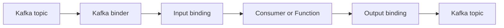

# Spring Cloud Stream Overview

Spring Cloud Stream connects Spring application functions to messaging systems.
Your business code can use Java's `Supplier`, `Function`, and `Consumer`; a
**binder** supplies the broker-specific integration.



It is not a broker and it does not remove Kafka's distributed-system rules. It
reduces direct broker API usage in application code while still exposing
broker-specific configuration when production behavior requires it.

## Start With The Problem

An order service can call inventory, notification, fraud, and analytics directly.
That creates runtime coupling: all services may need to be available while the
customer waits. An event allows independently deployed consumers to react later.

```text
Order service -> orders.created topic
                           |-> inventory group
                           |-> notification group
                           `-> analytics group
```

Messaging improves buffering, fan-out, and independent scaling, but introduces
eventual consistency, duplicates, schema evolution, ordering rules, lag, and
recovery work. Use it when those trade-offs are justified.

## Core Vocabulary

| Term | Meaning |
|---|---|
| message | payload plus headers |
| producer | code that sends a message |
| consumer | code that processes a message |
| destination | broker-side topic or queue |
| binding | application-side connection to a destination |
| binder | broker-specific implementation of the binding contract |
| group | one logical durable subscription whose instances share work |

This configuration makes the distinction concrete:

```yaml
spring:
  cloud:
    function:
      definition: reserveInventory
    stream:
      bindings:
        reserveInventory-in-0:
          destination: orders.created
          group: inventory-service
```

- `reserveInventory` is the function bean.
- `reserveInventory-in-0` is its first input binding.
- `orders.created` is the Kafka topic.
- `inventory-service` is the logical consumer group.

Different responsibilities need different groups. Instances of the same
responsibility use the same group and divide partitions among themselves.

## Supplier, Function, Consumer

```java
@Bean
Consumer<OrderCreated> reserveInventory(InventoryService service) {
    return service::reserve;
}

@Bean
Function<OrderCreated, PaymentRequested> requestPayment() {
    return order -> new PaymentRequested(order.orderId(), order.total());
}

@Bean
Supplier<Heartbeat> heartbeat() {
    return () -> new Heartbeat(Instant.now());
}
```

| Type | Input | Output | Best fit |
|---|---:|---:|---|
| `Consumer<T>` | yes | no | terminal side effect |
| `Function<T,R>` | yes | yes | transform and publish |
| `Supplier<T>` | no | yes | framework-triggered source or poller |

For an HTTP-triggered or domain-triggered send, use `StreamBridge` rather than a
supplier that the framework polls.

## Command Versus Event

- A command expresses intent: `ReserveInventory`.
- An event records a fact: `InventoryReserved`.

Commands usually have one intended handler and may be rejected. Events can have
many interested consumers and should be immutable. Naming something
`CreateOrderEvent` hides whether it is a request or a fact.

## Spring Cloud Stream Versus Spring Kafka

| Prefer Spring Cloud Stream when | Prefer Spring Kafka when |
|---|---|
| functional bindings fit the service | Kafka-specific APIs are part of the design |
| consistent binding conventions help teams | listener-container control dominates |
| broker abstraction has real value | custom seek, recovery, or acknowledgment logic is central |
| functions and message conversion keep adapters small | abstraction would hide important behavior |

Neither is universally better. Spring Cloud Stream's Kafka binder uses Spring
Kafka underneath, so Kafka partitions, offset commits, rebalances, and client
configuration still determine runtime behavior.

## Beginner Interview Questions

**What problem does Spring Cloud Stream solve?** It binds application functions to
messaging middleware and supplies common configuration, conversion, routing, and
error-handling integration.

**Is a binding a topic?** No. A binding is the application connection; its
destination maps to the topic.

**Why must inventory and notification use different groups?** Different groups
each receive the event. Sharing one group would make them competing instances of
one logical responsibility.

**Does it guarantee exactly once?** No. Correctness depends on Kafka settings,
offset commits, application side effects, transactions, and idempotency.

## Revision Checkpoint

Before continuing, explain aloud:

- the path from Kafka record to Java function;
- binding versus destination versus binder;
- why partitions cap active consumers in a group;
- `Supplier` versus `StreamBridge`;
- what abstraction Spring Cloud Stream provides and what it cannot hide.

## Official References

- [Spring Cloud Stream introduction](https://docs.spring.io/spring-cloud-stream/reference/spring-cloud-stream.html)
- [Producing and consuming messages](https://docs.spring.io/spring-cloud-stream/reference/spring-cloud-stream/producing-and-consuming-messages.html)
- [Functional binding names](https://docs.spring.io/spring-cloud-stream/reference/spring-cloud-stream/functional-binding-names.html)

## Recommended Next

Continue with [Functions, Bindings, And Runtime Internals](./SPRING-CLOUD-STREAM-FUNCTIONS-BINDINGS.md).

