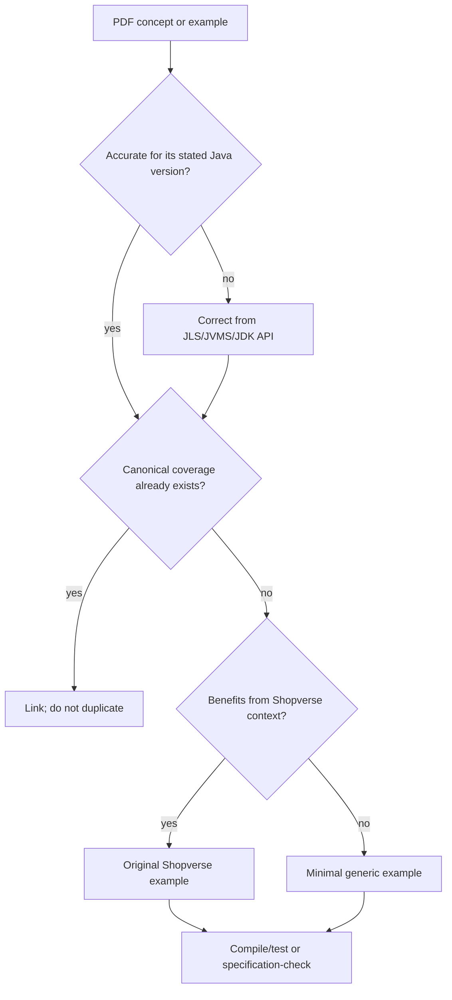

# Core Java Source Coverage And Adaptation Ledger

This ledger records the one-time completeness review of the 22 chapter PDFs in
`RamanaGR/Durga-Sir-Core-Java-Materials-Chapter-Wise`. The PDFs are educational
inputs, not normative specifications. Examples are rewritten around Shopverse or
replaced by smaller verified examples; repetitive syntax drills are represented by a
canonical example and rule instead of being copied many times.

## Adaptation Policy

Source page numbers and original snippets remain in the temporary audit workspace;
the durable ledger tracks learning objectives and canonical destinations rather than
reproducing the PDFs.

## Chapter Coverage

| # | Source chapter | Canonical documentation | Example disposition and modernization |
|---:|---|---|---|
| 1 | Language Fundamentals | [Fundamentals](./JAVA-FUNDAMENTALS.md), [Language Semantics](./JAVA-LANGUAGE-SEMANTICS.md) | identifiers, arrays, literals, `main`, imports, and promotions consolidated into typed Shopverse examples; obsolete launch assumptions omitted |
| 2 | Operators And Assignments | [Operators And Control Flow](./JAVA-OPERATORS-CONTROL-FLOW.md) | promotion, increment, concatenation, equality, type tests, short-circuiting, casts, assignment, precedence, and evaluation order rewritten and safety-labeled |
| 3 | Flow Control | [Operators And Control Flow](./JAVA-OPERATORS-CONTROL-FLOW.md), [Modern Switch](./features-8-to-26/JAVA-SWITCH.md) | selection, loops, transfer, reachability, iterable/iterator, and fall-through represented without repetitive compile-error drills |
| 4 | Declarations And Access Modifiers | [OOP](./JAVA-OOP.md), [Language/OOP Internals](./JAVA-LANGUAGE-OOP-INTERNALS.md), [Keywords](./JAVA-KEYWORDS.md) | class/member modifiers, interfaces, initialization, and access rules mapped to existing deeper dispatch and initialization examples |
| 5 | OOP | [OOP](./JAVA-OOP.md), [Overloading](./JAVA-OVERLOADING-RESOLUTION-DEEP-DIVE.md), [Overriding](./JAVA-OVERRIDING-HIDING-DEEP-DIVE.md) | inheritance and polymorphism examples use order/payment abstractions; outdated blanket rules corrected in canonical deep dives |
| 6 | Exception Handling | [Exception And Async Failure](./JAVA-EXCEPTION-ASYNC-DEEP-DIVE.md), [Exceptions/Streams Internals](./JAVA-EXCEPTIONS-STREAMS-INTERNALS.md) | propagation, `throw`/`throws`, multi-catch, try-with-resources, custom domain failures, and async boundaries replace console-only samples |
| 7 | Multithreading | [Threading Umbrella](./JAVA-THREADING-UMBRELLA.md) | lifecycle, scheduling, priority, synchronization, wait/notify, deadlock, daemon, and groups routed to focused guides and labs |
| 8 | Multithreading Enhancements | [Executors](./JAVA-EXECUTORS-THREAD-POOLS.md), [Advanced Utilities](./JAVA-ADVANCED-CONCURRENCY-UTILITIES.md) | pools, locks, atomics, concurrent collections, latches, barriers, and queues use bounded production scenarios |
| 9 | Inner Classes | [Nested Types](./JAVA-NESTED-TYPES.md), [Lambdas](./features-8-to-26/JAVA-LAMBDAS.md) | all four nested forms, capture, access, and combinations consolidated; obsolete restriction that inner classes cannot declare static members corrected for Java 16+ |
| 10 | `java.lang` | [Objects, Strings And GC](./JAVA-OBJECTS-STRINGS-GC.md), [String Internals](./JAVA-STRINGS-ENCODING-INTERNALS.md), [JVM Memory](./JAVA-JVM-MEMORY.md) | Object/String/wrappers/autoboxing examples retained through safer identity, parsing, immutability, and memory explanations |
| 11 | File I/O | [I/O And Resource Ownership](./JAVA-NIO-IO-RESOURCE-OWNERSHIP.md), [Secure Async I/O](./JAVA-SECURE-ASYNC-IO.md) | legacy readers/writers and file traversal are contrasted with `Path`, `Files`, charset, ownership, and boundary security |
| 12 | Serialization | [Serialization Umbrella](./JAVA-SERIALIZATION-UMBRELLA.md) | object graphs, `transient`, UID, inheritance, hooks, and externalization are retained with filters, evolution, and untrusted-data warnings |
| 13 | Regular Expressions | [Regex And Internationalization](./JAVA-REGEX-INTERNATIONALIZATION.md), [Secure Async I/O](./JAVA-SECURE-ASYNC-IO.md) | Pattern/Matcher, classes, quantifiers, split, extraction, and validation rewritten with bounded Shopverse identifiers and ReDoS controls |
| 14 | Collections Framework | [Collections Guide](./JAVA-COLLECTIONS.md) | hierarchy and implementations routed to selection, internals, hashing, ordering, specialized and concurrent-collection guides |
| 15 | Generics | [Generics](./JAVA-GENERICS.md), [Erasure Internals](./JAVA-GENERICS-ERASURE-INTERNALS.md) | generic classes/methods, bounds, wildcards, erasure, bridge methods, restrictions, and PECS are already covered more deeply |
| 16 | Garbage Collection | [GC Object Layout](./JAVA-GC-OBJECT-LAYOUT-DEEP-DIVE.md), [GC Collectors](./JAVA-GC-COLLECTORS-ARCHITECT.md) | reachability and collection requests retained; finalization-centric advice replaced by ownership, cleaners only as fallback, JFR and GC evidence |
| 17 | Enum | [Enums](./JAVA-ENUMS.md) | fields, constructors, methods, interfaces, switching, and `values` represented with stable order states; ordinal persistence rejected |
| 18 | Internationalization | [Regex And Internationalization](./JAVA-REGEX-INTERNATIONALIZATION.md), [Time/Numeric Security](./JAVA-TIME-NUMERIC-SECURITY.md) | Locale, number/currency/date formatting modernized with BCP 47, `java.time`, explicit zones, bundles, and stable machine codes |
| 19 | Development | [Assertions And Toolchain](./JAVA-ASSERTIONS-TOOLCHAIN.md), [JPMS And Packaging](./JAVA-DYNAMIC-JPMS-PACKAGING.md) | `javac`, `java`, class path, JAR/WAR/EAR, properties, executable JAR and inspection modernized for reproducible Gradle builds |
| 20 | Assertions | [Assertions And Toolchain](./JAVA-ASSERTIONS-TOOLCHAIN.md) | simple/detail forms and runtime flags retained; validation/authorization/side-effect misuse explicitly prohibited |
| 21 | JVM Architecture | [JVM Architecture And Operations](./JAVA-JVM-ARCHITECTURE-OPERATIONS.md), [Execution Internals](./advanced-internals/JVM-EXECUTION-INTERNALS.md) | loading, linking, initialization, runtime areas, execution engine, JNI and diagnostics use JVMS terminology and operational evidence |
| 22 | Java 8 Features | [Java 8 To 26](./features-8-to-26/JAVA-8-TO-26.md), [Functional Interfaces](./JAVA-FUNCTIONAL-INTERFACES.md), [Streams](./JAVA-STREAMS.md) | lambdas, functional interfaces, default/static interface methods, method references, streams, date/time and Optional routed to canonical versioned guides |

## Material Corrections Applied

- A member inner class may declare static members in modern Java; the historical ban
  was relaxed in Java 16. Enclosing-instance rules still apply to non-static members.
- Assertions are not primarily a logging replacement and must not enforce required
  production behavior because they can be disabled.
- Locale does not uniquely identify a time zone or currency, and output can vary with
  locale data. Domain values remain locale-neutral.
- Regex is inappropriate for complete email, URL, path, date, or programming-language
  validation and must be protected from adversarial backtracking.
- `--release` is the normal compatibility control; `-source` alone does not constrain
  the linked Java SE API surface.
- Native serialization and finalization examples require modern security and lifecycle
  warnings rather than being presented as defaults.

## Verification Boundary

Concept pages link to Java SE 24 specifications because the executable learning module
targets release 24. Version-history pages may discuss later releases explicitly. The
repository's documentation checks, Docusaurus build, and Java senior-lab tests are the
final acceptance gates.

## Source And Official References

- [Reviewed chapter repository](https://github.com/RamanaGR/Durga-Sir-Core-Java-Materials-Chapter-Wise)
- [Java SE 24 specifications](https://docs.oracle.com/en/java/javase/24/docs/specs/index.html)
- [Java SE 24 API](https://docs.oracle.com/en/java/javase/24/docs/api/index.html)

## Recommended Next

Use [Core Java Deep Dive](./CORE-JAVA-DEEP-DIVE.md) for the learning order and this
ledger only for audit traceability.
