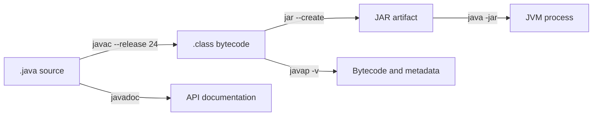

# Java Assertions, Compilation And Packaging Toolchain

Assertions express internal assumptions that may be disabled. The JDK toolchain turns
source into class files, packages them, documents public APIs, and exposes evidence
for debugging.



## Assertions Are Not Validation

```java
Reservation reserve(Order order) {
    Objects.requireNonNull(order, "order");       // public precondition
    Reservation result = calculate(order);
    assert result.totalQuantity() >= 0
            : "negative reservation total: " + result;
    return result;
}
```

The condition must be boolean. The detail expression is evaluated only when the
condition is false and assertions are enabled. A failed assertion throws
`AssertionError`, which application code should not normally catch.

Never use assertions for request validation, authorization, payment checks, data
integrity, or required side effects. Those rules must run regardless of `-ea`.

```powershell
java -ea -cp target/classes io.shopverse.Example
java -ea:io.shopverse... -da:io.shopverse.generated... -cp target/classes io.shopverse.Example
```

Assertions are disabled by default for application classes. Their value is greatest in
tests and invariant-heavy internal code; ordinary tests should still assert externally
observable behavior with the test framework.

## Compile And Run

```powershell
javac --release 24 -d out src/io/shopverse/OrderExample.java
java -cp out io.shopverse.OrderExample
```

`--release` constrains language features, class-file target, and the documented Java SE
API surface for that release. `-source` alone is not an equivalent compatibility gate.

The class path is an ordered list of directories and archives for unnamed-module code.
The module path resolves named modules. Prefer Gradle/Maven dependency declarations
over a global `CLASSPATH`; they make resolution reproducible and auditable.

## Package And Inspect

```powershell
jar --create --file shopverse-example.jar --main-class io.shopverse.OrderExample -C out .
jar --list --file shopverse-example.jar
java -jar shopverse-example.jar
javap -c -v -p -classpath shopverse-example.jar io.shopverse.OrderExample
```

A JAR is a ZIP-based archive with optional metadata. A WAR packages a servlet web
application. EAR remains an enterprise-application archive format, but modern
Spring Boot services are commonly executable JARs or layered container images.

Never add an untrusted JAR to the class path merely to inspect it. Static initializers,
service providers, agents, annotation processors, or application startup may execute
code when tools or builds load components.

## System Properties And Environment

```powershell
java -Dshopverse.region=ap-south-1 -jar app.jar
```

Read non-secret configuration with `System.getProperty` or `System.getenv` at a
configuration boundary and convert it to typed values. Do not print all properties or
environment variables: they may expose credentials and deployment metadata.

## Documentation And Diagnostics

```powershell
javadoc -Xdoclint:all -d api-docs -sourcepath src -subpackages io.shopverse
javac -Xlint:all --release 24 -d out src/io/shopverse/OrderExample.java
```

Use `javadoc` for API contracts, `javap` for class-file facts, and JFR/JDK diagnostic
tools for runtime facts. Generated output is evidence, not a substitute for explaining
the invariant and its production consequence.

## Shopverse Build Guidance

- Use the Gradle wrapper and version catalogs/build logic already owned by the repo.
- Pin toolchains and dependency versions; do not depend on the developer machine's
  ambient class path.
- Treat annotation processors and build plugins as executable supply-chain inputs.
- Build thin domain examples as tests or labs; do not introduce tutorial code into a
  production service package.
- Compare the packaged artifact and runtime image, not only the IDE class path.

## Official References

- [JLS 14.10: The assert Statement](https://docs.oracle.com/javase/specs/jls/se24/html/jls-14.html#jls-14.10)
- [java command](https://docs.oracle.com/en/java/javase/24/docs/specs/man/java.html)
- [javac command](https://docs.oracle.com/en/java/javase/24/docs/specs/man/javac.html)
- [jar command](https://docs.oracle.com/en/java/javase/24/docs/specs/man/jar.html)
- [javadoc command](https://docs.oracle.com/en/java/javase/24/docs/specs/man/javadoc.html)
- [javap command](https://docs.oracle.com/en/java/javase/24/docs/specs/man/javap.html)

## Recommended Next

Continue with [JVM Execution Internals](./advanced-internals/JVM-EXECUTION-INTERNALS.md)
and [Dynamic Java, JPMS And Packaging](./JAVA-DYNAMIC-JPMS-PACKAGING.md).
