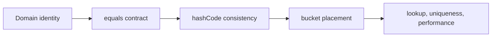

# Java Collections Learning Guide

Collections should be selected from access pattern, ordering, mutation,
concurrency, and memory requirements—not from habit.

## Learning Order

| Step | Page | Outcome |
|---:|---|---|
| 1 | [Collections](./JAVA-COLLECTIONS.md) | select the correct `List`, `Set`, `Map`, queue, or deque |
| 2 | [Collection Internals](./JAVA-COLLECTION-INTERNALS.md) | understand arrays, nodes, trees, resizing, and complexity |
| 3 | [Hash Collections Deep Dive](./JAVA-HASH-COLLECTIONS-DEEP-DIVE.md) | reason about equality, collisions, load factor, CME, and `ConcurrentHashMap` |
| 4 | [ConcurrentHashMap OpenJDK Internals](./JAVA-CONCURRENT-HASHMAP-OPENJDK.md) | trace CAS insertion, bin coordination, tree bins, resize, counters and architectural limits |
| 5 | [Objects, Equality And Immutability](./JAVA-OBJECTS-STRINGS-GC.md) | design safe custom keys and values |

## Quick Choice Matrix

| Requirement | Usually start with | Important warning |
|---|---|---|
| indexed reads and append | `ArrayList` | middle insertion shifts elements |
| unique values | `HashSet` | equality and hash contracts control uniqueness |
| key-value lookup | `HashMap` | mutable keys break future lookup |
| predictable insertion order | `LinkedHashMap` | extra links consume memory |
| sorted/range operations | `TreeMap` | operations are typically O(log n) |
| producer-consumer handoff | bounded `BlockingQueue` | capacity is part of backpressure |
| concurrent key-value updates | `ConcurrentHashMap` | multi-key business invariants still need coordination |
| read-mostly small list | `CopyOnWriteArrayList` | every write copies the backing array |

## The Contract Chain

For every custom hash key, ask whether its identity fields can mutate, whether
equality is symmetric across inheritance, and whether its hash distribution is
reasonable. Measure before replacing a simple collection with a specialized or
concurrent one.

## Interview And Production Checklist

- Explain why `ArrayList` usually beats `LinkedList` despite middle-removal claims.
- Predict behavior when only `equals` or only `hashCode` is overridden.
- Distinguish fail-fast, snapshot, and weakly consistent iteration.
- Explain duplicate handling in maps and sets.
- Size initial capacity from expected entries and load factor.
- Use atomic concurrent-map operations for compound updates.
- Identify when ordering or range queries change the correct structure.

## Official References

- [Java Collections Framework](https://docs.oracle.com/en/java/javase/25/docs/api/java.base/java/util/doc-files/coll-overview.html)
- [`java.util.concurrent` collections](https://docs.oracle.com/en/java/javase/25/docs/api/java.base/java/util/concurrent/package-summary.html)

## Recommended Next

Begin with [Java Collections](./JAVA-COLLECTIONS.md).
