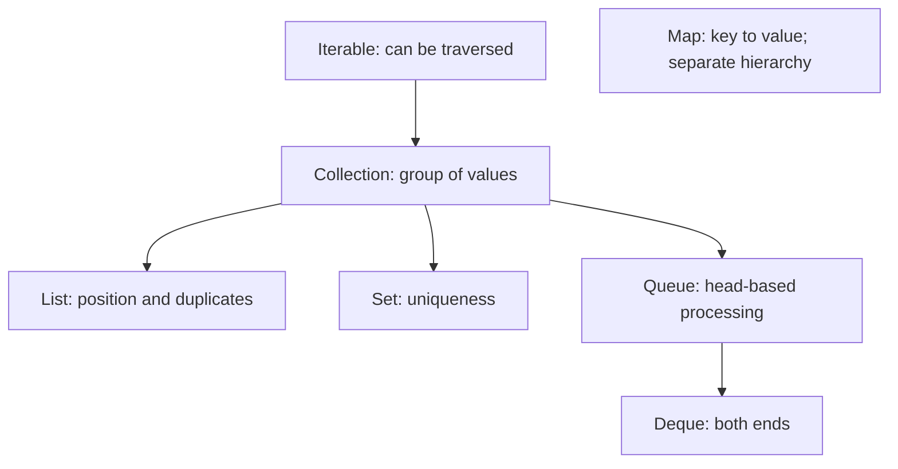
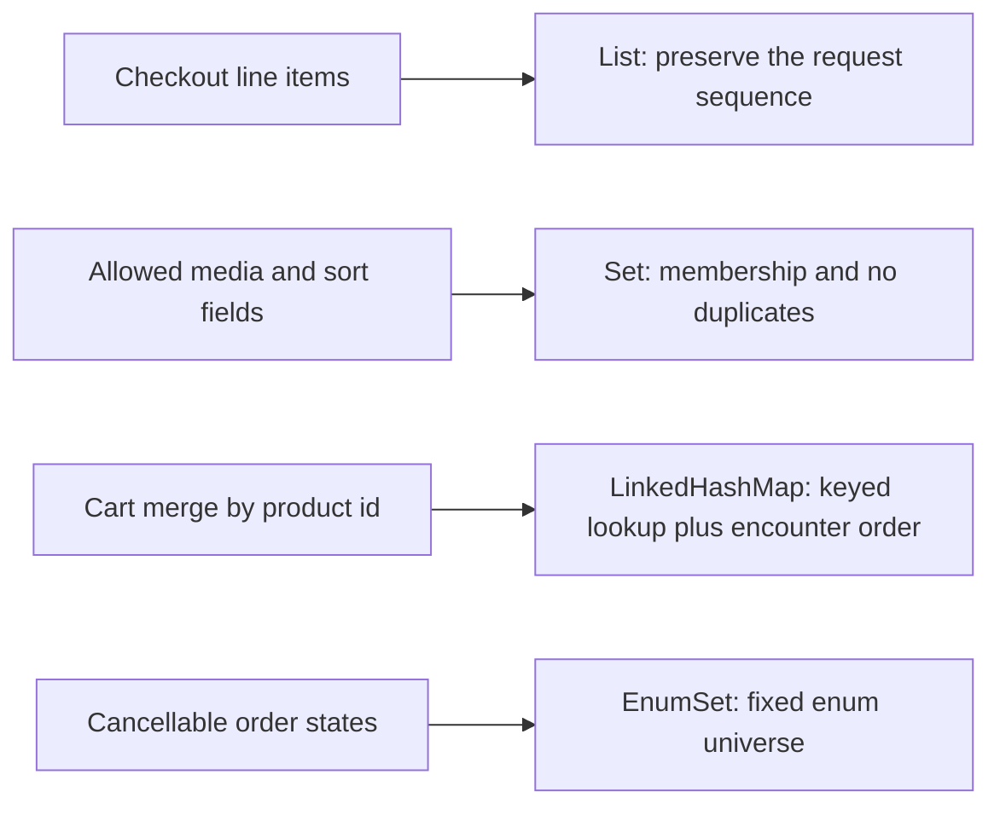

# Java Collections

<DocLabels items={[
  {label: 'Intermediate', tone: 'intermediate'},
  {label: 'Production decisions', tone: 'production'},
  {label: 'Shopverse examples', tone: 'shopverse'},
]} />

Choose a collection from the behavior the caller needs: duplicates, encounter
order, lookup shape, mutation ownership, and concurrency. The concrete class is
the last decision, not the first.

<DocCallout type="tip" title="Choose the contract before the class">
First decide duplicates, ordering, lookup, mutation ownership, and concurrency.
Only then choose an implementation; a familiar collection can still encode the
wrong domain behavior.
</DocCallout>

## Focused Learning Route

<TopicCards items={[
  {title: 'Contracts and selection', href: '/java/collections/COLLECTION-CONTRACTS-AND-SELECTION', description: 'Define duplicates, order, lookup, queue behavior, ownership, and concurrency.', icon: 'route', tags: ['Start here', 'Contracts']},
  {title: 'List, Set, and Map choices', href: '/java/collections/LIST-SET-MAP-CHOICES', description: 'Select the usual implementation for a concrete application workload.', icon: 'boxes', tags: ['Selection', 'Trade-offs']},
  {title: 'Safe collection mutation', href: '/java/collections/SAFE-COLLECTION-MUTATION', description: 'Remove, transform, publish, and update values without aliasing or iteration bugs.', icon: 'security', tags: ['Mutation', 'Ownership']},
  {title: 'Collection internals', href: '/java/JAVA-COLLECTION-INTERNALS', description: 'Trace arrays, nodes, trees, capacity changes, and practical complexity.', icon: 'layers', tags: ['Internals', 'Complexity']},
  {title: 'Hash collections deep dive', href: '/java/JAVA-HASH-COLLECTIONS-DEEP-DIVE', description: 'Connect equality and stable keys to collisions, buckets, and resizing.', icon: 'brain', tags: ['HashMap', 'Equality']},
  {title: 'Architect collection choices', href: '/java/JAVA-COLLECTION-IMPLEMENTATIONS-ARCHITECT', description: 'Evaluate memory, ordering, backpressure, and specialized implementations.', icon: 'gauge', tags: ['Architecture', 'Performance']},
  {title: 'ConcurrentHashMap internals', href: '/java/JAVA-CONCURRENT-HASHMAP-OPENJDK', description: 'Understand atomic map operations and the mechanics of concurrent hashing.', icon: 'network', tags: ['Concurrency', 'OpenJDK']},
]} />

## Contract Map

`Collection` and `Map` are contracts. `Collections` is a utility class containing
algorithms and wrappers. Ordering is also not one promise: insertion order,
sorted order, queue priority, and unspecified encounter order are different
contracts.

## Fast Selection

| Required behavior | Start with | Change when |
|---|---|---|
| indexed values, duplicates allowed | `ArrayList` | the operation is really FIFO/LIFO, then use `ArrayDeque` |
| unique values | `HashSet` | encounter order, sorting, or an enum universe is required |
| lookup by stable key | `HashMap` | encounter order, sorted ranges, or shared mutation is required |
| FIFO/LIFO work | `ArrayDeque` | threads must wait for capacity/data, then use a bounded `BlockingQueue` |
| immutable boundary value | `List.copyOf`, `Set.copyOf`, or `Map.copyOf` | elements themselves also need defensive copies |
| shared key-value updates | `ConcurrentHashMap` | an invariant spans keys or systems, then coordinate at that wider boundary |

These are defaults, not performance guarantees. Cardinality, allocation,
locality, contention, and hash distribution still need representative
measurement.

## Shopverse At A Glance

These choices appear in Shopverse code: order items are lists, validation
allowlists are immutable sets, cart merge indexes existing items by product ID,
and cancellable order states use `EnumSet`. The domain requirement explains the
type; the implementation is not chosen from habit.

## Production Baseline

- Expose the least powerful interface that satisfies the caller.
- Do not rely on `HashMap` or `HashSet` encounter order.
- Keep fields used by map-key or set equality stable while stored.
- Return an immutable snapshot when a caller must not observe later mutation.
- Mutate ordinary collections only through supported iteration operations.
- Treat thread safety, atomicity, backpressure, and distributed correctness as
  separate concerns.

## Official References

- [Java Collections Framework](https://docs.oracle.com/en/java/javase/25/docs/api/java.base/java/util/doc-files/coll-overview.html)
- [`java.util.concurrent` package](https://docs.oracle.com/en/java/javase/25/docs/api/java.base/java/util/concurrent/package-summary.html)
