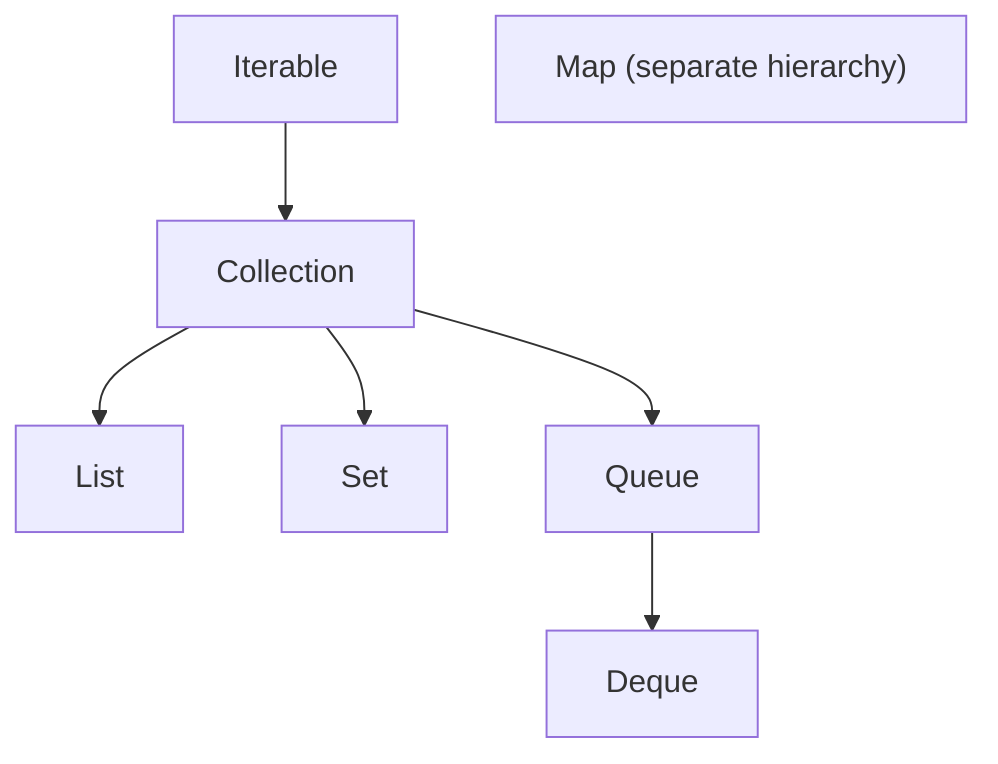

# Java Collections Framework

The Collections Framework provides interfaces, implementations, algorithms,
iterators, and concurrent data structures.

For deeper implementation details, see
[Java Collection Internals](JAVA-COLLECTION-INTERNALS.md).

## Main Hierarchy



## Choosing A Collection

| Need | Typical choice |
|---|---|
| ordered, indexed values | `ArrayList` |
| frequent operations at both ends | `ArrayDeque` |
| unique values | `HashSet` |
| insertion-order unique values | `LinkedHashSet` |
| sorted unique values | `TreeSet` |
| key-value lookup | `HashMap` |
| insertion-order map | `LinkedHashMap` |
| sorted keys/range navigation | `TreeMap` |
| concurrent key-value access | `ConcurrentHashMap` |
| blocking producer-consumer queue | `ArrayBlockingQueue` |

Prefer `ArrayList` over `LinkedList` for most application workloads because of
memory locality and fast indexed reads.

## Interface Summary

| Interface | Purpose |
|---|---|
| `List` | ordered collection with positional access |
| `Set` | unique elements |
| `Queue` | FIFO-style processing |
| `Deque` | double-ended queue, stack, or queue |
| `Map` | key-value lookup, separate from `Collection` hierarchy |

## Common Defaults

| Type | Important default |
|---|---|
| `ArrayList` | grows from an internal array as elements are added |
| `HashMap` | default capacity 16, load factor 0.75 |
| `HashSet` | backed by `HashMap` |
| `ArrayDeque` | resizable circular array |
| `TreeMap` | red-black tree |

Default values matter when large collections are built repeatedly. If expected
size is known, pre-size hash maps and array lists to reduce reallocations.

## Complexity

| Structure | Get/search | Add | Remove | Notes |
|---|---:|---:|---:|---|
| `ArrayList` | O(1) index, O(n) value | amortized O(1) end | O(n) | contiguous array |
| `HashSet` | average O(1) | average O(1) | average O(1) | relies on hash/equality |
| `TreeSet` | O(log n) | O(log n) | O(log n) | sorted red-black tree |
| `HashMap` | average O(1) | average O(1) | average O(1) | tree bins under collisions |
| `TreeMap` | O(log n) | O(log n) | O(log n) | sorted keys |

Big-O does not capture allocation, cache locality, contention, or poor hash
distribution. Measure realistic workloads.

## HashMap Internals

`HashMap`:

1. computes/spreads the key hash;
2. maps it to a bucket;
3. compares hash and `equals`;
4. stores collisions in a list, which can become a balanced tree;
5. resizes when size crosses capacity times load factor.

```java
Map<ProductId, Integer> quantities = new HashMap<>();
quantities.merge(productId, quantity, Integer::sum);
```

Keys must have stable `equals` and `hashCode`. Do not mutate a field involved
in hashing after insertion.

More detail: [HashMap and HashSet internals](JAVA-COLLECTION-INTERNALS.md).

## Immutable And Unmodifiable

```java
List<String> immutable = List.of("ADMIN", "CUSTOMER");
List<String> snapshot = List.copyOf(mutableRoles);
List<String> view = Collections.unmodifiableList(mutableRoles);
```

An unmodifiable view still reflects changes to the backing collection.
`List.copyOf` creates an unmodifiable snapshot.

## Comparable And Comparator

```java
Comparator<Order> newestFirst =
        Comparator.comparing(Order::createdAt)
                .reversed()
                .thenComparing(Order::orderNumber);

orders.sort(newestFirst);
```

## Safe Iteration And Fail-Fast Behavior

Most non-concurrent collection iterators are fail-fast. If the collection is
structurally modified outside the iterator while iterating, Java can throw
`ConcurrentModificationException`.

Avoid:

```java
for (Order order : orders) {
    if (order.cancelled()) {
        orders.remove(order);
    }
}
```

Prefer iterator removal:

```java
Iterator<Order> iterator = orders.iterator();
while (iterator.hasNext()) {
    if (iterator.next().cancelled()) {
        iterator.remove();
    }
}
```

Or create a new filtered collection:

```java
List<Order> activeOrders = orders.stream()
        .filter(order -> !order.cancelled())
        .toList();
```

## HashMap Versus ConcurrentHashMap

| Concern | `HashMap` | `ConcurrentHashMap` |
|---|---|---|
| Thread safety | no | yes for concurrent access |
| Null keys/values | allows one null key and null values | does not allow null keys/values |
| Iteration | fail-fast best effort | weakly consistent |
| Use case | local/single-threaded map | shared mutable map across threads |

`ConcurrentHashMap` does not make compound business operations automatically
atomic. Use methods such as `compute`, `computeIfAbsent`, and `merge` when the
read-modify-write operation must be atomic for one key.

```java
inventoryByProduct.merge(productId, quantity, Integer::sum);
```

## ArrayList Versus Vector

| Concern | `ArrayList` | `Vector` |
|---|---|---|
| Synchronization | not synchronized | synchronized methods |
| Performance | better in normal code | slower due method-level locking |
| Modern preference | yes | legacy |

Prefer `ArrayList` with external synchronization or concurrent collections
when needed. `Vector` is mostly seen in legacy code.

## Storing Custom Objects In Hash Collections

Objects used as keys in `HashMap` or elements in `HashSet` need correct,
stable `equals` and `hashCode`.

```java
public record ProductKey(Long productId, String warehouseCode) {
}
```

Records are useful keys because Java generates value-based equality and hash
code. Do not mutate fields used by equality after insertion into a hash-based
collection.

`Comparable` defines natural order. `Comparator` defines external or multiple
orders. A sorted set/map treats comparator equality as key equality, so the
comparison should be consistent with intended uniqueness.

## Concurrent Collections

```java
ConcurrentMap<String, LongAdder> counters = new ConcurrentHashMap<>();
counters.computeIfAbsent(route, ignored -> new LongAdder()).increment();
```

`ConcurrentHashMap` does not permit null keys or values. Compound behavior
should use atomic methods such as `compute`, `merge`, and `putIfAbsent`.

`CopyOnWriteArrayList` is suitable for small, read-heavy collections with rare
writes. Every mutation copies the backing array.

## Interview And Tricky Questions

### HashMap Versus ConcurrentHashMap

`HashMap` is not thread-safe and permits one null key. `ConcurrentHashMap`
supports concurrent access, atomic compound methods, and no null keys/values.

### Fail-Fast Versus Fail-Safe?

Most ordinary iterators are best described as fail-fast: they may detect
structural modification and throw `ConcurrentModificationException`.
Concurrent collection iterators are weakly consistent, not a guaranteed
snapshot.

### Why Must Equals And HashCode Agree?

Equal objects must have equal hash codes so hash collections search the correct
bucket. Equal hash codes do not imply equality.

### ArrayList Versus LinkedList?

`ArrayList` normally wins for indexed access, iteration, memory, and append.
`LinkedList` only helps when node-position insertion/removal is already known;
finding that position remains O(n).

### What Happens With Duplicate Map Keys?

`put` replaces the old value and returns it. `putIfAbsent`, `compute`, or
`merge` express safer intent for conditional updates.

## Practices

- declare variables using interfaces;
- return immutable snapshots at boundaries;
- pre-size large known collections;
- never rely on `HashMap` iteration order;
- avoid parallel mutation of ordinary collections;
- use database pagination rather than loading huge tables into collections;
- choose concurrent collections for their semantics, not only to avoid locks.
