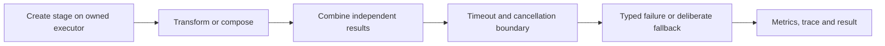

# Java CompletableFuture Learning Guide

<DocLabels items={[
  {label: 'Intermediate', tone: 'intermediate'},
  {label: 'Async composition', tone: 'foundation'},
  {label: 'Production boundaries', tone: 'production'},
]} />

`CompletableFuture<T>` represents a result that can be completed and composed. It does
not make blocking work non-blocking, create unlimited capacity, propagate thread-local
context, or cancel external side effects automatically.



## Focused Guides

<TopicCards items={[
  {
    title: 'Fundamentals And Execution',
    href: './completable-future/COMPLETABLE-FUTURE-FUNDAMENTALS',
    description: 'Compare Future, create stages, choose executors, and understand get versus join.',
    icon: 'gauge',
    tags: ['Executors', 'Thread ownership'],
  },
  {
    title: 'Composition And Fan-Out',
    href: './completable-future/COMPLETABLE-FUTURE-COMPOSITION',
    description: 'Transform, flatten, combine, race, and coordinate dynamic groups of stages.',
    icon: 'network',
    tags: ['thenCompose', 'Fan-out'],
  },
  {
    title: 'Failure, Timeout And Cancellation',
    href: './completable-future/COMPLETABLE-FUTURE-FAILURE-CANCELLATION',
    description: 'Design exception flow, deadlines, recovery, interruption, and cancellation limits.',
    icon: 'security',
    tags: ['Deadlines', 'Failure semantics'],
  },
  {
    title: 'Production Architecture',
    href: './completable-future/COMPLETABLE-FUTURE-PRODUCTION',
    description: 'Apply capacity, context, transaction, observability, and virtual-thread boundaries.',
    icon: 'layers',
    tags: ['Shopverse', 'Observability'],
  },
]} />

## Decision Rule

Use `CompletableFuture` when explicit data-flow composition is valuable. Prefer direct
blocking code on virtual threads when the workflow is mostly sequential and the clients
already expose blocking APIs. Use a bounded executor for CPU work and enforce separate
limits for database, HTTP and broker resources.

<DocCallout type="production" title="Every async boundary needs an owner">

Name the executor, concurrency limit, deadline, cancellation behavior, and telemetry for
each remote or CPU-heavy stage. The common pool is a default mechanism, not a production
capacity plan.

</DocCallout>

## Quick Example

```java
CompletableFuture<Order> order =
        CompletableFuture.supplyAsync(() -> orderClient.load(id), ioExecutor);
CompletableFuture<Inventory> inventory =
        CompletableFuture.supplyAsync(() -> inventoryClient.load(id), ioExecutor);

return order.thenCombine(inventory, OrderView::new)
        .orTimeout(800, TimeUnit.MILLISECONDS)
        .join();
```

Both calls start before the boundary waits. The timeout bounds the stage result, but the
underlying clients still need their own connect, request and resource-acquisition
timeouts.

## Official References

- [`CompletableFuture`](https://docs.oracle.com/en/java/javase/25/docs/api/java.base/java/util/concurrent/CompletableFuture.html)
- [`CompletionStage`](https://docs.oracle.com/en/java/javase/25/docs/api/java.base/java/util/concurrent/CompletionStage.html)

## Recommended Next

Start with [Fundamentals And Execution](./completable-future/COMPLETABLE-FUTURE-FUNDAMENTALS.md).
