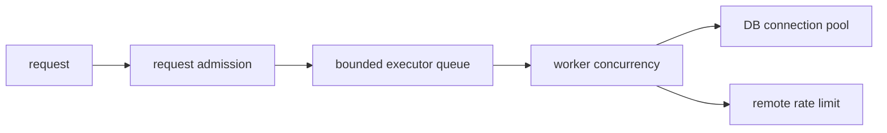

# Java Concurrency Architecture And Design Review

Concurrency correctness is not demonstrated by using a thread-safe collection
or adding `synchronized`. A review must define the invariant, every state
participant, the atomic boundary, visibility proof, overload behavior, and
lifecycle ownership.

## Begin With The Invariant

Suppose a local component tracks `available + reserved = capacity`. Protecting
each field with an atomic variable does not protect the relationship:

```java
if (available.get() >= quantity) {
    available.addAndGet(-quantity);
    reserved.addAndGet(quantity);
}
```

Other threads can observe or create an invalid intermediate state. Options
include one lock around the aggregate transition, one immutable state held in
an `AtomicReference` and replaced by CAS, actor/event-loop ownership, or a
database atomic update when the authority spans processes.

```java
record Stock(int available, int reserved) {}

boolean reserve(int quantity) {
    for (;;) {
        Stock before = stock.get();
        if (before.available() < quantity) return false;
        Stock after = new Stock(
                before.available() - quantity,
                before.reserved() + quantity);
        if (stock.compareAndSet(before, after)) return true;
    }
}
```

The CAS loop is correct only when the whole invariant fits that immutable state
and side effects occur after successful publication. Remote calls inside a CAS
retry would be duplicated.

## Establish A Happens-Before Proof

For each shared read, identify the edge making the writer visible:

| Mechanism | Relevant edge |
|---|---|
| monitor | unlock happens-before a later lock of the same monitor |
| volatile | write happens-before a later read observing that order |
| thread lifecycle | actions before `start` are visible to the started thread; completion is visible after `join` |
| concurrent utility | rely on its documented memory-consistency effects |
| final fields | safe construction plus non-escaping publication provides final-field guarantees |

“It usually works” and “the CPU cache will flush” are not proofs. Neither is a
thread-safe container proof that mutable values retrieved from it are safe.

## Publication And Ownership

Safe options include static initialization, volatile publication, monitor-
protected publication, final fields in safely published immutable objects, and
concurrent queues/maps with documented transfer effects. Common failures:

- leaking `this` from a constructor through a listener or executor;
- publishing a mutable collection and then modifying it without coordination;
- using double-checked locking without `volatile`;
- exposing a mutable value stored inside `ConcurrentHashMap`;
- keeping request state in thread locals across reused pool workers.

Prefer confinement or immutability before locks. A state owner such as one
event-loop thread can remove data races, but its mailbox still needs a capacity,
failure policy and shutdown protocol.

## Executor And Downstream Bounds

Thread-pool configuration is a system capacity decision:



If 200 workers compete for 20 database connections, the extra concurrency may
only add queueing, timeouts and context switches. Align outer admission with
the smallest relevant downstream bound. Record queue time separately from task
execution time so overload is distinguishable from slow business logic.

Virtual threads move the platform-thread scarcity boundary; they do not remove
database connections, remote quotas, heap, CPU or lock contention.

## Cancellation And Deadlines

Interruption is a request, not forced termination. Code must preserve the signal
when it cannot complete cancellation at its layer:

```java
try {
    return queue.take();
} catch (InterruptedException e) {
    Thread.currentThread().interrupt();
    throw new TaskCancelledException("Interrupted while waiting", e);
}
```

Every blocking dependency needs a deadline. A request timeout that leaves
database or HTTP work running is resource leakage. Define whether cancellation
propagates to children, whether partial side effects require compensation, and
how idempotency prevents duplicate retries.

## Deadlock, Livelock And Starvation

- Deadlock: participants permanently wait in a dependency cycle.
- Livelock: participants run and react but make no useful progress.
- Starvation: a participant is continually denied CPU, lock or queue service.

Prevent lock deadlock with a global order, smaller critical sections, avoiding
remote calls while locked, or timed acquisition plus a recovery design. Thread
dumps prove ownership/wait relationships. They do not show a database lock
cycle unless database evidence is also collected.

## Shutdown Protocol

A component lifecycle should be explicit:

1. stop new admission;
2. signal producers and periodic tasks;
3. drain or reject queued work according to durability requirements;
4. interrupt/cancel bounded work where safe;
5. await termination with a deadline;
6. close downstream resources;
7. emit unfinished-work and forced-shutdown metrics.

Daemon threads are not a shutdown strategy; the JVM can terminate them without
application cleanup once no non-daemon thread remains.

## Review Evidence

Require:

- invariant tests under randomized concurrency;
- jcstress for Java Memory Model races where appropriate;
- JFR evidence for monitor blocking, parking, allocation and thread behavior;
- saturation tests with bounded queues and rejection assertions;
- cancellation and shutdown tests;
- thread naming and executor metrics;
- database/HTTP pool metrics correlated with executor queueing;
- no correctness claims based solely on throughput benchmarks.

## Senior Interview Scenarios

1. A synchronized method is correct in one instance but fails in production. Check multiple instances/JVMs and whether the lock covers the authority.
2. Virtual threads increase latency. Check downstream pool queueing, pinning, hot locks and admission rather than assuming scheduler failure.
3. A future times out but traffic remains high. Determine whether underlying work was cancelled and whether retries multiplied work.
4. CPU is low but latency is high. Inspect parked/blocked threads, executor queues and downstream waits.
5. A cache map is thread-safe but values corrupt. Examine value mutability and compound invariants.

## Official References

- [JLS memory model](https://docs.oracle.com/javase/specs/jls/se25/html/jls-17.html)
- [Java concurrency package](https://docs.oracle.com/en/java/javase/25/docs/api/java.base/java/util/concurrent/package-summary.html)
- [OpenJDK jcstress](https://openjdk.org/projects/code-tools/jcstress/)
- [JDK Mission Control](https://docs.oracle.com/en/java/javase/25/jmc/)

## Recommended Next

Continue with [JVM Architecture And Operations](./JAVA-JVM-ARCHITECTURE-OPERATIONS.md)
to connect concurrency symptoms to runtime evidence.
