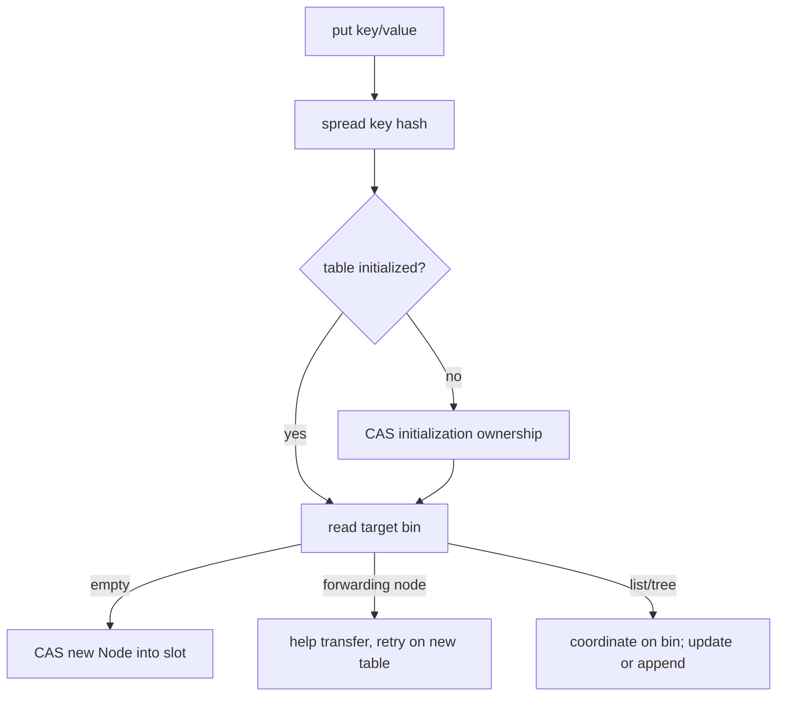
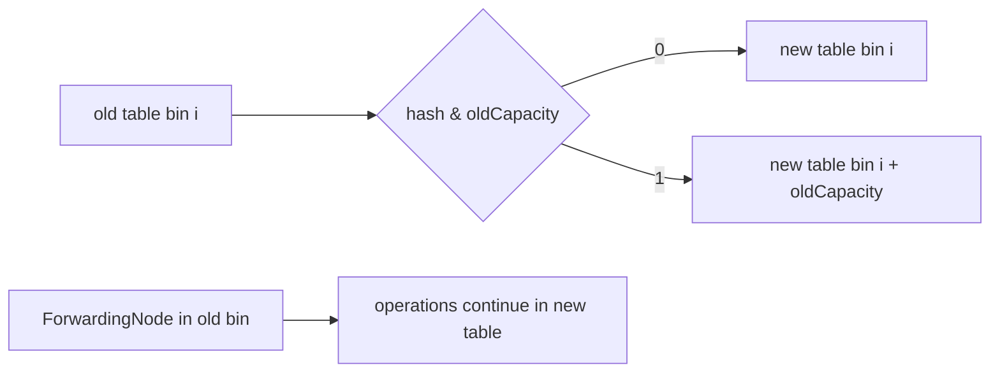

# ConcurrentHashMap OpenJDK Internals And Design Review

`ConcurrentHashMap` provides scalable concurrent access inside one JVM. It is
not a distributed map, transaction manager, or automatic guardian of multi-key
business invariants. Architectural use starts by identifying the atomicity
boundary the map actually offers.

## From Segments To Bin Coordination

Java 7 divided the map into fixed `Segment` regions backed by lock-bearing hash
tables. Modern implementations use one table and coordinate at finer granularity:

- volatile-style publication and reads for table elements;
- CAS for table initialization and empty-bin insertion;
- synchronization on a bin head for contended structural updates;
- tree-bin coordination for collision-heavy bins;
- forwarding nodes and cooperative transfer during resize;
- striped counters to avoid a single hot size counter.

Do not describe current `ConcurrentHashMap` as “segment locking.” That answer
confuses historical design with the implementation used by modern Java.

## Hashing And Table Initialization

The spread operation mixes high hash bits into lower bits because bucket
selection uses `(length - 1) & hash`. The table is initialized lazily. A control
field commonly called `sizeCtl` represents different state depending on sign
and phase: initialization coordination, resize threshold, or an encoded resize
state with participating workers.



The empty-bin path avoids a monitor. A collision path must recheck state after
acquiring coordination because another thread may have changed the bin.

## Node Roles

| Internal role | Purpose |
|---|---|
| ordinary node | immutable key/hash link plus visibility-managed value/next traversal |
| tree node | red-black-tree entry used inside a tree bin |
| tree bin | coordinates tree root, readers and writers for a dense bin |
| forwarding node | marks a transferred bin and points operations toward the new table |
| reservation node | temporarily reserves computation state for operations such as computation |

These are implementation details, not public API contracts. A lead should know
their purpose to understand profiles and thread dumps, while avoiding code that
depends on private thresholds or layout remaining identical across JDK releases.

## Read Path And Memory Visibility

`get` does not normally acquire an intrinsic lock. It obtains the table/bin
state with the visibility guarantees used by the implementation, compares the
first node, then traverses a list, tree, or forwarding structure. The API
specification establishes that a completed update for a key happens-before a
subsequent retrieval reporting that updated value.

That guarantee does not make operations across different keys atomic:

```java
if (balances.get(from) >= amount) {
    balances.compute(from, (key, old) -> old - amount);
    balances.compute(to, (key, old) -> old + amount);
}
```

Readers can observe an intermediate transfer. Use a domain-level lock,
transactional store, immutable aggregate replacement, or another design that
matches the invariant. In a replicated service, even a correct local critical
section cannot coordinate other JVMs.

## Treeification And Collision Behavior

When a bin becomes dense, the implementation may convert its linked structure
to a red-black tree, but only when the table is also sufficiently large;
otherwise resize is preferred. When density falls, a tree may become a list
again. Comparable keys can help ordering inside tree bins, while tie-breaking
still preserves correctness for non-comparable keys.

Tree bins constrain collision degradation but do not make adversarial or poor
hash functions harmless. A large collision domain still increases comparisons,
coordination and allocation.

## Cooperative Resizing

Resize creates a larger table and transfers bins. Threads encountering a
forwarding node can help move a range rather than waiting for one resizer. Each
old bin can be divided using the old capacity bit: entries stay at the old index
or move by `oldCapacity`, avoiding complete hash recomputation.



Resizing is incremental but not free. Poor initial sizing can create transfer
CPU, allocation and temporary memory pressure under peak traffic.

## Size Accounting

A single atomic counter would become a contention point. The implementation
uses a base count and, under contention, striped counter cells similar in spirit
to `LongAdder`. Aggregate size-related results during concurrent mutation are
observational, not a transactionally frozen snapshot. Do not use `size()` as a
check-then-act gate for correctness.

## Compound Operations

Use `putIfAbsent`, `replace`, `compute`, `computeIfAbsent`, and `merge` when the
operation fits one key. Mapping functions must be short and side-effect-aware.
They can coordinate other threads targeting the same bin, may be invoked under
contention semantics callers misunderstand, and must not recursively update the
same map in a way the implementation rejects.

```java
private final ConcurrentHashMap<String, LongAdder> counters = new ConcurrentHashMap<>();

void record(String productId) {
    counters.computeIfAbsent(productId, ignored -> new LongAdder()).increment();
}
```

This is appropriate for approximate/high-throughput counters. It is not an
inventory-decrement transaction, because `LongAdder` does not provide a linearizable
sum-and-update invariant.

## Iteration And Bulk Operations

Iterators are weakly consistent: they do not throw
`ConcurrentModificationException`, do not freeze the map, and may reflect some
updates that occur during traversal. Bulk operations accept a parallelism
threshold and can use the common pool. Avoid parallel bulk work when mapping
functions block or when the common pool is shared by unrelated latency paths.

## Design Review Checklist

- Is the state authoritative only inside one JVM?
- Is every correctness invariant confined to one atomic map operation/key?
- Are keys immutable with stable equality and hashes?
- Are mapping functions bounded and free from remote I/O?
- Can a hot key or collision concentrate bin contention?
- Is initial capacity appropriate for peak cardinality?
- Are weak iterator and aggregate-size semantics acceptable?
- Is lifecycle bounded, or can the map become a permanent retention root?
- Would Caffeine, a database, Redis, or an immutable snapshot be a better abstraction?

## Diagnostic Lab

1. Benchmark independent keys and one hot key separately.
2. Record JFR monitor-blocked, allocation and CPU evidence.
3. Force controlled collisions with a test key and inspect degradation.
4. Trigger resize from a deliberately small capacity and observe allocation.
5. Compare `LongAdder` counters with `merge` when exact per-operation results matter.

## Tricky Interview Questions

1. Are reads always lock-free in every internal path? Normal reads avoid locking, but describe API guarantees rather than claiming a universal implementation theorem.
2. Why can `maximum` concurrency still collapse? Hot bins, mapping-function duration, CPU, allocation and downstream work remain shared bottlenecks.
3. Does `computeIfAbsent` guarantee its function never runs concurrently for different keys? No; coordination is scoped to relevant map state, not global execution.
4. Can `size()` authorize a capacity-sensitive business action? No; concurrent aggregate observations are not a transaction.
5. Does a concurrent map make a local cache coherent across replicas? No.

## Official References

- [`ConcurrentHashMap` API](https://docs.oracle.com/en/java/javase/25/docs/api/java.base/java/util/concurrent/ConcurrentHashMap.html)
- [OpenJDK ConcurrentHashMap source](https://github.com/openjdk/jdk/blob/master/src/java.base/share/classes/java/util/concurrent/ConcurrentHashMap.java)
- [`LongAdder` API](https://docs.oracle.com/en/java/javase/25/docs/api/java.base/java/util/concurrent/atomic/LongAdder.html)

## Recommended Next

Continue with the [Concurrency Design Review](./JAVA-CONCURRENCY-DESIGN-REVIEW.md)
to place local atomic operations inside a complete service-level invariant.
