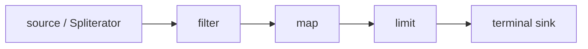

# Java Exception Propagation And Stream Pipeline Internals

## Exception Propagation

Throwing transfers control by unwinding frames until a compatible handler is
found. `finally` executes during normal and abrupt completion, but a new throw or
return from `finally` can replace the original outcome. Preserve causes; never
use exceptions as unstructured log-and-continue signals.

Try-with-resources closes initialized resources in reverse order. When the body
and close both fail, the body failure remains primary and close failures are
suppressed. Inspect `getSuppressed()` during diagnosis.

## Stream Execution Model

A stream is a single-use description of a pipeline. Intermediate operations
build stages; a terminal operation drives traversal. Stages are fused into a
sink chain so data generally flows element-by-element rather than materializing
one collection per operation. Stateful operations such as sorting or distinct
may require buffering.

Short-circuiting depends on both operation and encounter order. `findFirst` on
an ordered parallel stream can require coordination that `findAny` avoids.
Side effects violate non-interference assumptions and make retries/parallel
execution difficult to reason about.

## Spliterator And Parallel Decomposition

A `Spliterator` traverses and optionally partitions a source. Characteristics
such as `SIZED`, `SUBSIZED`, `ORDERED`, `DISTINCT`, `SORTED`, `IMMUTABLE` and
`CONCURRENT` allow optimizations but must be truthful in custom implementations.
Parallel streams recursively split work and execute through ForkJoin machinery,
usually the common pool.

Parallelism helps when work is CPU-expensive, splittable, sufficiently large,
and reduction is associative. It hurts with blocking I/O, tiny operations,
poor splitting, ordering constraints, shared mutation or common-pool contention.

## Failure Contracts In Streams

Standard functional interfaces do not declare checked exceptions. Choose an
explicit policy:

- move complex/error-prone processing into an ordinary loop;
- wrap while preserving the cause when failure aborts the whole pipeline;
- return a typed success/failure result for intentional partial success;
- perform retries outside pure transformation stages with bounded policy.

Do not turn failure into `Stream.empty()` unless data loss is an explicit,
measured contract. In parallel execution, sibling tasks may already have side
effects when one fails; an exception does not roll those effects back.

## Collector Correctness

A collector defines supplier, accumulator, combiner, finisher and characteristics.
Parallel correctness requires associativity and compatible identity/combination
semantics. A concurrent collector does not make arbitrary mutable accumulator
operations safe. Duplicate keys in `toMap` require a deliberate merge policy.

## Lead Review Checklist

- Is the pipeline clearer than a loop with explicit failure handling?
- Are functions stateless and non-interfering?
- Is encounter order required?
- Is reduction associative and identity-correct?
- Can the common pool be blocked or starved?
- Is partial success represented and observable?
- Are resources opened and closed within the terminal execution lifetime?

## Lab And Interview

Write a custom tracing spliterator, compare ordered/unordered parallel behavior,
demonstrate suppressed close failures, and benchmark a pipeline only with JMH.
Explain why `reduce(0, subtraction)` is invalid for parallel reduction and why
`peek` is not a reliable business side-effect mechanism.

## Official References

- [Stream package specification](https://docs.oracle.com/en/java/javase/25/docs/api/java.base/java/util/stream/package-summary.html)
- [`Spliterator` API](https://docs.oracle.com/en/java/javase/25/docs/api/java.base/java/util/Spliterator.html)
- [JLS exceptions](https://docs.oracle.com/javase/specs/jls/se25/html/jls-11.html)

## Recommended Next

Continue with the [Java Lead And Architect Learning Path](./JAVA-LEAD-ARCHITECT-PATH.md).
