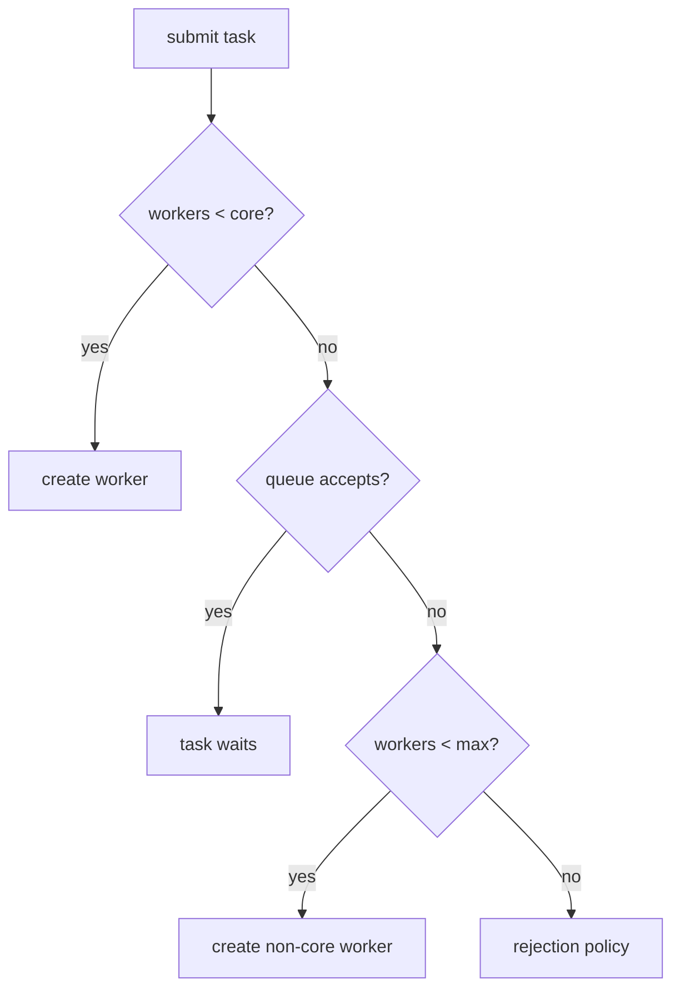

# Java Executors And Thread-Pool Engineering

## Why Use A Pool?

A thread pool separates task submission from execution, reuses expensive
platform workers, bounds concurrency, centralizes naming and failure metrics,
and provides queueing and shutdown policies. Its real purpose is resource
governance—not merely avoiding `new Thread`.

`Executor` accepts tasks. `ExecutorService` adds result submission, lifecycle,
and bulk execution. `ScheduledExecutorService` adds delayed/periodic work.
`ThreadPoolExecutor` exposes the platform-thread pool controls.

## ThreadPoolExecutor Admission Algorithm

Given `corePoolSize`, `maximumPoolSize`, and a work queue:

1. create a worker while current workers are below core size;
2. otherwise enqueue when the queue accepts the task;
3. if the queue is full, create workers up to maximum size;
4. when both pool and queue are saturated, invoke the rejection policy.

This surprises people: with an unbounded queue, the pool normally never grows
beyond its core size, so `maximumPoolSize` has no practical effect.



## Production Configuration

```java
ThreadPoolExecutor executor = new ThreadPoolExecutor(
        8,                              // core workers
        32,                             // maximum workers
        30, TimeUnit.SECONDS,           // excess-worker idle timeout
        new ArrayBlockingQueue<>(500),  // bounded waiting work
        Thread.ofPlatform().name("catalog-io-", 0).factory(),
        new ThreadPoolExecutor.CallerRunsPolicy()
);
executor.allowCoreThreadTimeOut(false);
```

| Setting | Meaning | Common mistake |
|---|---|---|
| core size | workers retained/created for normal load | treating it as CPU cores for every workload |
| maximum size | cap after queue saturation | expecting growth with an unbounded queue |
| keep-alive | idle timeout for workers above core | making burst workers live forever |
| core timeout | optionally retire core workers too | adding cold-start latency accidentally |
| queue capacity | admitted waiting work | using an unbounded queue and moving overload into memory/latency |
| thread factory | names, daemon status, uncaught handler | anonymous workers that cannot be diagnosed |
| rejection handler | saturation behavior | silently dropping important work |

Prestarting core threads can remove first-task creation latency but consumes
resources earlier. Idle means a worker has no task; it may wait on the work
queue until a task or timeout arrives.

## Rejection Policies

| Policy | Behavior | Appropriate only when |
|---|---|---|
| `AbortPolicy` | throws `RejectedExecutionException` | caller handles explicit overload |
| `CallerRunsPolicy` | submitter runs task | slowing producers safely provides backpressure |
| `DiscardPolicy` | silently drops newest task | loss is explicitly acceptable and measured |
| `DiscardOldestPolicy` | drops queue head and retries | oldest waiting work is safely disposable |

Custom handlers can emit metrics and return a domain overload response. Never
block blindly in a rejection handler: deadlock is possible when workers submit
back into their own saturated pool.

## Executor Factory Types

| Factory/type | Effective behavior | Use and warning |
|---|---|---|
| `newSingleThreadExecutor` | one worker, serialized tasks | ordering/isolation; one slow task blocks all, default queue is unbounded |
| `newFixedThreadPool(n)` | `n` workers | stable bounded concurrency; default queue is unbounded |
| `newCachedThreadPool` | zero core, potentially huge max, direct handoff | short bursts of trusted short tasks; can create too many platform threads |
| `newScheduledThreadPool(n)` | delayed and periodic tasks | schedulers; long jobs need adequate workers/isolation |
| work-stealing pool | multiple deques/ForkJoin workers | CPU divide-and-conquer; blocking needs care |
| virtual-thread-per-task executor | new virtual thread per task | high blocking-I/O concurrency; downstream limits remain mandatory |

Convenience factories hide queue and rejection configuration. For production
platform-thread pools, instantiate `ThreadPoolExecutor` explicitly when bounded
admission matters.

```java
try (ExecutorService executor = Executors.newVirtualThreadPerTaskExecutor()) {
    Future<Order> order = executor.submit(() -> orderClient.load(id));
    return order.get();
}
```

Virtual threads should not normally be pooled to limit thread count. Use
semaphores, connection pools, rate limiters, or bounded task admission to
protect scarce downstream resources. See the
[Virtual Threads Guide](./features-8-to-26/JAVA-VIRTUAL-THREADS.md).

## Sizing And Metrics

For CPU-bound work, start near available processors and benchmark. For blocking
work, required concurrency roughly grows with wait time relative to compute
time, but must be capped by downstream capacity. Treat formulas as hypotheses.

Monitor active workers, pool size, largest pool size, queue depth/capacity,
completed tasks, rejection count, task wait time, execution time, failure rate,
and shutdown state. Queue wait is often the first overload signal.

## Shutdown And Task Hygiene

Stop accepting work, call `shutdown`, await bounded termination, then use
`shutdownNow` and preserve interruption if necessary. Every task needs a
deadline and cancellation policy. Do not mix long blocking I/O and latency-
sensitive CPU work in one pool; bulkhead them when their failure modes differ.

## Tricky Interview Questions

<ExpandableAnswer title="Why might a pool never grow beyond core size?">

Its unbounded queue never rejects insertion.

</ExpandableAnswer>

<ExpandableAnswer title="Does CallerRunsPolicy discard work?">

No; it executes on the submitting thread.

</ExpandableAnswer>

<ExpandableAnswer title="Is newCachedThreadPool bounded?">

Its platform-thread growth is effectively unbounded.

</ExpandableAnswer>

<ExpandableAnswer title="Should virtual threads be put in a fixed pool?">

Usually no; bound the scarce resource instead.

</ExpandableAnswer>

<ExpandableAnswer title="What is more important than worker count during overload?">

Queue delay, capacity, rejection, and downstream limits.

</ExpandableAnswer>


## Official References

- [`ExecutorService` API](https://docs.oracle.com/en/java/javase/25/docs/api/java.base/java/util/concurrent/ExecutorService.html)
- [`ThreadPoolExecutor` API](https://docs.oracle.com/en/java/javase/25/docs/api/java.base/java/util/concurrent/ThreadPoolExecutor.html)
- [`Executors` API](https://docs.oracle.com/en/java/javase/25/docs/api/java.base/java/util/concurrent/Executors.html)

## Recommended Next

Continue with [CompletableFuture](./JAVA-COMPLETABLE-FUTURE.md), then compare
platform pools with the [Virtual Threads Guide](./features-8-to-26/JAVA-VIRTUAL-THREADS.md).
