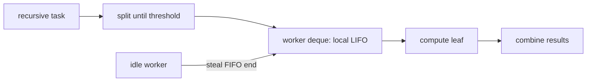

# ForkJoinPool And Work-Stealing Deep Dive


Fork/join targets recursively decomposable CPU work. Each worker owns a deque,
normally processing its own tasks LIFO for locality while idle workers steal older
tasks from another deque's opposite end to obtain larger chunks.



## RecursiveTask Scenario

```java
final class SumTask extends RecursiveTask<Long> {
    private final long[] values; private final int from, to;
    SumTask(long[] values, int from, int to) { this.values=values; this.from=from; this.to=to; }
    protected Long compute() {
        if (to - from <= 10_000) {
            long sum=0; for(int i=from;i<to;i++) sum+=values[i]; return sum;
        }
        int mid=(from+to)>>>1;
        SumTask left=new SumTask(values,from,mid);
        left.fork();
        long right=new SumTask(values,mid,to).compute();
        return left.join()+right;
    }
}
```

Fork one branch and compute the other to keep the worker productive. Forking both
then immediately joining can add scheduling overhead. Threshold selection balances
parallelism against task allocation, queueing and combination costs; benchmark it.

## Task Types

- `RecursiveTask<V>` returns a result.
- `RecursiveAction` performs no result-producing reduction.
- `CountedCompleter` supports completion graphs not centered on blocking joins.
- `ForkJoinTask` is a lightweight future-like base, not a general blocking-I/O task.

## Joining And Help

`join` may let a worker execute other tasks while waiting, reducing passive waits.
This does not make arbitrary blocking safe. `ManagedBlocker` can inform the pool
about unavoidable blocking so it may compensate, but database/HTTP work is usually
better isolated or expressed with virtual threads and resource limits.

## Common Pool

Parallel streams and default `CompletableFuture.*Async` stages commonly share the
common pool. One library's blocking tasks can delay unrelated endpoints. Pool
parallelism is not a service-level bulkhead. Prefer owned executors for workloads
with distinct latency, blocking or failure characteristics.

## Failure Scenarios

1. Threshold of one creates millions of tiny tasks.
2. Blocking JDBC calls consume workers and starve CPU tasks.
3. Nested parallel streams compete in the same common pool.
4. Calling `join` from an unrelated request thread blocks that caller.
5. Shared mutable reduction introduces races despite a parallel framework.
6. Container CPU quota makes host-core assumptions wrong.

## ForkJoin Versus Other Models

| Work | Better starting point |
|---|---|
| recursive CPU divide-and-conquer | ForkJoinPool |
| blocking request-per-task | virtual threads |
| bounded heterogeneous tasks | ThreadPoolExecutor |
| dependent async graph | CompletableFuture/structured tasks |

## Tricky Interview Questions

<ExpandableAnswer title="Why local LIFO and stealing FIFO?">

Locality for owner; older/larger work for thieves.

</ExpandableAnswer>

<ExpandableAnswer title="Is parallelism equal to total threads?">

No; compensation and lifecycle can differ.

</ExpandableAnswer>

<ExpandableAnswer title="Does join always park?">

Workers can help execute work.

</ExpandableAnswer>

<ExpandableAnswer title="Why is common-pool blocking dangerous?">

It is shared and sized for CPU-style work.

</ExpandableAnswer>

<ExpandableAnswer title="Should both recursive branches be forked?">

Often fork one and compute one.

</ExpandableAnswer>


## Official References

- [`ForkJoinPool`](https://docs.oracle.com/en/java/javase/25/docs/api/java.base/java/util/concurrent/ForkJoinPool.html)
- [`ForkJoinTask`](https://docs.oracle.com/en/java/javase/25/docs/api/java.base/java/util/concurrent/ForkJoinTask.html)

## Recommended Next

Continue with [Parallel Stream Internals](./JAVA-PARALLEL-STREAM-INTERNALS.md).
