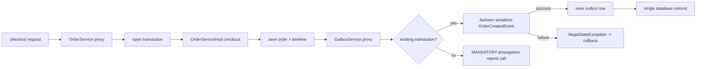

# Java Runtime Interactions With Spring, Hibernate And Jackson

<DocLabels items={[
  {label: 'Advanced', tone: 'advanced'},
  {label: 'Framework boundaries', tone: 'production'},
  {label: 'Shopverse runtime', tone: 'shopverse'},
]} />

<DocCallout type="mistake" title="Proxy boundaries change semantics">
Self-invocation, thread changes, detached entities, and serializer access can bypass the
transaction, security, lazy-loading, or type assumptions that source code appears to make.
</DocCallout>

## Spring Threads And Context

Spring MVC request work can use platform or supported virtual-thread executors.
Virtual threads simplify blocking code but do not enlarge JDBC pools. MDC,
security context, locale and transaction state often rely on thread-bound context;
crossing `@Async`, `CompletableFuture` or custom executors requires deliberate
capture/restore and cleanup. Never propagate a live transaction to arbitrary
parallel tasks: connection/entity-manager ownership and commit semantics are not
made thread-safe.

`@Transactional` and other AOP advice normally execute through a proxy. Self-
invocation bypasses that proxy, private/final method constraints depend on proxy
strategy, and exceptions caught inside the method may prevent rollback signaling.

## Shopverse Checkout Transaction Boundary

Shopverse keeps order creation and its integration event in one database
transaction. `OrderServiceImpl.checkout` enters through the Spring transaction
proxy, writes the order and timeline, then calls the separate `OutboxService`
bean. Its `MANDATORY` propagation joins the existing transaction; it does not
open an independent commit boundary.



The production shape is intentionally split across two proxied beans:

```java
@Transactional
public OrderResponse checkout(...) {
    OrderEntity saved = repository.save(order);
    appendTimeline(saved, OrderTimelineStage.ORDER_CREATED,
            "Checkout accepted and order persisted");
    outboxService.enqueue(..., new OrderCreatedEvent(...), correlationId);
    return OrderMapper.toResponse(saved);
}

@Transactional(propagation = Propagation.MANDATORY)
public void enqueue(..., Object event, ...) {
    repository.save(new OutboxEvent(
            ..., objectMapper.writeValueAsString(event), ...));
}
```

`OutboxService` converts Jackson's checked `JsonProcessingException` to an
`IllegalStateException`, so Spring's default runtime-exception rule rolls back
the order, timeline and outbox work together. Moving `enqueue` to an annotated
helper invoked on `this` would lose this proxy boundary; catching the runtime
exception in `checkout` could also allow an incomplete transaction to commit.

## Hibernate Identity And Proxies

Entity equality must survive transient, managed, detached and proxied states.
Database-generated IDs are null before persistence; mutable business fields make
dangerous hash keys; strict `getClass()` can conflict with proxies. Choose and
document an identity strategy, avoid entities as map keys across lifecycle changes,
and keep lazy relationships out of generated `toString`/`equals`.

Lazy access outside a session fails or causes hidden N+1 queries. DTO projection
and explicit fetch plans are preferable to serializing persistence graphs.

## Jackson, Records And Sealed Types

Records work well as DTOs when canonical-constructor validation, property names
and unknown-field policy are explicit. They are shallowly immutable. Sealed
polymorphic models still require secure subtype configuration; never enable broad
default typing for untrusted JSON. API schemas need discriminators and backward-
compatible subtype evolution.

## Async Failure Boundary

Spring exception handlers operate on request-thread/controller failures, not
automatically on background futures. A returned async type must preserve failure,
timeout and cancellation until the web/framework adapter observes it. Fire-and-
forget work needs durable messaging or explicit failure storage—not only logging.

## Tricky Interview Questions

<ExpandableAnswer title="Why may @Transactional self-invocation not start a transaction?">

Proxy advice is bypassed.

</ExpandableAnswer>

<ExpandableAnswer title="Can an entity with generated ID safely be a HashSet member before and after persist?">

Often no; its hash/equality can change.

</ExpandableAnswer>

<ExpandableAnswer title="Do virtual threads make one Hibernate session safe across tasks?">

No.

</ExpandableAnswer>

<ExpandableAnswer title="Are records deeply immutable?">

No.

</ExpandableAnswer>

<ExpandableAnswer title="Does @Async carry MDC/security/transaction state automatically for every executor?">

No.

</ExpandableAnswer>


## Official References

- [Spring transaction documentation](https://docs.spring.io/spring-framework/reference/data-access/transaction/declarative.html)
- [Hibernate user guide](https://docs.hibernate.org/orm/current/userguide/html_single/)
- [Jackson records support](https://github.com/FasterXML/jackson-databind)

## Recommended Next

Continue with [Java Production Incident Walkthroughs](./JAVA-PRODUCTION-INCIDENTS.md).
