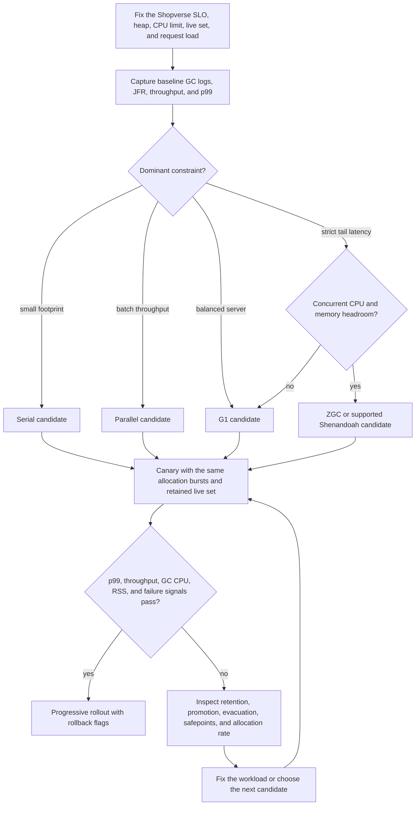

# JVM Garbage Collectors For Architects

<DocLabels items={[
  {label: 'Advanced', tone: 'advanced'},
  {label: 'Collector selection', tone: 'production'},
  {label: 'Evidence-driven', tone: 'shopverse'},
]} />

<DocCallout type="production" title="Choose a collector against an SLO">
Name the latency, throughput, footprint, startup, and CPU constraints first. Collector
reputation is not a substitute for comparable workload measurements.
</DocCallout>

Collector selection is an SLO and capacity decision. Compare the same live set,
allocation rate, heap/container limit and request load; never compare marketing
pause claims from unrelated workloads.

## Shared Mechanics

Collectors find live objects from roots, maintain reachability while the
application mutates references, reclaim dead space, and sometimes relocate live
objects. Generational collectors exploit the weak generational hypothesis.
Write barriers/card tables/remembered sets avoid scanning all old objects for
young references. Concurrent collectors require barriers to preserve marking or
relocation invariants. Safepoints coordinate phases requiring a consistent VM view.

## Serial GC

Serial uses one GC worker and stop-the-world collection. Its low coordination
overhead fits small heaps, constrained CPUs and short-lived tools. It is unsuitable
for large latency-sensitive heaps because pause work cannot use multiple cores.
Select it deliberately for footprint/simplicity, not because “single threaded”
means universally slow.

## Parallel GC

Parallel uses multiple workers during stop-the-world young and old collections,
optimizing application throughput. It is appropriate for batch/compute workloads
with pause tolerance. More GC threads consume CPU and can interfere under container
quotas. Tune from throughput and pause evidence, with adequate old-generation
headroom to prevent expensive full collections.

## G1

G1 divides the heap into regions. Young evacuations copy survivors; concurrent
marking estimates old-region liveness; mixed collections combine young regions
with selected old regions. Remembered sets track cross-region references. The
pause target guides region selection—it is not a deadline.

Humongous objects occupy special region sequences and can increase fragmentation
or trigger earlier cycles. Evacuation failure indicates insufficient destination
space during copying; inspect live-set/headroom, region pressure and allocation,
not just increase pause targets blindly.

## ZGC

ZGC performs marking and relocation mostly concurrently, using colored/metadata
references and load barriers whose implementation evolves by JDK. Pauses remain
small across large heaps, while concurrent CPU and memory headroom are required.
Generational ZGC changes young/old behavior in current releases; document the exact
JDK. It is attractive for strict tail latency when sufficient CPU/headroom exists.

## Shenandoah

Shenandoah performs concurrent marking and evacuation using forwarding/barrier
techniques, aiming for pause times weakly related to heap size. Availability and
support depend on the JDK distribution. Degenerated/full fallback indicates the
concurrent collector could not keep up or obtain space; diagnose allocation,
live set and headroom.

## Selection Matrix

| Requirement | Starting candidate |
|---|---|
| tiny heap/tool/one CPU | Serial |
| maximum batch throughput, pauses tolerated | Parallel |
| balanced server default | G1 |
| very low pauses and large heap | ZGC |
| low pauses with supported distribution | Shenandoah |

## Evidence-Gated Collector Selection



The diagram adds an evidence loop to the starting-candidate matrix: a lower pause
number is not a win if RSS, concurrent CPU, throughput, or fallback collections
violate another operating limit.

### Executable Shopverse allocation diagnostic

The following workload models bursty checkout DTO allocation plus a bounded set of
promoted order payloads. It is intentionally repeatable rather than realistic in
every detail, so use it to learn the logs and reject unsuitable collector/heap
combinations, not to publish universal collector rankings. Save it as
`ShopverseGcDiagnostic.java`.

```java
import java.util.ArrayDeque;
import java.util.Deque;

public final class ShopverseGcDiagnostic {
    private static final Deque<byte[]> RETAINED_ORDERS = new ArrayDeque<>();
    private static volatile long sink;

    public static void main(String[] args) throws Exception {
        int rounds = args.length > 0 ? Integer.parseInt(args[0]) : 80;
        int ordersPerRound = args.length > 1 ? Integer.parseInt(args[1]) : 3_000;
        long allocatedBytes = 0;

        for (int round = 0; round < rounds; round++) {
            int burst = ordersPerRound + (round % 10 == 0 ? ordersPerRound : 0);
            for (int order = 0; order < burst; order++) {
                int bytes = 2_048 + ((round * 31 + order) & 4_095);
                byte[] checkoutPayload = new byte[bytes];
                checkoutPayload[0] = (byte) round;
                checkoutPayload[bytes - 1] = (byte) order;
                sink += checkoutPayload[0] + checkoutPayload[bytes - 1];
                allocatedBytes += bytes;

                if ((order & 63) == 0) RETAINED_ORDERS.addLast(checkoutPayload);
            }

            while (RETAINED_ORDERS.size() > 2_048) RETAINED_ORDERS.removeFirst();
            if (round % 10 == 0) {
                System.out.printf("round=%d retained=%d allocatedMiB=%.1f%n",
                        round, RETAINED_ORDERS.size(), allocatedBytes / 1_048_576.0);
            }
            Thread.sleep(20); // separates request-like bursts; it is not a correctness proof
        }

        System.out.printf("done retained=%d allocatedMiB=%.1f sink=%d%n",
                RETAINED_ORDERS.size(), allocatedBytes / 1_048_576.0, sink);
    }
}
```

Compile once, then run one collector at a time with the same JDK, heap, CPU quota,
arguments, and otherwise-idle host:

```bash
javac ShopverseGcDiagnostic.java
java -Xms256m -Xmx256m -XX:+UseG1GC -Xlog:gc*,safepoint:file=g1-gc.log:time,uptime,level,tags ShopverseGcDiagnostic 80 3000
java -Xms256m -Xmx256m -XX:+UseZGC -Xlog:gc*,safepoint:file=zgc.log:time,uptime,level,tags ShopverseGcDiagnostic 80 3000
```

Compare completed work and elapsed time together with pause distribution, GC CPU,
post-collection live set, cycle frequency, promotion/evacuation warnings and process
RSS. Change one variable at a time. Run long enough to reach steady state before a
real migration decision, and keep rollback flags because this fixture cannot model
Shopverse dependencies, cache retention, object graphs or production concurrency.

## Migration And Logs

Enable `-Xlog:gc*,safepoint` and capture JFR. Compare allocation rate, live-set
after collection, application throughput, p95/p99, pause causes, concurrent GC
CPU, promotion/evacuation failures and RSS. Roll out under representative traffic
with rollback flags. A collector change cannot fix unbounded caches or retained
class loaders.

## Tricky Interview Questions

<ExpandableAnswer title="Is G1's pause target guaranteed?">

No.

</ExpandableAnswer>

<ExpandableAnswer title="Why might ZGC worsen throughput?">

Concurrent barriers/work consume CPU and headroom.

</ExpandableAnswer>

<ExpandableAnswer title="Does “full GC” mean identical work for every collector?">

No.

</ExpandableAnswer>

<ExpandableAnswer title="What causes evacuation failure?">

Insufficient suitable destination space while live objects must move.

</ExpandableAnswer>

<ExpandableAnswer title="Why can adding heap increase latency?">

More live data/longer cycles and less container headroom may result.

</ExpandableAnswer>


## Official References

- [HotSpot GC tuning guide](https://docs.oracle.com/en/java/javase/25/gctuning/)
- [JEP 439: Generational ZGC](https://openjdk.org/jeps/439)
- [Shenandoah project](https://openjdk.org/projects/shenandoah/)

## Recommended Next

Run the collector workload from [Executable Labs](./JAVA-EXECUTABLE-LABS.md).
