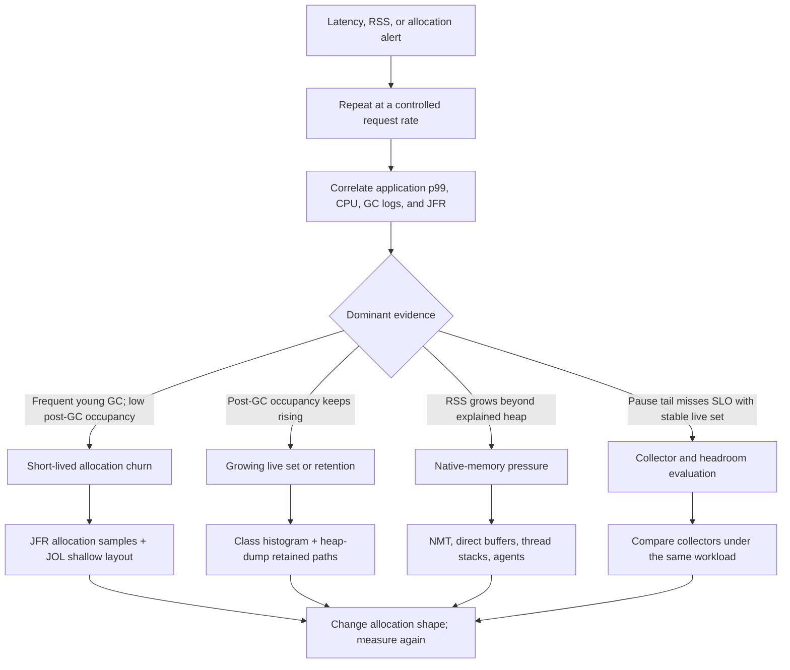

# Java Object Layout, Allocation And Garbage Collectors

<DocLabels items={[
  {label: 'Advanced', tone: 'advanced'},
  {label: 'JOL + JFR', tone: 'intermediate'},
  {label: 'Allocation diagnostics', tone: 'production'},
]} />

<DocCallout type="tip" title="Separate shallow size from retained impact">
One small object can retain a large graph, while many short-lived objects can create
high allocation pressure without remaining reachable. Measure both questions.
</DocCallout>

## Layout And Allocation

HotSpot objects commonly contain a mark word, class metadata pointer, fields and
alignment padding. Exact layout depends on JVM, flags and class shape. Compressed
ordinary/class pointers reduce reference/header width within supported heap ranges.
Field packing and alignment create non-obvious shallow sizes; arrays add length
and element storage. Verify with JOL rather than mental arithmetic.

Most small objects allocate through a thread-local allocation buffer using a
pointer bump. TLAB refill or large allocation takes a slower shared path. Escape
analysis may enable scalar replacement and lock elimination after JIT compilation,
but source allocation is not proof of runtime allocation—or elimination.

## Reachability And Barriers

Collectors trace from GC roots including live stacks, JNI handles and statics of
loaded classes. Cycles without a root are collectible. Generational/concurrent
collectors use write/load barriers, card tables or remembered sets to track cross-
region/generation references and maintain marking invariants.

## Collector Matrix

| Collector | Primary target | Architectural trade-off |
|---|---|---|
| Serial | small/simple heaps | single GC worker and longer pauses |
| Parallel | throughput | stop-the-world parallel work |
| G1 | balanced regional collector | young/mixed cycles, pause target is a goal |
| ZGC | very low pauses, large heaps | concurrent work and CPU/headroom requirements |
| Shenandoah | low pauses | concurrent evacuation/marking trade-offs and distribution support |

Young collections reclaim recent regions. G1 mixed collections add selected old
regions after marking. “Full GC” is a high-cost fallback/whole-heap condition whose
exact behavior is collector-specific. Promotion/evacuation failure means the
collector could not move objects as planned, often due to fragmentation/headroom
or allocation/live-set pressure. Humongous objects can receive special regional
handling and should be diagnosed from logs, not guessed.

## Selection And Log Analysis

Choose from SLO, live set, allocation rate, heap/container size, CPU headroom and
operational support. Enable unified logging, correlate timestamps with application
latency, and examine pause percentiles, causes, before/after occupancy, concurrent
cycle time, allocation/promotion and safepoint time. Average pause alone hides tails.

```text
-Xlog:gc*,safepoint:file=gc.log:time,uptime,level,tags
```

## Evidence-First GC And Layout Workflow

Object layout, retention, native growth, and collector behavior answer different
questions. Start from an observed service symptom and choose the measurement that
can distinguish them.



## Shopverse Diagnostic: Promotion Calculation Allocation Storm

Assume the cart pricing endpoint is held at 600 requests/second and p99 spikes
regularly. Unified logs show young collections roughly every 300 ms while
post-collection old occupancy returns to the same baseline. That pattern argues
for short-lived churn, not a reachable-object leak. A JFR allocation profile
then identifies temporary `PromotionCandidate` objects and per-item maps as the
dominant allocation sites.

On a controlled replica, combine runtime evidence with layout inspection:

```bash
jcmd <pid> JFR.start name=pricing-allocation settings=profile duration=120s filename=pricing-allocation.jfr
jcmd <pid> GC.class_histogram
java -jar jol-cli.jar internals io.shopverse.pricing.PromotionCandidate
```

The histogram estimates live instance counts at that moment; JFR locates
allocation-producing code; JOL explains the candidate's shallow layout and
padding. None alone proves retained size. If the team removes unnecessary
intermediate maps and stops materializing rejected candidates, rerun at the same
600 requests/second and compare allocation rate, young-GC frequency, CPU, and
p99. Changing collectors first would not establish whether object churn was the
cause. Run intrusive histograms or heap dumps only where their pause and I/O cost
is acceptable.

## Lab

Run the same allocation/live-set workload with G1 and a low-pause collector.
Hold request rate constant. Capture JFR, GC logs, RSS and CPU. Report application
throughput and p99, not just GC pause. Use JOL for layout and a heap dump for
retained size; shallow size does not include reachable graphs.

## Tricky Interview Questions

<ExpandableAnswer title="Does shallow size include reachable objects?">

No. Shallow size covers one object's header, fields, references, and padding. Retained
size concerns the graph kept alive through it.

</ExpandableAnswer>

<ExpandableAnswer title="Can a collector repair a reachable-object leak?">

No. Collectors reclaim unreachable objects. A cache, listener, thread local, static, or
class loader that still owns the graph must be fixed at the lifecycle boundary.

</ExpandableAnswer>

<ExpandableAnswer title="Why can object pooling hurt?">

Pool coordination, stale mutable state, larger live sets, locality loss, and reset bugs
can cost more than allocating short-lived objects.

</ExpandableAnswer>

## Official References

- [HotSpot GC tuning guide](https://docs.oracle.com/en/java/javase/25/gctuning/)
- [Java Object Layout](https://openjdk.org/projects/code-tools/jol/)
- [Unified logging](https://docs.oracle.com/en/java/javase/25/docs/specs/man/java.html)

## Recommended Next

Continue with [JVM Profiling, GC And Native Memory](./JVM-PROFILING-GC-NATIVE.md).
