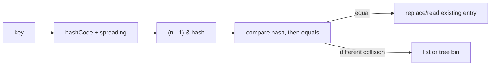

# HashMap, ConcurrentHashMap And Iterator Internals


## HashMap Write And Lookup

`HashMap` spreads the key hash, selects a power-of-two bucket, then compares hash and equality within that bucket. A matching key replaces the value; it does not create a duplicate key. `HashSet` uses keys of an internal map, so an equal element is ignored.



The default load factor is `0.75`; threshold is approximately `capacity * loadFactor`. Crossing it triggers resize. Heavy collisions may treeify a sufficiently large bin when table capacity and bin thresholds are met. Treeification limits worst-case collision behavior but does not excuse poor hash functions.

```java
record CustomerKey(String tenantId, long customerId) {}
Map<CustomerKey, String> names = new HashMap<>(1_024);
names.put(new CustomerKey("eu", 42), "Asha");
```

Size capacity from expected entries when large maps are known in advance. Never use a mutable key whose equality fields can change after insertion.

## ConcurrentModificationException

Most ordinary collection iterators are fail-fast on a best-effort basis. Structural modification outside that iterator can make its expected modification count differ and cause `ConcurrentModificationException` (CME). The name is misleading: the same thread can trigger it, and cross-thread modification is not guaranteed to trigger it.

```java
for (var item : items) {
    if (item.expired()) {
        // items.remove(item); // unsafe during this traversal
    }
}
items.removeIf(Item::expired); // supported operation
```

Safe choices include `Iterator.remove`, bulk operations such as `removeIf`, collecting removals for later, or a collection with suitable iteration semantics. Do not catch CME and retry as a correctness strategy.

`CopyOnWriteArrayList` iterates a snapshot. `ConcurrentHashMap` iterators are weakly consistent: they do not throw CME and may observe some concurrent updates, without representing one atomic snapshot.

## ConcurrentHashMap Internals

Modern `ConcurrentHashMap` no longer uses Java 7's fixed `Segment` architecture. Reads are normally nonblocking; empty-bin insertion can use CAS; contended bin updates synchronize at bin level; tree bins handle dense collisions. Resizing is cooperative, allowing multiple threads to transfer bins.

```java
ConcurrentHashMap<String, LongAdder> counts = new ConcurrentHashMap<>();
counts.computeIfAbsent(productId, ignored -> new LongAdder()).increment();
```

Compound behavior must use atomic map operations (`putIfAbsent`, `compute`, `merge`, `replace`) or external coordination. A `get` followed by `put` is a race. Mapping functions should be short, deterministic, and avoid recursively updating the same map; slow I/O can serialize contenders on a hot bin.

`ConcurrentHashMap` rejects null keys and values so `null` from `get` can unambiguously mean absent. It provides happens-before visibility from a completed update for a key to a subsequent successful retrieval of that key.

## Selection Guide

| Need | Choice |
|---|---|
| single-threaded/general map | `HashMap` |
| insertion/access order or bounded LRU building block | `LinkedHashMap` |
| sorted keys/range queries | `TreeMap` |
| concurrent key operations | `ConcurrentHashMap` |
| sorted concurrent map | `ConcurrentSkipListMap` |
| read-mostly tiny list | `CopyOnWriteArrayList` |

## Tricky Interview Questions

<ExpandableAnswer title="Is CME a thread-safety mechanism?">

No; it is best-effort bug detection.

</ExpandableAnswer>

<ExpandableAnswer title="What happens if only equals is overridden?">

Equal keys can occupy different buckets.

</ExpandableAnswer>

<ExpandableAnswer title="Does ConcurrentHashMap lock the whole map?">

Not for normal reads or independent-bin updates.

</ExpandableAnswer>

<ExpandableAnswer title="Is map.get(k) + map.put(k, v) atomic?">

No.

</ExpandableAnswer>

<ExpandableAnswer title="Can a weakly consistent iterator see newly inserted entries?">

It may see some; no snapshot guarantee exists.

</ExpandableAnswer>


## Official References

- [HashMap API](https://docs.oracle.com/en/java/javase/25/docs/api/java.base/java/util/HashMap.html)
- [ConcurrentHashMap API](https://docs.oracle.com/en/java/javase/25/docs/api/java.base/java/util/concurrent/ConcurrentHashMap.html)
- [ConcurrentModificationException API](https://docs.oracle.com/en/java/javase/25/docs/api/java.base/java/util/ConcurrentModificationException.html)

## Recommended Next

Continue with [Thread Coordination And Monitors](./JAVA-THREAD-COORDINATION.md).
