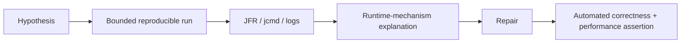

# Java Internals Hands-On Labs

Run each lab with a pinned JDK and bounded heap. Record JDK, flags, hardware,
workload and raw evidence.

| Lab | Experiment | Evidence |
|---|---|---|
| bytecode | compile lambdas, generic override and synchronization | `javap -c -v -p` |
| JIT | warm polymorphic call sites then change types | JFR compilation/deoptimization |
| allocation | allocate short-lived and retained graphs | JFR allocation, GC logs, histogram |
| native memory | heap, direct buffers and threads | `jcmd VM.native_memory` |
| memory model | unsafe versus safe publication stress | observed outcomes plus HB proof |
| AQS | fair/nonfair lock contention | throughput, wait distribution, JFR locks |
| fork/join | blocking common-pool task | worker starvation and dedicated executor fix |
| virtual threads | supported blocking and monitor pinning | JFR pinning/carrier occupation |
| NIO | partial framed reads and direct buffers | correctness, CPU, throughput, native memory |
| JMH | broken elimination/folding benchmark | fixed forks/warmup/Blackhole result |

Failure labs must end automatically, dump diagnostics and assert the repaired
variant. Never use arbitrary sleeps as the correctness proof.

## Safety And Operations

Run only against disposable processes with CPU, heap, native-memory and duration
limits. Heap dumps and recordings can contain secrets and user data; store them in
restricted temporary locations and delete them after analysis. Separate correctness
assertions from performance thresholds so a slower CI host does not hide a race or
produce meaningless nanosecond failures.

For every lab capture the failure signature, expected mechanism, repaired result,
resource ceiling and cleanup evidence. A production recommendation requires an
application-level load test in addition to any JMH microbenchmark.

## Tricky Interview Questions

1. Why is one benchmark run insufficient? Warm-up, forks, variance and environment alter results.
2. What makes a lab architectural evidence? A falsifiable invariant, controlled variables and rejected alternatives.

## Official References

- [JDK diagnostic tools](https://docs.oracle.com/en/java/javase/25/troubleshoot/diagnostic-tools.html)
- [JMH](https://openjdk.org/projects/code-tools/jmh/)
- [JEP 444 — Virtual Threads](https://openjdk.org/jeps/444)

## Recommended Next Page

Continue with [Spring Internals Hands-On Labs](../spring/SPRING-INTERNALS-LABS.md).
