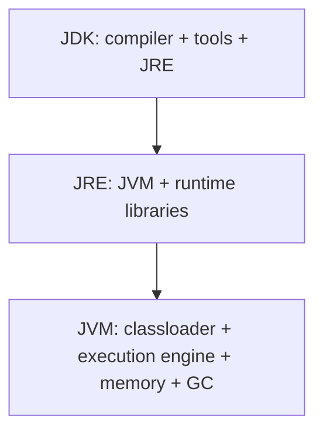
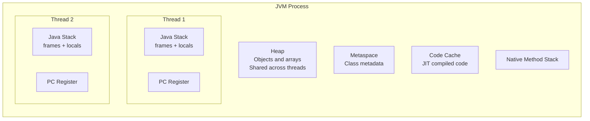
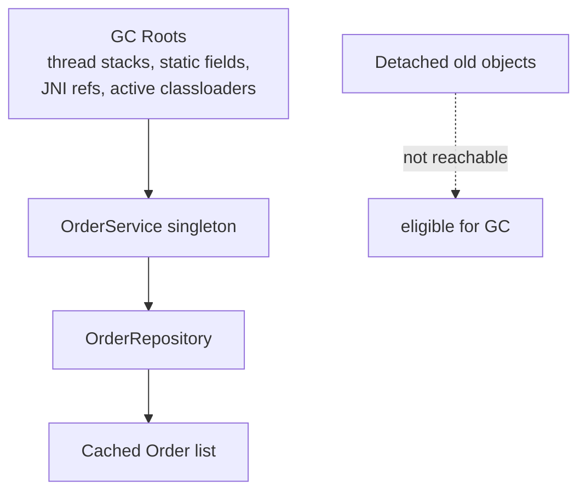

# JVM Memory Model


*The Java heap is only part of process memory. Container limits must also cover
thread stacks, metaspace, compiled code, direct buffers, GC structures, agents,
JNI libraries, and sidecars.*

The JVM divides runtime memory into areas with different ownership and
lifetime. Understanding these areas helps with memory leaks, stack overflows,
GC tuning, and performance debugging.



## Runtime Areas



| Area | Stores | Common issue |
|---|---|---|
| Heap | objects and arrays | memory leak, high GC |
| Stack | method frames and local variables | `StackOverflowError` |
| Metaspace | class metadata | classloader leak |
| Code cache | JIT-compiled native code | code cache full warnings |
| PC register | current instruction per thread | rarely tuned directly |
| Native stack | JNI/native calls | native memory pressure |

The specification defines logical runtime data areas; exact heap regions,
collectors, TLAB layout, code cache, and native-memory accounting are JVM
implementation details. Confirm them for the deployed JDK and collector.

## Heap And GC

Most Java objects live on the heap. Garbage collection frees objects that are
no longer reachable from GC roots such as thread stacks, static fields, JNI
references, and active classloaders.



An object is not collected just because it is old. It is collected when it is
unreachable. Memory leaks in Java usually mean objects are still reachable from
some long-lived reference, such as a static map, cache, thread-local, listener
list, or unbounded collection.

Common production signals:

- growing heap after full GC means possible leak;
- frequent young GC means high allocation rate;
- long pause times can affect latency;
- too many threads increase stack/native memory.

## Young And Old Generations

Most JVM collectors optimize for the fact that many objects die young.

Typical object lifecycle:

```text
new object -> young generation -> survives several GCs -> old generation
```

Short-lived request DTOs, stream objects, and temporary collections often die
in young generation. Long-lived caches, Spring singleton beans, and metadata
remain reachable longer.

You do not normally tune generations first. First check:

- allocation rate;
- heap usage after full GC;
- GC pause percentiles;
- object retention paths from a heap dump;
- unbounded caches/collections.

## Metaspace

Metaspace stores class metadata. In Spring Boot applications, metaspace grows
with loaded classes, generated proxies, reflection metadata, and frameworks.

Metaspace leaks are usually classloader leaks. They are more common in
application servers, plugin systems, repeated hot reloads, or tools that
generate many classes dynamically.

## Direct And Native Memory

Not all JVM memory is heap.

Native memory can include:

- thread stacks;
- direct `ByteBuffer`;
- memory used by Netty;
- memory-mapped files;
- JVM internal structures;
- native libraries.

This matters in containers. A Java process can be killed by the container even
when heap looks fine because total process memory exceeds the container limit.

## Common Diagnostic Commands

```bash
jcmd <pid> VM.native_memory summary
jcmd <pid> GC.heap_info
jcmd <pid> Thread.print
jmap -dump:live,format=b,file=heap.hprof <pid>
```

Use heap dumps carefully in production because they can be large and may contain
sensitive data.

## Stack

Each platform thread owns a stack. Recursive calls or very deep call chains can
overflow it:

```java
void recurse() {
    recurse();
}
```

Virtual threads are lighter, but they still need safe blocking boundaries and
bounded downstream resources.

## JVM Memory In Containers

For Docker/Kubernetes, memory planning must include more than heap:

```text
container memory
  = heap
  + metaspace
  + thread stacks
  + direct/native memory
  + code cache
  + JVM overhead
```

Example:

```bash
java -XX:MaxRAMPercentage=70 -jar app.jar
```

This lets the JVM size heap based on container memory. Do not set heap to 100%
of container memory because the JVM also needs non-heap memory.

## Interview Questions

### Where are objects stored?

<ExpandableAnswer>

Usually on the heap, although the JVM may optimize allocations internally.

</ExpandableAnswer>

### Where are local variables stored?

<ExpandableAnswer>

Primitive local values and object references are held in stack frames; the
objects referenced by those variables usually live on the heap.

</ExpandableAnswer>

### What causes `OutOfMemoryError`?

<ExpandableAnswer>

Exhaustion can occur in the heap, metaspace, direct memory, thread or native
memory, or because the garbage collector exceeds its overhead limit.

</ExpandableAnswer>

### What causes `StackOverflowError`?

<ExpandableAnswer>

Deep recursion or excessive call depth exhausts the stack allocated to one
thread.

</ExpandableAnswer>

## Official References

- [JVMS §2.5 — Run-Time Data Areas](https://docs.oracle.com/javase/specs/jvms/se25/html/jvms-2.html#jvms-2.5)
- [Java Troubleshooting Guide — Native Memory Tracking](https://docs.oracle.com/en/java/javase/25/vm/native-memory-tracking.html)
- [Java Flight Recorder Runtime Guide](https://docs.oracle.com/en/java/javase/25/jfapi/flight-recorder-runtime-guide.html)
