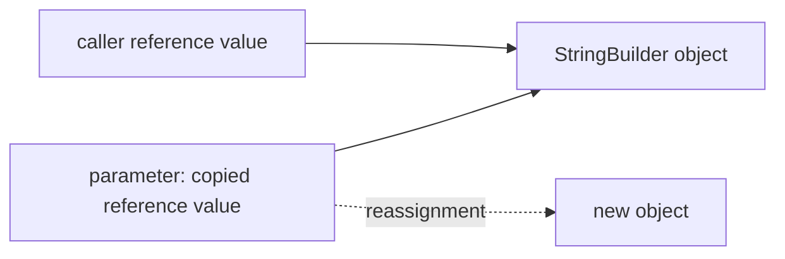

# Java Language Semantics And Interview Traps

## Casting And Numeric Promotion

Widening (`byte -> short -> int -> long -> float -> double`) is normally implicit; narrowing requires a cast and can discard magnitude or precision. Arithmetic promotes `byte`, `short`, and `char` operands to `int`.

```java
byte a = 10, b = 20;
// byte sum = a + b;       // compile error: expression is int
byte sum = (byte) (a + b);

final int constant = 100;
byte allowed = constant;  // constant-expression narrowing when representable
```

Reference upcasting is safe. Downcasting is checked at runtime; use pattern matching when the runtime type is uncertain.

```java
Object value = "shopverse";
if (value instanceof String text) {
    System.out.println(text.length());
}
```

## Overload Resolution

The useful interview order is: exact match, primitive widening, boxing/unboxing, applicable reference widening, then varargs. Java chooses an overload at compile time from the declared argument types.

```java
static String pick(long x)    { return "long"; }
static String pick(Integer x) { return "Integer"; }
static String pick(int... x)  { return "varargs"; }

pick(1);           // long: widening beats boxing
pick(Integer.valueOf(1)); // Integer
```

`null` selects the most specific applicable reference overload. Unrelated candidates such as `String` and `Integer` make the call ambiguous.

## Overriding Rules And Exceptions

An overriding method may widen access, return a covariant subtype, and declare the same, narrower, or no checked exception. It cannot add a broader checked exception. Unchecked exceptions are not restricted by that rule. Static methods are hidden, not overridden.

```java
class Parent {
    Number load() throws java.io.IOException { return 1; }
}
class Child extends Parent {
    @Override public Integer load() throws java.io.FileNotFoundException { return 2; }
}
```

The method name never “contains” an exception; the `throws` clause is part of the method contract but not its signature for overload uniqueness.

## Java Is Always Pass-By-Value

For an object, the copied value is a reference. Both variables can reach the same object, but reassigning the parameter cannot change the caller's variable.

```java
static void change(StringBuilder b) {
    b.append("!");                    // mutates shared object
    b = new StringBuilder("other");   // changes local copy only
}
var original = new StringBuilder("order");
change(original);                     // original is "order!"
```



## Variance And PECS

Generics are invariant: `List<Integer>` is not a `List<Number>`. `? extends T` is a producer you mainly read from; `? super T` is a consumer you can add `T` to. Arrays are covariant and therefore can fail later with `ArrayStoreException`; generics reject the unsafe assignment at compile time.

```java
static double total(java.util.List<? extends Number> values) { return values.stream().mapToDouble(Number::doubleValue).sum(); }
static void addDefaults(java.util.List<? super Integer> out) { out.add(1); }
```

## Tricky Interview Questions

<ExpandableAnswer title="Why does byte + byte produce int?">

Numeric promotion is defined before assignment.

</ExpandableAnswer>

<ExpandableAnswer title="Does runtime object type choose an overload?">

No; overriding dispatch is runtime, overloading is compile-time.

</ExpandableAnswer>

<ExpandableAnswer title="Can an override throw Exception when its parent throws IOException?">

No.

</ExpandableAnswer>

<ExpandableAnswer title="Can Java swap two caller references through a method?">

No; it receives copies.

</ExpandableAnswer>

<ExpandableAnswer title="Why is List&lt;String&gt; not a List&lt;Object&gt;?">

Otherwise adding an `Integer` would violate its element type.

</ExpandableAnswer>


## Official References

- [JLS conversions and contexts](https://docs.oracle.com/javase/specs/jls/se25/html/jls-5.html)
- [JLS methods](https://docs.oracle.com/javase/specs/jls/se25/html/jls-8.html#jls-8.4)

## Recommended Next

Continue with [Abstraction And Interfaces](./JAVA-ABSTRACTION-INTERFACES.md).
