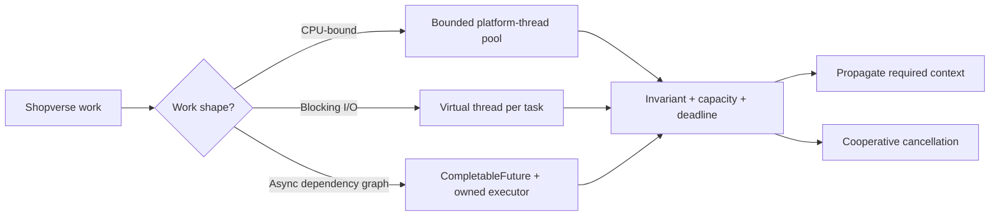

# Java Multithreading

<DocLabels items={[
  {label: 'Advanced', tone: 'advanced'},
  {label: 'Production design', tone: 'production'},
  {label: 'Shopverse examples', tone: 'shopverse'},
]} />

Multithreading is not a reason to start with `Thread`. Start with the work shape,
the shared-state invariant, and the resource that limits concurrency. Then choose
an execution model and define context, deadline, cancellation, and shutdown
ownership.



Concurrency means tasks can make overlapping progress; parallelism means work
actually runs at the same instant. Neither provides correctness. Correctness
comes from ownership, safe publication, atomic state transitions, and bounded
resource use.

## Choose The Focused Guide

<TopicCards items={[
  {title: 'Thread creation and scheduling', href: '/java/JAVA-THREAD-CREATION-SCHEDULING', description: 'Understand start, join, platform threads, and scheduler behavior.', icon: 'route', tags: ['Lifecycle', 'Scheduling']},
  {title: 'Java Memory Model', href: '/java/advanced-internals/JAVA-MEMORY-MODEL', description: 'Reason about visibility, ordering, and safe publication through happens-before edges.', icon: 'brain', tags: ['JMM', 'Shared state']},
  {title: 'Thread coordination', href: '/java/JAVA-THREAD-COORDINATION', description: 'Choose monitors, conditions, queues, and higher-level coordination utilities.', icon: 'network', tags: ['Locks', 'Coordination']},
  {title: 'Executors and thread pools', href: '/java/JAVA-EXECUTORS-THREAD-POOLS', description: 'Own workers, queues, rejection, saturation metrics, and shutdown.', icon: 'gauge', tags: ['Capacity', 'Lifecycle']},
  {title: 'CompletableFuture', href: '/java/JAVA-COMPLETABLE-FUTURE', description: 'Compose dependent and independent stages with explicit failure handling.', icon: 'route', tags: ['Async', 'Failures']},
  {title: 'Virtual threads', href: '/java/features-8-to-26/JAVA-VIRTUAL-THREADS', description: 'Use cheap blocking tasks without forgetting downstream resource limits.', icon: 'layers', tags: ['Java 21+', 'Blocking I/O']},
  {title: 'Context propagation', href: '/java/threading/THREAD-CONTEXT-PROPAGATION', description: 'Carry correlation, identity, and locale safely across execution boundaries.', icon: 'network', tags: ['Observability', 'Security']},
  {title: 'Cancellation and deadlines', href: '/java/threading/TASK-CANCELLATION-DEADLINES', description: 'Coordinate timeouts, interruption, cleanup, and durable side effects.', icon: 'security', tags: ['Timeouts', 'Shutdown']},
  {title: 'Concurrency design review', href: '/java/JAVA-CONCURRENCY-DESIGN-REVIEW', description: 'Prove invariant, admission, cancellation, and lifecycle decisions before release.', icon: 'book', tags: ['Review', 'Production']},
]} />

This page intentionally does not repeat the dedicated deadlock, race-condition,
atomic, executor, virtual-thread, or `CompletableFuture` material.

<DocCallout type="production" title="Capacity is still finite">
More runnable tasks do not create more database connections, sockets, CPU, or
provider quota. Size concurrency against the tightest downstream limit and
measure queue delay before increasing it.
</DocCallout>

## Shopverse Boundary Example

A checkout read can fan out to order, inventory, and payment services because
the calls are independent reads. The design still needs an overall deadline,
per-client timeouts, an owned execution mechanism, explicit correlation context,
and a concurrency limit aligned with connection pools.

```java
record RequestContext(String correlationId, Instant deadline) {}

RequestContext context = new RequestContext(
        correlationId, Instant.now().plusMillis(800));

Future<InventoryView> inventory = ioExecutor.submit(() ->
        CorrelationContext.call(context.correlationId(),
                () -> inventoryClient.forOrder(orderId)));

try {
    return inventory.get(millisRemaining(context.deadline()), MILLISECONDS);
} catch (TimeoutException timeout) {
    inventory.cancel(true); // a request to stop, not a rollback guarantee
    throw new CheckoutDeadlineExceeded(orderId, timeout);
}
```

The sketch makes two different contracts visible: `CorrelationContext` scopes
logging context around the task, while the deadline bounds how long the owner
waits. The HTTP client and database must also have their own deadlines. If work
changes inventory or payment state, cancellation requires idempotency and saga
compensation rather than assuming an interrupt undoes the change.

## Production Decision Rules

1. Prefer immutable task inputs and avoid shared mutable state.
2. Use bounded platform pools for CPU work; do not hide blocking I/O in the
   common pool.
3. Virtual threads make blocking cheaper, not databases, sockets, or providers
   more scalable.
4. Carry correlation and identity deliberately across thread, executor, and
   message boundaries; never carry an open transaction.
5. Treat interruption as cooperative. Preserve it when the current layer cannot
   complete cancellation.
6. Put deadlines at the request, dependency, and blocking-wait boundaries.
7. Name platform workers, measure queue delay and saturation, and capture thread
   dumps or JFR evidence before changing pool sizes.

## Official References

- [`java.util.concurrent`](https://docs.oracle.com/en/java/javase/25/docs/api/java.base/java/util/concurrent/package-summary.html)
- [JLS 17: Threads And Locks](https://docs.oracle.com/javase/specs/jls/se25/html/jls-17.html)
- [`Thread` API](https://docs.oracle.com/en/java/javase/25/docs/api/java.base/java/lang/Thread.html)
