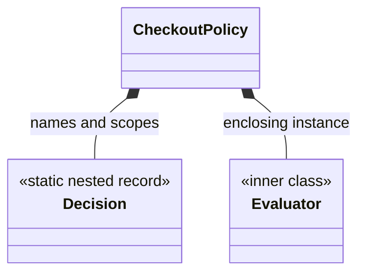

# Java Nested Types, Local Classes And Lambdas

A nested type communicates ownership and limits namespace exposure. Only a non-static
nested class is an *inner class*; static nested classes do not carry an enclosing
instance.



## Four Forms

| Form | Name | Enclosing-instance reference | Typical use |
|---|---|---:|---|
| static nested type | yes | no | helper strongly owned by an API |
| member inner class | yes | yes | behavior inherently tied to one owner instance |
| local class | yes, method-local | captures effectively-final locals | multi-method local implementation |
| anonymous class | no | captures effectively-final locals | one-off subtype with state or multiple methods |

Lambdas are not anonymous inner classes. A lambda supplies behavior for a functional
interface, has different `this` semantics, and is normally the clearer choice for a
stateless callback.

## Static Nested Type: Prefer By Default

```java
final class InventoryReservation {
    private final String reservationId;

    record Line(String sku, int quantity) {
        Line {
            if (quantity <= 0) throw new IllegalArgumentException("quantity");
        }
    }
}
```

`Line` is scoped to the aggregate without retaining an `InventoryReservation` object.
Nested interfaces and records are implicitly static.

## Member Inner Class And Lifetime Coupling

```java
final class RetryBudget {
    private int remaining;

    final class Permit {
        boolean consume() {
            return remaining > 0 && remaining-- > 0;
        }
    }
}
```

Each `Permit` is associated with a specific `RetryBudget`. Holding the inner object can
therefore keep the outer object reachable. Do not use a member inner class merely for
namespacing; make it static when it does not require owner state.

## Local And Anonymous Implementations

Captured local variables must be final or effectively final because the generated
object can outlive the method invocation.

```java
Predicate<Order> aboveLimit(BigDecimal limit) {
    return order -> order.total().compareTo(limit) > 0;
}
```

Use an anonymous class when identity, fields, or several overridden methods are useful:

```java
var listener = new ReservationListener() {
    private int accepted;

    @Override public void onAccepted(String id) { accepted++; }
    @Override public int acceptedCount() { return accepted; }
};
```

Do not serialize anonymous, local, or inner classes as durable contracts. Their binary
shape and synthetic fields are implementation details.

## Access And Bytecode Model

Source-level nested types can access private members of their enclosing declaration.
At the class-file level they remain separate classes, usually named with `$`. Modern
class files use nestmate metadata so related classes can access private members without
the synthetic accessors older compilers commonly emitted.

```powershell
javac CheckoutPolicy.java
javap -v -p CheckoutPolicy.class
javap -v -p 'CheckoutPolicy$Decision.class'
```

Check `NestHost`, `NestMembers`, synthetic capture fields, and constructor parameters.

## Design Rules

- Prefer a static nested type unless an enclosing instance is semantically required.
- Prefer a lambda for a small functional behavior.
- Avoid non-static inner classes in persistence entities and serialization DTOs.
- Keep public nested APIs rare; nesting should clarify ownership, not hide complexity.
- Test captured mutable state for thread-safety just as you would any other shared object.

## Official References

- [JLS 8.1.3: Inner Classes and Enclosing Instances](https://docs.oracle.com/javase/specs/jls/se24/html/jls-8.html#jls-8.1.3)
- [JLS 14.3: Local Class and Interface Declarations](https://docs.oracle.com/javase/specs/jls/se24/html/jls-14.html#jls-14.3)
- [JLS 15.27: Lambda Expressions](https://docs.oracle.com/javase/specs/jls/se24/html/jls-15.html#jls-15.27)
- [JVMS 4.7.28: NestHost](https://docs.oracle.com/javase/specs/jvms/se24/html/jvms-4.html#jvms-4.7.28)

## Recommended Next

Continue with [Abstraction And Interfaces](./JAVA-ABSTRACTION-INTERFACES.md) and
[Java Lambdas](./features-8-to-26/JAVA-LAMBDAS.md).
