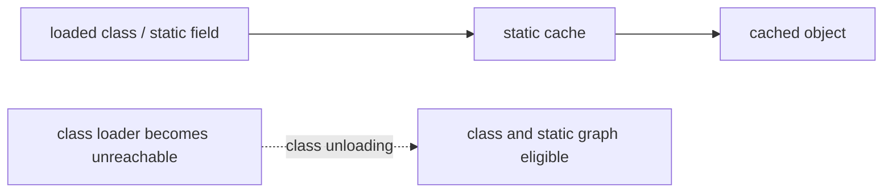

# Java Objects, Strings, Immutability And Garbage Collection

## Identity, Equality And Hashing

`==` compares primitive values or reference identity. `equals` defines logical equality. The contract requires reflexivity, symmetry, transitivity, consistency, and false for `null`. Equal objects must have equal hash codes; unequal objects may collide.

```java
record ProductKey(String tenant, String sku) { }

var prices = new java.util.HashMap<ProductKey, java.math.BigDecimal>();
prices.put(new ProductKey("in", "A1"), new java.math.BigDecimal("10.00"));
prices.get(new ProductKey("in", "A1")); // works because record supplies both contracts
```

If neither method is overridden, identity semantics apply. If only `equals` is overridden, equal keys can land in different buckets and lookup fails. If only `hashCode` is overridden, distinct instances remain unequal. Never mutate fields used by equality while an object is a hash key.

## Custom Immutable Class Rules

- prevent uncontrolled subclassing;
- make observable state private and final;
- validate and defensively copy mutable input;
- never return mutable internals directly;
- ensure methods do not mutate state;
- remember records are only shallowly immutable.

```java
public final class OrderSnapshot {
    private final java.util.List<String> items;
    public OrderSnapshot(java.util.List<String> items) { this.items = java.util.List.copyOf(items); }
    public java.util.List<String> items() { return items; }
}
```

## String Pool And Heap

String literals are canonicalized in the string pool. `new String("x")` creates a distinct object while referring to the same character content. `intern()` returns the canonical pooled reference. Use `equals`, never `==`, for content.

```java
String a = "shop";
String b = "sh" + "op";         // compile-time constant: same pooled reference
String c = new String("shop");   // distinct object
System.out.println(a == b);       // true
System.out.println(a == c);       // false
System.out.println(a.equals(c));  // true
```

Runtime concatenation normally uses compiler-selected builder/concat machinery. Strings are immutable but can retain secrets until GC; prefer `char[]` only where lifecycle control genuinely helps.

## Reachability And Static References

GC starts from roots such as live thread stacks, JNI handles, and static fields of loaded classes. Cycles are collectable when no root reaches them. An object held by a static field remains strongly reachable until the field is cleared or its defining class loader becomes unreachable and the class unloads.



Soft references are cache hints, weak references do not retain keys, and phantom references plus a `ReferenceQueue` support post-mortem cleanup tracking. Avoid finalizers; use explicit lifecycle and `Cleaner` only as a safety net.

## Interview Traps

1. Can a cycle leak forever? Only if reachable from a root.
2. Does `final` make a collection immutable? It prevents reassignment, not mutation.
3. Can unequal objects have identical hashes? Yes.
4. When can a statically referenced object be collected? After clearing the reference or unloading the defining class loader.
5. Is a string literal necessarily “outside the heap”? No; the pool is an implementation-managed heap structure in modern JVMs.

## Official References

- [Object contract](https://docs.oracle.com/en/java/javase/25/docs/api/java.base/java/lang/Object.html)
- [String API](https://docs.oracle.com/en/java/javase/25/docs/api/java.base/java/lang/String.html)
- [Java reference objects](https://docs.oracle.com/en/java/javase/25/docs/api/java.base/java/lang/ref/package-summary.html)

## Recommended Next

Continue with [Hash Collections Internals](./JAVA-HASH-COLLECTIONS-DEEP-DIVE.md).
