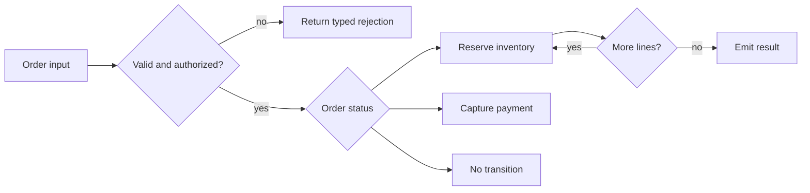

# Java Operators And Control Flow

Operators compute values; control-flow statements decide which computations run.
The production risk is rarely remembering syntax. It is misunderstanding promotion,
side effects, short-circuiting, fall-through, or termination.



The diagram is a decision model, not a claim about the current Shopverse runtime.

## Promotion, Assignment And Increment

Binary numeric promotion converts `byte`, `short`, and `char` operands to at least
`int`. Compound assignment includes an implicit narrowing conversion; ordinary
assignment does not.

```java
byte reserved = 10;
// reserved = reserved + 1;       // does not compile: expression type is int
reserved += 1;                    // equivalent to (byte) (reserved + 1)
reserved++;                       // also narrows back to byte
```

That implicit conversion can wrap:

```java
byte retries = 127;
retries++;
System.out.println(retries);      // -128
```

Use `Math.addExact`, range checks, or a wider type when overflow would corrupt a
business invariant. Do not use floating point for money; use `BigDecimal` with an
explicit scale and rounding policy.

## Evaluation Order And Side Effects

Java evaluates operands left to right, but precedence decides grouping. These are
different rules.

```java
int stock = 5;
int result = stock++ + ++stock;   // 5 + 7; final stock is 7
```

The result is defined, but the expression is hostile to review. Keep mutation in a
separate statement. Precedence should explain compiler behavior, not justify clever
production code.

## Short-Circuit Versus Eager Boolean Operators

`&&` and `||` may skip the right operand. Boolean `&` and `|` evaluate both sides.

```java
boolean canReserve(Order order) {
    return order != null
            && order.lines() != null
            && !order.lines().isEmpty();
}
```

Use short-circuit operators for guards. Use `&` or `|` with booleans only when both
evaluations are deliberately required and free of surprising side effects. Their
integral forms are bitwise operators, which are useful for flags and masks but should
not replace domain types such as `EnumSet<Permission>`.

## Equality, Identity And Type Tests

- `==` compares primitive values or reference identity.
- `equals` expresses logical equality when the type defines it.
- `instanceof` is false for `null` and supports pattern variables.
- Avoid `getClass() == ...` when subtype polymorphism is intended.

```java
if (event instanceof PaymentCaptured captured
        && captured.orderId().equals(expectedOrderId)) {
    apply(captured);
}
```

See [Objects, Strings And GC](./JAVA-OBJECTS-STRINGS-GC.md) for equality contracts
and [Collections](./JAVA-COLLECTIONS.md) for hash-key consequences.

## Conditional Logic

Prefer guard clauses for invalid states and a switch expression for one closed
decision that returns a value.

```java
String customerMessage(OrderStatus status) {
    return switch (status) {
        case CREATED -> "Awaiting inventory";
        case RESERVED -> "Awaiting payment";
        case PAID -> "Confirmed";
        case CANCELLED -> "Cancelled";
    };
}
```

A classic colon-style switch permits fall-through. Use it only when fall-through is
intentional and obvious. Modern switch rules avoid it and make exhaustiveness visible.
See [Java Switch](./features-8-to-26/JAVA-SWITCH.md) for patterns and version history.

## Loops And Transfer Statements

| Construct | Best fit | Main risk |
|---|---|---|
| enhanced `for` | traverse every element | structural modification during iteration |
| indexed `for` | index is part of the algorithm | boundary errors |
| `while` | condition checked before work | condition never changes |
| `do-while` | work must run once | `continue` jumps to the condition |
| `break` | terminate the nearest loop/switch | hidden exit in long bodies |
| `continue` | skip to the next iteration | skipped state update |

```java
for (OrderLine line : order.lines()) {
    if (line.quantity() == 0) {
        continue;
    }
    reserve(line.sku(), line.quantity());
}
```

Avoid labeled `break` and `continue` unless they make a small nested search clearer.
For complex workflows, extract a method or model explicit states instead.

## Reachability And Definite Assignment

Java rejects statements it can prove are unreachable and reads of local variables
that are not definitely assigned. The two analyses are related but distinct.

```java
int capacity;
if (premium) {
    capacity = 100;
} else {
    capacity = 20;
}
return capacity; // assigned on every normal path
```

An empty statement (`;`) is legal, which makes `if (condition);` a dangerous typo.
Always use braces in production code.

## Review Checklist

- Is numeric overflow or narrowing possible?
- Are money and ratios represented with the right numeric type?
- Does a boolean guard rely on short-circuiting?
- Is mutation separated from a larger expression?
- Is switch exhaustiveness intentional and version-compatible?
- Can every loop prove progress, termination, and bounded work?
- Are all branches testable without changing global state?

## Official References

- [JLS Chapter 5: Conversions](https://docs.oracle.com/javase/specs/jls/se24/html/jls-5.html)
- [JLS Chapter 14: Statements](https://docs.oracle.com/javase/specs/jls/se24/html/jls-14.html)
- [JLS Chapter 15: Expressions](https://docs.oracle.com/javase/specs/jls/se24/html/jls-15.html)

## Recommended Next

Continue with [Language Semantics](./JAVA-LANGUAGE-SEMANTICS.md).
