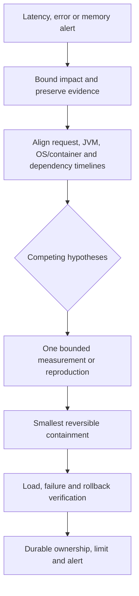

# Java Production Incident Walkthroughs

<DocLabels items={[
  {label: 'Advanced', tone: 'advanced'},
  {label: 'Incident response', tone: 'production'},
  {label: 'Interview scenarios', tone: 'shopverse'},
]} />

<DocCallout type="production" title="Contain first, explain from evidence">
Preserve a synchronized timeline and make the smallest reversible containment. A nearby
GC, deployment, or dependency event remains correlation until evidence connects it.
</DocCallout>



Start from a synchronized timeline and at least two plausible causes. A nearby GC event,
thread spike, deployment, or downstream timeout is correlation until evidence connects
it to the symptom.

## Shopverse Queue-Saturation Evidence Walkthrough

Assume checkout p99 rises while CPU remains moderate. Capture the same five-minute
window from application metrics, executor metrics, database-pool metrics, traces and
JFR. The useful sequence is:

| Observation | Supports | Does not prove |
|---|---|---|
| executor queue grows before p99 | admission exceeds completion capacity | executor size is too small |
| active workers stay at maximum | worker resource is saturated | work is CPU-bound |
| DB connection wait rises with stage duration | database capacity/transactions constrain completion | database is intrinsically slow |
| rejection counter rises after queue bound | overload policy is active | clients handled rejection correctly |

```powershell
jcmd <pid> Thread.print -l > thread-dump.txt
jcmd <pid> JFR.dump name=shopverse filename=checkout-incident.jfr
jcmd <pid> VM.native_memory summary
```

Contain by reducing admission or expensive optional work before increasing threads.
Verify the durable fix with bounded load: queue wait must remain below its budget,
rejections must be intentional, connection wait must remain bounded, and recovery must
not create duplicate orders or payments.

## Native OOM With Healthy Heap

Symptom: container OOM kill while heap is below 60%. Correlate RSS/cgroup limit,
thread count/stacks, direct buffers, metaspace, code cache and NMT. Fix ownership
and limits; increasing `-Xmx` may reduce native headroom and worsen the incident.

## Class-Loader Leak After Redeploy

Symptom: metaspace/class count grows per redeploy. Group classes by defining
loader in JFR/heap dump. Trace retaining roots through thread locals, context
class loaders, JDBC drivers, logging appenders, static caches and executor threads.
Close lifecycle components; use `ClassValue`/weak lifecycle-aware metadata where appropriate.

## Executor Queue Explosion

Symptom: low CPU, rising p99 and heap. Separate queue wait from execution time;
inspect active workers, queue depth, DB/HTTP pools and rejection count. Replace
unbounded admission with bounded queue/concurrency and explicit overload behavior.

## Virtual Threads Exhaust Database

Symptom: more throughput initially, then connection timeouts. Cheap tasks removed
the platform-thread throttle. Bound database concurrency, shorten transactions,
set query/deadline policy and measure connection wait. Do not pool virtual threads
to imitate the old accidental limit.

## ConcurrentHashMap Hot Key

Symptom: CPU/blocked time around `compute` despite many keys overall. Profile key
distribution and mapping duration. Remove remote I/O from computations, shard hot
state, use striped/additive structures when semantics permit, or move authority to
the correct durable system.

## GC Pause Misdiagnosis

Symptom: logs show request stalls near GC activity. Correlate unified GC/safepoint
timestamps, JFR CPU/locks and downstream spans. The cause may be time-to-safepoint,
CPU saturation or dependency latency—not the reported GC pause.

## Unicode Identity Collision

Symptom: visually identical usernames create separate accounts or security rules
disagree. Define normalization, case-folding, locale and confusable policy before
uniqueness checks; migrate carefully because canonicalization can merge identities.

## Serialization Upgrade Outage

Symptom: cached/session payloads throw `InvalidClassException` after deployment.
Inspect UID/class evolution and rolling-version compatibility. Restore compatible
reader, migrate/evict payloads deliberately, and replace durable native serialization
with a governed schema.

## Sensitive Heap/JFR Artifact

Symptom: incident dump copied broadly contains tokens/PII. Revoke exposed secrets,
audit access, encrypt and restrict artifacts, shorten retention and prevent sensitive
values from diagnostic paths. Treat dumps as production data, not ordinary logs.

## Architect Interview Questions

For every incident state the first evidence, a dangerous premature conclusion,
the immediate containment, the durable fix, and a rollback/verification plan.

## Official References

- [JDK troubleshooting guide](https://docs.oracle.com/en/java/javase/25/troubleshoot/)
- [JDK Flight Recorder](https://docs.oracle.com/en/java/javase/25/jfapi/)

## Recommended Next

Reproduce bounded versions using [Executable Labs](./JAVA-EXECUTABLE-LABS.md).
