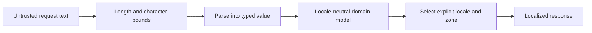

# Java Regex And Internationalization

Regex answers whether text has a structural pattern. Internationalization determines
how values and messages are represented for a user. Neither should define core domain
identity or monetary arithmetic.



## Pattern And Matcher

Compile a reused regex once. `Pattern` is immutable and safe to share; `Matcher` holds
mutable match state and should remain local to one operation.

```java
private static final Pattern ORDER_REFERENCE =
        Pattern.compile("SV-[A-Z0-9]{8,20}");

boolean validReference(String value) {
    return value != null
            && value.length() <= 23
            && ORDER_REFERENCE.matcher(value).matches();
}
```

`matches()` requires the whole region, `find()` searches for the next subsequence, and
`lookingAt()` requires a match at the beginning only.

```java
Matcher matcher = Pattern.compile("ORD-(?<id>\\d+)")
        .matcher("retry ORD-1042 after timeout");
if (matcher.find()) {
    String id = matcher.group("id");
}
```

## Regex Construction And Splitting

- Use `Pattern.quote(userText)` when user text must be literal pattern content.
- Use `Matcher.quoteReplacement(value)` for literal replacement text.
- Remember that Java string literals add an escaping layer: regex `\d` is `"\\d"`.
- `String.split` discards trailing empty strings unless a negative limit is supplied.
- Prefer `Files`, parsers, or typed validators over regex for paths, URLs, email
  standards, dates, JSON, and programming-language syntax.

## Regex Safety

Java's backtracking engine can take excessive CPU on ambiguous nested repetition.
Bound input length, avoid patterns such as `(a+)+`, prefer possessive quantifiers or
atomic groups when appropriate, and test adversarial near-matches. Abandoning a worker
future does not guarantee that the regex engine stops consuming its thread.

See [Secure XML, Regex, Paths And Asynchronous I/O](./JAVA-SECURE-ASYNC-IO.md) for
boundary-security guidance.

## Locale Is Presentation Context

Prefer BCP 47 language tags and pass the locale explicitly.

```java
Locale locale = Locale.forLanguageTag("en-IN");
NumberFormat currency = NumberFormat.getCurrencyInstance(locale);
String total = currency.format(new BigDecimal("123456.78"));
```

Formatting does not replace monetary modeling. Store an amount with its currency and
perform arithmetic using explicit rounding rules. Exact rendered symbols and spacing
can vary with locale-data updates, so tests should use controlled locales and assert
the contract at the appropriate level.

## Dates, Times And Zones

Use `java.time` for new code rather than legacy `DateFormat`.

```java
Locale locale = Locale.forLanguageTag("hi-IN");
ZoneId zone = ZoneId.of("Asia/Kolkata");
DateTimeFormatter formatter = DateTimeFormatter
        .ofLocalizedDateTime(FormatStyle.MEDIUM)
        .localizedBy(locale)
        .withZone(zone);

String placedAt = formatter.format(order.createdAt());
```

A locale does not imply a time zone. Obtain both from an explicit user or tenant
preference. Persist an instant for event time and retain a zone when civil-time intent
matters.

## Messages And Resource Bundles

Keep translatable messages outside code and resolve them at the delivery boundary.

```java
ResourceBundle bundle = ResourceBundle.getBundle("messages", locale);
String template = bundle.getString("order.confirmed");
String message = new MessageFormat(template, locale)
        .format(new Object[] {order.id(), total});
```

Do not localize machine-readable error codes, enum persistence values, Kafka event
types, log field names, or idempotency keys. Localize the human-facing message that
accompanies a stable code.

## Boundary Checklist

- Is the input length bounded before regex evaluation?
- Is the pattern compiled once and the matcher confined?
- Are user-controlled regex and replacement fragments quoted?
- Are locale and time zone explicit?
- Are stable machine contracts separated from translated display text?
- Are parsing and formatting tested under at least two materially different locales?

## Official References

- [Pattern API](https://docs.oracle.com/en/java/javase/24/docs/api/java.base/java/util/regex/Pattern.html)
- [Matcher API](https://docs.oracle.com/en/java/javase/24/docs/api/java.base/java/util/regex/Matcher.html)
- [Locale API](https://docs.oracle.com/en/java/javase/24/docs/api/java.base/java/util/Locale.html)
- [NumberFormat API](https://docs.oracle.com/en/java/javase/24/docs/api/java.base/java/text/NumberFormat.html)
- [ResourceBundle API](https://docs.oracle.com/en/java/javase/24/docs/api/java.base/java/util/ResourceBundle.html)
- [DateTimeFormatter API](https://docs.oracle.com/en/java/javase/24/docs/api/java.base/java/time/format/DateTimeFormatter.html)

## Recommended Next

Continue with [Strings And Encoding Internals](./JAVA-STRINGS-ENCODING-INTERNALS.md)
and [Time, Numeric And Security Boundaries](./JAVA-TIME-NUMERIC-SECURITY.md).
