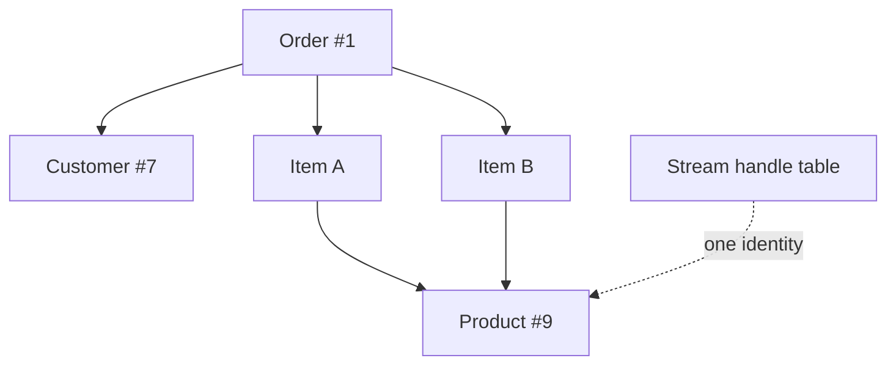
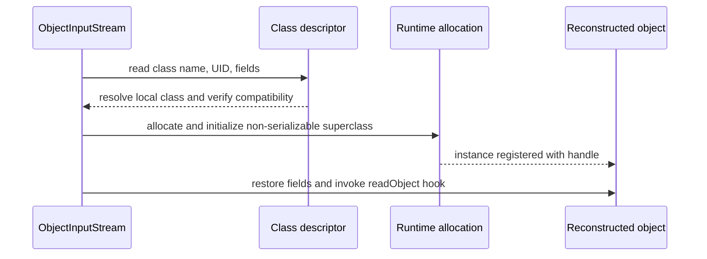

# Native Java Serialization Internals And Object Graphs

## The Marker Interface

`Serializable` declares no methods. It is a marker checked by the serialization
runtime to opt a class into the protocol. The JVM does not continuously
serialize marked objects; library code in `ObjectOutputStream` and
`ObjectInputStream`, assisted by reflection and JVM allocation mechanisms,
performs work when explicitly called.

```java
final class CartSnapshot implements java.io.Serializable {
    @java.io.Serial
    private static final long serialVersionUID = 1L;

    private final String cartId;
    private final java.util.List<String> productIds;
    private transient String requestToken;

    CartSnapshot(String cartId, java.util.List<String> productIds) {
        this.cartId = cartId;
        this.productIds = java.util.List.copyOf(productIds);
    }
}
```

The marker is inherited by subclasses. Every reachable non-transient object in
the graph must also be serializable unless custom writing replaces or omits it;
otherwise writing fails with `NotSerializableException`.

## Writing An Object Graph

`ObjectOutputStream` writes a stream header, class descriptors, field data, and
handles representing identities already encountered. It recursively traverses
reachable non-static, non-transient fields. Handles preserve shared references
and cycles instead of copying the same object indefinitely.



If two fields point to the same object before serialization, normal
deserialization makes them point to the same reconstructed object. Calling
`writeUnshared` requests different sharing semantics; `reset` clears stream
handle state and can increase output size.

## Reading And Reconstructing

At a high level, `ObjectInputStream` reads the descriptor, resolves the class,
checks compatibility, allocates instances, registers handles early enough to
support cycles, restores fields, and invokes allowed hooks.

Constructors of serializable classes are not invoked as ordinary construction
during restoration. The no-argument constructor of the first non-serializable
superclass is invoked, so it must be accessible. Serializable subclass fields
are then restored from the stream or assigned defaults.



## Static, Transient And Derived State

Static fields belong to the class, not an instance, and are never part of the
default serialized object state. A `transient` instance field is skipped and
receives its Java default (`null`, `0`, or `false`) unless custom restoration
sets it. `transient` is not encryption and does not remove the same sensitive
value if it is reachable through another non-transient path.

```java
@java.io.Serial
private void readObject(ObjectInputStream in)
        throws IOException, ClassNotFoundException {
    in.defaultReadObject();
    requestToken = null;
    if (cartId == null || productIds == null) {
        throw new InvalidObjectException("Invalid cart snapshot");
    }
}
```

Use `@Serial` so the compiler can check special serialization declarations.
Important hooks include `writeObject`, `readObject`, `readObjectNoData`,
`writeReplace`, and `readResolve`. These are protocol hooks, not normal
interface overrides, and mistakes may silently change behavior.

## Inheritance, Records, Enums And Externalizable

- A non-serializable superclass contributes constructor-initialized state, not
  default field data from the stream.
- A serializable superclass's eligible state is included.
- Enum serialization records the enum constant name and has special rules;
  adding/removing or renaming constants remains a compatibility concern.
- Serializable records use record-specific reconstruction rules centered on
  components and the canonical constructor.
- `Externalizable` gives full control through `writeExternal/readExternal` but
  requires a public no-argument constructor and greatly increases compatibility
  and security responsibility.

## JVM And Library Responsibilities

| Responsibility | JVM/runtime support | Serialization library |
|---|---:|---:|
| object allocation and class metadata | yes | requests/uses it |
| reflection and field access | supports | discovers and transfers fields |
| stream protocol and handles | no | yes |
| compatibility/UID check | no | yes |
| GC of reconstructed graph | yes | no |
| trust and business validation | no | application must enforce |

## Tricky Interview Questions

<ExpandableAnswer title="Does Serializable contain a serialize method?">

No; it is a marker.

</ExpandableAnswer>

<ExpandableAnswer title="Are static fields serialized?">

No.

</ExpandableAnswer>

<ExpandableAnswer title="Does transient final recover its initializer automatically?">

Do not rely on it; skipped state needs deliberate reconstruction.

</ExpandableAnswer>

<ExpandableAnswer title="Are cycles supported?">

Yes, through stream handles.

</ExpandableAnswer>

<ExpandableAnswer title="Is the serializable class constructor called normally?">

No; the first non-serializable superclass constructor is the key constructor step.

</ExpandableAnswer>


## Official References

- [Serialization output specification](https://docs.oracle.com/en/java/javase/25/docs/specs/serialization/output.html)
- [Serialization input specification](https://docs.oracle.com/en/java/javase/25/docs/specs/serialization/input.html)
- [`Serializable` API](https://docs.oracle.com/en/java/javase/25/docs/api/java.base/java/io/Serializable.html)

## Recommended Next

Continue with [Serialization Evolution And Security](./JAVA-SERIALIZATION-EVOLUTION-SECURITY.md).
