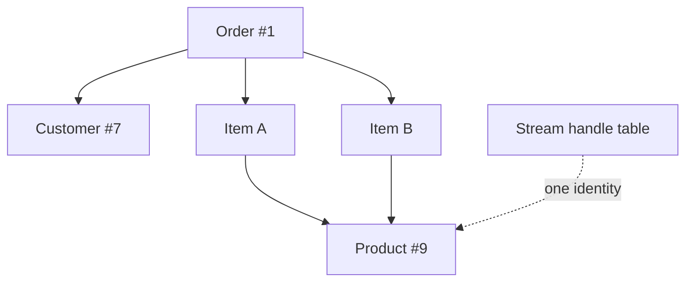
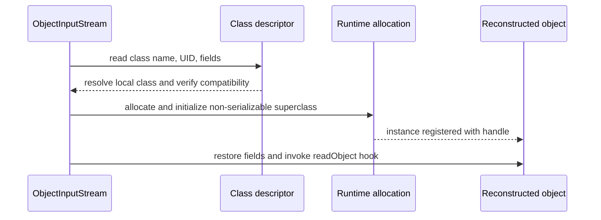

# Native Java Serialization Internals And Object Graphs

## The Marker Interface

`Serializable` declares no methods. It is a marker checked by the serialization
runtime to opt a class into the protocol. The JVM does not continuously
serialize marked objects; library code in `ObjectOutputStream` and
`ObjectInputStream`, assisted by reflection and JVM allocation mechanisms,
performs work when explicitly called.

```java
final class CartSnapshot implements java.io.Serializable {
    @java.io.Serial
    private static final long serialVersionUID = 1L;

    private final String cartId;
    private final java.util.List<String> productIds;
    private transient String requestToken;

    CartSnapshot(String cartId, java.util.List<String> productIds) {
        this.cartId = cartId;
        this.productIds = java.util.List.copyOf(productIds);
    }
}
```

The marker is inherited by subclasses. Every reachable non-transient object in
the graph must also be serializable unless custom writing replaces or omits it;
otherwise writing fails with `NotSerializableException`.

The marker is a declaration by the class author, not proof that a particular
instance is safe, immutable, compatible, or free of non-serializable references.
The runtime check is necessary because `ObjectOutputStream.writeObject` accepts
`Object`, and eligibility depends on the complete runtime graph.

```java
Object value = new CartSnapshot("C-1", List.of("P-1"));
if (!(value instanceof Serializable)) {
    throw new NotSerializableException(value.getClass().getName());
}
```

That is only a conceptual eligibility check; the stream performs additional
handling for strings, arrays, enums, records, replacement objects, class
descriptors, and every transitively reached value.

## What The Stream Contains

Native serialization is a tagged binary protocol. Conceptually, a stream can
contain:

```text
stream magic and protocol version
class descriptor
  class name
  serialVersionUID
  flags: serializable/externalizable/enum/custom write method
  persistent field names and type descriptors
object data for each serializable class in the hierarchy
primitive block-data records
arrays, strings, enum names, nulls, and class objects
handles and back-references to prior identities
custom optional data followed by an end marker
```

The exact stream uses type codes such as new object, class descriptor, string,
array, null, reference, block data, reset, exception, and enum. A class
descriptor is normally written once and then referenced by a handle. Primitive
data written outside default fields is grouped into block-data records.

At a high level, `writeObject(root)` performs this traversal:

1. apply permitted replacement logic;
2. write `null` or an existing back-reference when applicable;
3. inspect the runtime class and serialization kind;
4. assign a handle before recursively following the graph;
5. write or reference the class descriptor;
6. process serializable superclass state from superclass to subclass;
7. use default fields or invoke the class's private `writeObject` hook;
8. recursively encode referenced values and close optional-data blocks.

An exception while writing can leave the stream unusable or in an indeterminate
state. Do not assume a failed `writeObject` can be followed by normal writes.

## Object Graph Identity And Cycles

`ObjectOutputStream` writes a stream header, class descriptors, field data, and
handles representing identities already encountered. It recursively traverses
reachable non-static, non-transient fields. Handles preserve shared references
and cycles instead of copying the same object indefinitely.



If two fields point to the same object before serialization, normal
deserialization makes them point to the same reconstructed object. Calling
`writeUnshared` requests different sharing semantics; `reset` clears stream
handle state and can increase output size.

```java
Address shared = new Address("Hyderabad");
Employee first = new Employee("A", shared);
Employee second = new Employee("B", shared);
List<Employee> team = List.of(first, second);
```

After one serialization/deserialization of `team`, the identity invariant is
normally preserved:

```java
restored.get(0).address() == restored.get(1).address(); // true
```

The first encounter writes the address and assigns a handle. The second writes
a reference to that handle. The same mechanism terminates cycles:

```text
Parent -> Child -> back-reference to the existing Parent handle
```

Every reachable object still needs a supported representation. A serializable
root that contains a non-serializable nested collaborator fails when traversal
reaches it, unless the field is transient or custom/replacement logic omits it.
Collections may implement `Serializable`, but their elements and keys/values
are part of the graph too.

## Allocation, Constructors And Inheritance

At a high level, `ObjectInputStream` reads the descriptor, resolves the class,
checks compatibility, allocates instances, registers handles early enough to
support cycles, restores fields, and invokes allowed hooks.

Constructors of serializable classes are not invoked as ordinary construction
during restoration. The no-argument constructor of the first non-serializable
superclass is invoked, so it must be accessible. Serializable subclass fields
are then restored from the stream or assigned defaults.

```java
class Person {                         // not serializable
    protected String category;
    protected Person() { category = "human"; }
}

final class Employee extends Person implements Serializable {
    @Serial private static final long serialVersionUID = 1L;
    private String name;
    Employee(String name) { this.name = name; }
}
```

On deserialization, `Person()` runs and initializes `category`; the ordinary
`Employee(String)` constructor does not run, and `name` is restored from the
stream. If `Person` were serializable, its eligible state would also come from
the stream and its ordinary constructor would not run. An inaccessible missing
no-argument constructor on the first non-serializable superclass causes
`InvalidClassException`.

Because ordinary constructors can be bypassed, a stream can present field
combinations that no public constructor would accept. Validate reconstructed
state in `readObject`, `readResolve`, a serialization proxy, or a separate
trusted validation boundary.



The corresponding read path is roughly:

1. read a type code and resolve any referenced descriptor;
2. load/resolve the local class and verify serialization compatibility;
3. allocate the object and register its handle before completing nested state;
4. initialize the first non-serializable superclass when applicable;
5. restore each serializable class data slot or invoke its `readObject` method;
6. resolve back-references, then apply validation and replacement hooks;
7. return the reconstructed root, or fail with an I/O/class/compatibility error.

Registering handles before nested reconstruction is what permits ordinary
cycles. Deserialization allocates new objects; it does not locate and overwrite
an existing application object with the same business identifier.

## Static, Transient, Final And Derived State

Static fields belong to the class, not an instance, and are never part of the
default serialized object state. A `transient` instance field is skipped and
receives its Java default (`null`, `0`, or `false`) unless custom restoration
sets it. `transient` is not encryption and does not remove the same sensitive
value if it is reachable through another non-transient path.

| State | Default behavior |
|---|---|
| non-static, non-transient primitive | value is written |
| non-static, non-transient reference | referenced graph is traversed |
| `private` field | written; Java visibility is not a secrecy boundary |
| `static` field | not written; current JVM class state is used |
| `transient` field | skipped and restored to its type default |
| compiler-generated outer reference | treated like another field unless excluded |
| derived cache/resource | should usually be transient and reconstructed |

A transient final field does not regain its source initializer through normal
ordinary-class deserialization. This is another reason immutable classes with
strict invariants often prefer a serialization proxy.

```java
@java.io.Serial
private void readObject(ObjectInputStream in)
        throws IOException, ClassNotFoundException {
    in.defaultReadObject();
    requestToken = null;
    if (cartId == null || productIds == null) {
        throw new InvalidObjectException("Invalid cart snapshot");
    }
}
```

## Custom Serialization Hooks

Ordinary serializable classes can declare specially named methods that the
serialization runtime discovers. They are not interface overrides:

```java
@Serial
private void writeObject(ObjectOutputStream out) throws IOException;

@Serial
private void readObject(ObjectInputStream in)
        throws IOException, ClassNotFoundException;

@Serial
private void readObjectNoData() throws ObjectStreamException;

@Serial
private Object writeReplace() throws ObjectStreamException;

@Serial
private Object readResolve() throws ObjectStreamException;
```

Use `@Serial` so the compiler checks supported serialization declarations.

### Default Fields Plus Optional Data

```java
@Serial
private void writeObject(ObjectOutputStream out) throws IOException {
    out.defaultWriteObject();
    out.writeInt(2);                    // custom format version
    out.writeObject(encryptForStorage(secret));
}

@Serial
private void readObject(ObjectInputStream in)
        throws IOException, ClassNotFoundException {
    in.defaultReadObject();
    int formatVersion = in.readInt();
    String stored = (String) in.readObject();
    secret = decryptFromStorage(stored, formatVersion);
    validateState();
}
```

The write/read order and types must match. For each class's custom field data,
call `defaultWriteObject`/`defaultReadObject` consistently, or use
`putFields`/`writeFields` and `readFields`. Optional custom data is that class's
wire protocol; the developer owns its versioning.

`readObjectNoData` handles the case where the local serializable hierarchy has a
class for which the incoming stream contains no data, such as some hierarchy
evolution or tampered-stream cases. It is a suitable place to establish safe
defaults or reject the object.

`serialPersistentFields` can explicitly define the persistent field contract
independently of actual fields. It is powerful for compatibility adapters but
easy to misuse; document every persistent field and test old payloads.

Replacement hooks are covered with the safer proxy pattern in
[Serialization Evolution And Security](./JAVA-SERIALIZATION-EVOLUTION-SECURITY.md#replacement-hooks-and-the-serialization-proxy).

## Externalizable: Full Manual Control

`Externalizable` extends `Serializable` but replaces automatic state handling
with public methods:

```java
final class CompactEmployee implements Externalizable {
    private String name;
    private int level;

    public CompactEmployee() {} // required public no-argument constructor

    @Override
    public void writeExternal(ObjectOutput out) throws IOException {
        out.writeUTF(name);
        out.writeInt(level);
    }

    @Override
    public void readExternal(ObjectInput in) throws IOException {
        name = in.readUTF();
        level = in.readInt();
        if (level < 0) throw new InvalidObjectException("Negative level");
    }
}
```

The public no-argument constructor runs, then `readExternal` reconstructs the
entire state. The implementation must coordinate superclass state, field order,
format versioning, validation, and sensitive-data policy. Missing a field does
not produce a helpful automatic compatibility mapping. Prefer it only when its
explicit control justifies the substantially larger maintenance burden.

## Special Types And Hidden Graph Edges

- **Arrays:** primitive arrays are serializable; object arrays recursively
  require serializable elements. Array UID matching is handled specially.
- **Collections/maps:** many standard implementations are serializable, but
  every reachable element, key, value, comparator, and captured collaborator
  must be serializable. Implementation-specific serialized forms are not a good
  public cross-language contract.
- **Enums:** only the constant name forms the serialized state. Enum UID is
  fixed at `0L`, and enum serialization hooks are ignored. Renaming/removing a
  constant breaks streams containing that name.
- **Records:** component values form the state and the canonical constructor is
  invoked during reconstruction. Ordinary record `writeObject`, `readObject`,
  `readObjectNoData`, `writeExternal`, and `readExternal` hooks are ignored;
  replacement hooks remain available. A cycle back to a record through one of
  its components is not preserved like an ordinary-object cycle.
- **Non-static inner classes:** a hidden `this$0` reference points to the
  enclosing instance. Serialization can unexpectedly traverse that outer
  object and fail or expose more state. Prefer static nested types.
- **Lambdas:** a lambda is serializable only when its target functional
  interface extends `Serializable`; captured variables become graph state.
  Serialized lambdas are fragile across compiler and implementation changes and
  are poor durable contracts.
- **Framework proxies/resources:** JPA lazy proxies, sockets, streams, threads,
  executors, class loaders, and database connections should not be persisted as
  object state. Serialize explicit DTO state instead.

## Long-Lived And Multi-Object Streams

Constructing `ObjectOutputStream` writes a stream header. Repeatedly opening a
new `ObjectOutputStream` in append mode writes additional headers that a single
`ObjectInputStream` can interpret as corruption. Keep one object stream open for
the logical stream, frame independent payloads externally, or use a carefully
designed header-suppressing format.

```java
try (ObjectOutputStream out = new ObjectOutputStream(fileOut)) {
    out.writeObject(first);
    out.writeObject(second);
}
```

Read values in the same sequence or serialize a collection/envelope that
defines the count and format.

`ObjectOutputStream` remembers identities across calls. Mutating an already
written object and writing it again normally emits a back-reference, not a fresh
snapshot:

```java
out.writeObject(employee);
employee.rename("Updated");
out.writeObject(employee); // may refer to the first representation

out.reset();               // clears output handle state and emits reset marker
out.writeObject(employee); // writes current state as new graph data
```

Frequent `reset` increases bytes and object churn but prevents an unbounded
handle table in long-lived streams. `writeUnshared`/`readUnshared` request
unshared semantics for the root handle; they do not automatically make every
nested object unique, and replacement hooks/enums/classes can still return
canonical identities.

## JVM And Library Responsibilities

| Responsibility | JVM/runtime support | Serialization library |
|---|---:|---:|
| object allocation and class metadata | yes | requests/uses it |
| reflection and field access | supports | discovers and transfers fields |
| stream protocol and handles | no | yes |
| compatibility/UID check | no | yes |
| GC of reconstructed graph | yes | no |
| trust and business validation | no | application must enforce |

## Tricky Interview Questions

<ExpandableAnswer title="Does Serializable contain a serialize method?">

No; it is a marker.

</ExpandableAnswer>

<ExpandableAnswer title="Are static fields serialized?">

No.

</ExpandableAnswer>

<ExpandableAnswer title="Does transient final recover its initializer automatically?">

Do not rely on it; skipped state needs deliberate reconstruction.

</ExpandableAnswer>

<ExpandableAnswer title="Are cycles supported?">

Yes, through stream handles.

</ExpandableAnswer>

<ExpandableAnswer title="Is the serializable class constructor called normally?">

No; the first non-serializable superclass constructor is the key constructor step.

</ExpandableAnswer>


## Official References

- [Serialization output specification](https://docs.oracle.com/en/java/javase/25/docs/specs/serialization/output.html)
- [Serialization input specification](https://docs.oracle.com/en/java/javase/25/docs/specs/serialization/input.html)
- [Object serialization stream protocol](https://docs.oracle.com/en/java/javase/25/docs/specs/serialization/protocol.html)
- [`Serializable` API](https://docs.oracle.com/en/java/javase/25/docs/api/java.base/java/io/Serializable.html)
- [`ObjectOutputStream` API](https://docs.oracle.com/en/java/javase/25/docs/api/java.base/java/io/ObjectOutputStream.html)
- [`ObjectInputStream` API](https://docs.oracle.com/en/java/javase/25/docs/api/java.base/java/io/ObjectInputStream.html)

## Recommended Next

Continue with [Serialization Evolution And Security](./JAVA-SERIALIZATION-EVOLUTION-SECURITY.md).
