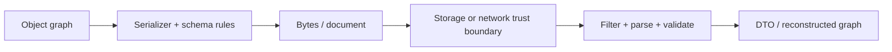

# Java Serialization And Deserialization Guide

Serialization converts in-memory state into bytes or a structured document;
deserialization reconstructs an in-memory representation. The important design
question is not only “can this object be encoded?” but “who owns the schema,
who may supply bytes, and how will the contract evolve?”

## Learning Path

| Step | Chapter | Outcome |
|---:|---|---|
| 1 | [Serialization Formats And APIs](./JAVA-SERIALIZATION.md) | choose JSON, Avro, Protobuf, Java native serialization, or another format |
| 2 | [Native Serialization Internals](./JAVA-SERIALIZATION-INTERNALS.md) | understand streams, descriptors, handles, object graphs, constructors, hooks, and `transient` |
| 3 | [Evolution, Security And Safe Design](./JAVA-SERIALIZATION-EVOLUTION-SECURITY.md) | control `serialVersionUID`, compatible changes, filters, proxies, and trust boundaries |

## Decision Guide

| Situation | Preferred direction |
|---|---|
| REST or browser-facing contract | JSON DTOs with validation and explicit compatibility policy |
| durable Kafka/event contract | Avro or Protobuf with schema governance |
| internal RPC | Protobuf or another explicitly versioned IDL |
| cache payload | explicit compact format; treat upgrades and eviction as part of the design |
| legacy Java-only trusted stream | native serialization only with strict filtering and controlled types |
| attacker-controlled bytes | never use unrestricted native Java deserialization |

## Core Principles

- Serialization is a versioned data contract, not a persistence shortcut.
- A class being `Serializable` does not make its graph safe or compatible.
- Never confuse transport validation with domain authorization.
- Prefer DTOs over persistence entities and framework proxies.
- Never put secrets into payloads merely because fields are private.
- Test old-writer/new-reader and new-writer/old-reader compatibility.

## Tricky Interview Questions

<ExpandableAnswer title="Does implementing Serializable validate the graph?">

No.

</ExpandableAnswer>

<ExpandableAnswer title="Is keeping a UID sufficient for compatibility?">

No; field and invariant evolution still matter.

</ExpandableAnswer>

<ExpandableAnswer title="Can private fields contain safe-to-expose data by definition?">

No; serialization crosses encapsulation boundaries.

</ExpandableAnswer>

## Official References

- [Java Object Serialization Specification](https://docs.oracle.com/en/java/javase/25/docs/specs/serialization/index.html)
- [Serialization filtering](https://docs.oracle.com/en/java/javase/25/core/serialization-filtering1.html)

## Recommended Next

Begin with [Serialization Formats And APIs](./JAVA-SERIALIZATION.md).
