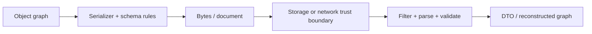

# Java Serialization And Deserialization Guide

Serialization converts in-memory state into bytes or a structured document;
deserialization reconstructs an in-memory representation. The important design
question is not only “can this object be encoded?” but “who owns the schema,
who may supply bytes, and how will the contract evolve?”

## Learning Path

| Step | Chapter | Outcome |
|---:|---|---|
| 1 | [Serialization Formats And APIs](./JAVA-SERIALIZATION.md) | choose JSON, Avro, Protobuf, Java native serialization, or another format |
| 2 | [Native Serialization Internals](./JAVA-SERIALIZATION-INTERNALS.md) | understand streams, descriptors, handles, object graphs, constructors, hooks, and `transient` |
| 3 | [Evolution, Security And Safe Design](./JAVA-SERIALIZATION-EVOLUTION-SECURITY.md) | control `serialVersionUID`, compatible changes, filters, proxies, and trust boundaries |

## Complete Coverage Map

Use this map when revising a specific interview or production topic.

| Subject | Canonical chapter |
|---|---|
| basic byte-stream round trip and format choices | [Serialization Formats And APIs](./JAVA-SERIALIZATION.md) |
| `Serializable` marker semantics and runtime eligibility | [Native Serialization Internals](./JAVA-SERIALIZATION-INTERNALS.md#the-marker-interface) |
| stream header, class descriptors, field data, type codes, and handles | [Native Serialization Internals](./JAVA-SERIALIZATION-INTERNALS.md#what-the-stream-contains) |
| recursive object graph, shared identity, cycles, and nested failures | [Native Serialization Internals](./JAVA-SERIALIZATION-INTERNALS.md#object-graph-identity-and-cycles) |
| constructor bypass and serializable/non-serializable inheritance | [Native Serialization Internals](./JAVA-SERIALIZATION-INTERNALS.md#allocation-constructors-and-inheritance) |
| static, transient, final, derived, and sensitive state | [Native Serialization Internals](./JAVA-SERIALIZATION-INTERNALS.md#static-transient-final-and-derived-state) |
| `writeObject`, `readObject`, `defaultWriteObject`, validation, and field APIs | [Native Serialization Internals](./JAVA-SERIALIZATION-INTERNALS.md#custom-serialization-hooks) |
| `writeReplace`, `readResolve`, and serialization proxies | [Evolution, Security And Safe Design](./JAVA-SERIALIZATION-EVOLUTION-SECURITY.md#replacement-hooks-and-the-serialization-proxy) |
| `Externalizable` and manual wire formats | [Native Serialization Internals](./JAVA-SERIALIZATION-INTERNALS.md#externalizable-full-manual-control) |
| multiple objects, append headers, `reset`, and unshared objects | [Native Serialization Internals](./JAVA-SERIALIZATION-INTERNALS.md#long-lived-and-multi-object-streams) |
| arrays, collections, enums, records, inner classes, and lambdas | [Native Serialization Internals](./JAVA-SERIALIZATION-INTERNALS.md#special-types-and-hidden-graph-edges) |
| `serialVersionUID` generation, matching, and compatibility | [Evolution, Security And Safe Design](./JAVA-SERIALIZATION-EVOLUTION-SECURITY.md#what-serialversionuid-does) |
| compatible/incompatible class changes and golden-payload tests | [Evolution, Security And Safe Design](./JAVA-SERIALIZATION-EVOLUTION-SECURITY.md#evolution-matrix) |
| gadget chains, denial of service, filters, trust, and integrity | [Evolution, Security And Safe Design](./JAVA-SERIALIZATION-EVOLUTION-SECURITY.md#deserialization-is-code-reachable-input) |
| JSON, Avro, Protobuf, CBOR, MessagePack, and migration choices | [Serialization Formats And APIs](./JAVA-SERIALIZATION.md#format-selection) |

## End-To-End Mental Model

```text
writeObject(root)
  -> inspect runtime type and serialization eligibility
  -> write/lookup class descriptor and serialVersionUID
  -> assign a handle to the new object identity
  -> write eligible state for each serializable class in the hierarchy
  -> recursively write referenced objects or back-references
  -> invoke class-specific replacement/custom hooks where applicable

readObject()
  -> validate stream header and type code
  -> resolve the local class and compare compatibility
  -> allocate/register object identity before completing the graph
  -> initialize the first non-serializable superclass
  -> restore fields and graph references
  -> invoke validation/replacement hooks
  -> return the reconstructed root
```

This is a graph reconstruction protocol, not a raw memory dump. Methods and
bytecode are supplied by the classes loaded in the receiving JVM; the stream
carries descriptors, state, and relationships needed to rebuild objects.

## Decision Guide

| Situation | Preferred direction |
|---|---|
| REST or browser-facing contract | JSON DTOs with validation and explicit compatibility policy |
| durable Kafka/event contract | Avro or Protobuf with schema governance |
| internal RPC | Protobuf or another explicitly versioned IDL |
| cache payload | explicit compact format; treat upgrades and eviction as part of the design |
| legacy Java-only trusted stream | native serialization only with strict filtering and controlled types |
| attacker-controlled bytes | never use unrestricted native Java deserialization |



## Core Principles

- Serialization is a versioned data contract, not a persistence shortcut.
- A class being `Serializable` does not make its graph safe or compatible.
- Never confuse transport validation with domain authorization.
- Prefer DTOs over persistence entities and framework proxies.
- Never put secrets into payloads merely because fields are private.
- Test old-writer/new-reader and new-writer/old-reader compatibility.

## Tricky Interview Questions

<ExpandableAnswer title="Does implementing Serializable validate the graph?">

No.

</ExpandableAnswer>

<ExpandableAnswer title="Is keeping a UID sufficient for compatibility?">

No; field and invariant evolution still matter.

</ExpandableAnswer>

<ExpandableAnswer title="Can private fields contain safe-to-expose data by definition?">

No; serialization crosses encapsulation boundaries.

</ExpandableAnswer>


## Official References

- [Java Object Serialization Specification](https://docs.oracle.com/en/java/javase/25/docs/specs/serialization/index.html)
- [Serialization filtering](https://docs.oracle.com/en/java/javase/25/core/serialization-filtering1.html)

## Recommended Next

Begin with [Serialization Formats And APIs](./JAVA-SERIALIZATION.md).
