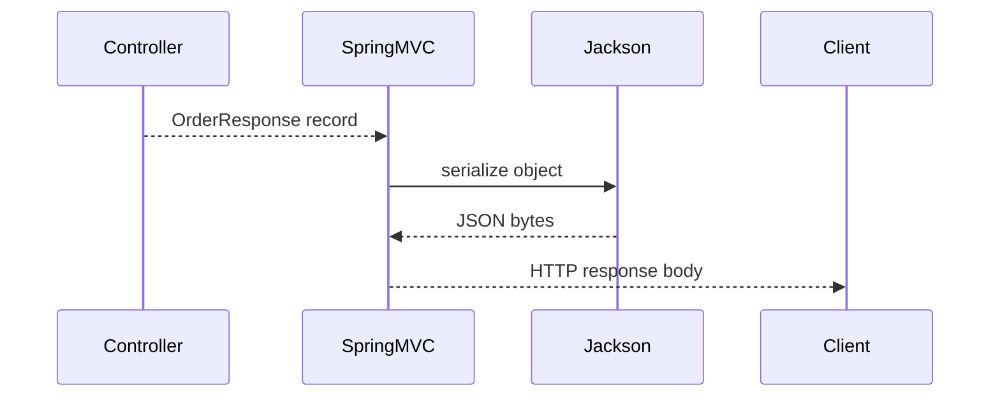

# Java Serialization

Serialization converts an object into a transport or storage format.

In modern backend systems, JSON serialization through Jackson is more common
than Java native serialization.

Common serialization formats:

| Format | Common use |
|---|---|
| JSON | REST APIs, logs, configuration, Kafka messages |
| Avro/Protobuf | schema-based event streaming and RPC |
| XML | legacy integrations, SOAP |
| Java native serialization | legacy Java-only object serialization |
| MessagePack/CBOR | compact binary payloads |

## Native Java Serialization

```java
class UserSession implements Serializable {
    private static final long serialVersionUID = 1L;
    private String username;
}
```

Native serialization is rarely recommended for public APIs because it is Java
specific, fragile across versions, and has a long security history.

Avoid native deserialization of untrusted input. Many historical Java security
issues came from deserializing attacker-controlled object graphs that triggered
dangerous gadget chains.

## JSON Serialization With Jackson

Spring Boot REST APIs usually use Jackson:

```java
public record OrderResponse(
        Long id,
        String orderNumber,
        BigDecimal totalAmount
) {
}
```

Jackson converts this response to JSON automatically when returned from a
controller.

Spring Boot uses HTTP message converters. For JSON, the relevant converter is
usually `MappingJackson2HttpMessageConverter`.



## Useful Jackson Annotations

| Annotation | Use |
|---|---|
| `@JsonIgnore` | exclude a field |
| `@JsonProperty` | customize JSON property name |
| `@JsonFormat` | format dates/numbers |
| `@JsonInclude` | omit null/empty values |
| `@JsonBackReference` | break parent-child recursion |
| `@JsonIdentityInfo` | represent object identity to avoid cycles |

## Entity Relationship Cycles

JPA relationships can create infinite JSON recursion:

```java
class Order {
    private List<OrderItem> items;
}

class OrderItem {
    private Order order;
}
```

If returned directly, Jackson can serialize `Order -> items -> order -> items`
repeatedly. Solutions:

| Approach | When to use |
|---|---|
| DTOs/records | preferred for public APIs |
| `@JsonIgnore` | hide one side completely |
| `@JsonManagedReference` / `@JsonBackReference` | parent-child JSON only |
| `@JsonIdentityInfo` | represent repeated objects by identity |

DTOs are the best default because they avoid exposing persistence internals and
give stable API contracts.

## Versioning And Compatibility

Serialization is also a contract. Changing field names, types, required fields,
or enum values can break clients.

Safe changes:

- add optional response fields;
- accept unknown request fields if policy allows;
- keep old enum values stable;
- use explicit API versions for breaking changes.

Risky changes:

- rename fields;
- remove fields;
- change number to string or string to object;
- change date/time format;
- expose entity graphs directly.

## Best Practices

- Use DTOs or records for external APIs.
- Avoid exposing JPA entities directly.
- Keep `serialVersionUID` explicit for native serialization.
- Never deserialize untrusted native Java serialized data.
- Validate deserialized request objects with Bean Validation.

## Interview Questions

| Question | Short answer |
|---|---|
| What is `serialVersionUID`? | Version identifier used during native deserialization compatibility checks. |
| Why avoid native serialization? | Security risk, Java-specific format, fragile evolution. |
| How does Spring serialize REST responses? | Usually Jackson `HttpMessageConverter`. |
