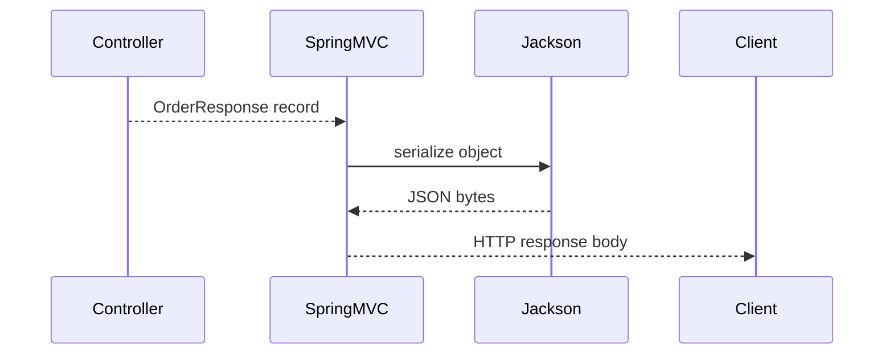

# Java Serialization

This is the format-selection and framework-facing introduction. For the full
learning sequence, start at the
[Serialization And Deserialization Guide](./JAVA-SERIALIZATION-UMBRELLA.md),
then continue into native stream internals and version/security design.

Serialization converts an object into a transport or storage format.

In modern backend systems, JSON serialization through Jackson is more common
than Java native serialization.

## Format Selection

Common serialization formats:

| Format | Common use |
|---|---|
| JSON | REST APIs, logs, configuration, Kafka messages |
| Avro/Protobuf | schema-based event streaming and RPC |
| XML | legacy integrations, SOAP |
| Java native serialization | controlled legacy Java-only object graphs |
| MessagePack/CBOR | compact language-neutral structured payloads |

| Requirement | Usually prefer | Reason |
|---|---|---|
| public REST or browser API | JSON | interoperable, inspectable, ubiquitous tooling |
| high-volume governed Kafka events | Avro or Protobuf | explicit schema and compatibility tooling |
| internal RPC | Protobuf or another IDL | generated cross-language contracts |
| compact schemaless document | CBOR or MessagePack | smaller binary representation than textual JSON |
| trusted legacy Java session/snapshot | native Java serialization | reconstructs Java object identity and cycles |

Native serialization has historically appeared in RMI, application-server
session replication, legacy messaging, desktop state, and Java-only caches.
Those are not endorsements for new distributed contracts: durability and trust
boundaries make its class coupling and deserialization behavior expensive.

## Native Java Serialization

```java
class UserSession implements Serializable {
    private static final long serialVersionUID = 1L;
    private String username;
}
```

### Complete Round Trip

```java
import java.io.*;
import java.nio.file.*;

final class Employee implements Serializable {
    @Serial
    private static final long serialVersionUID = 1L;

    private final String name;
    private final int level;
    private transient String accessToken;

    Employee(String name, int level, String accessToken) {
        this.name = name;
        this.level = level;
        this.accessToken = accessToken;
    }
}

Path file = Path.of("employee.ser");
Employee original = new Employee("Ahmed", 7, "runtime-only");

try (ObjectOutputStream out = new ObjectOutputStream(
        new BufferedOutputStream(Files.newOutputStream(file)))) {
    out.writeObject(original);
}

Employee restored;
try (ObjectInputStream in = new ObjectInputStream(
        new BufferedInputStream(Files.newInputStream(file)))) {
    restored = (Employee) in.readObject();
}
```

`writeObject` accepts `Object`, so graph eligibility is checked at runtime.
`readObject` returns `Object`, so callers validate/cast the expected root type.
The runtime type is serialized: an `Employee` instance referenced through a
`Person` variable is still written as `Employee`.

The resulting file is protocol data, not a JVM heap image. It contains a stream
header, class descriptors, field state, object/array contents, and references to
previous handles. It does not contain method implementations.

Native serialization is rarely recommended for public APIs because it is Java
specific, fragile across versions, and has a long security history.

Avoid native deserialization of untrusted input. Many historical Java security
issues came from deserializing attacker-controlled object graphs that triggered
dangerous gadget chains.

## JSON Serialization With Jackson

Spring Boot REST APIs usually use Jackson:

```java
public record OrderResponse(
        Long id,
        String orderNumber,
        BigDecimal totalAmount
) {
}
```

Jackson converts this response to JSON automatically when returned from a
controller.

Spring Boot uses HTTP message converters. For JSON, the relevant converter is
usually `MappingJackson2HttpMessageConverter`.



## Useful Jackson Annotations

| Annotation | Use |
|---|---|
| `@JsonIgnore` | exclude a field |
| `@JsonProperty` | customize JSON property name |
| `@JsonFormat` | format dates/numbers |
| `@JsonInclude` | omit null/empty values |
| `@JsonBackReference` | break parent-child recursion |
| `@JsonIdentityInfo` | represent object identity to avoid cycles |

## Entity Relationship Cycles

JPA relationships can create infinite JSON recursion:

```java
class Order {
    private List<OrderItem> items;
}

class OrderItem {
    private Order order;
}
```

If returned directly, Jackson can serialize `Order -> items -> order -> items`
repeatedly. Solutions:

| Approach | When to use |
|---|---|
| DTOs/records | preferred for public APIs |
| `@JsonIgnore` | hide one side completely |
| `@JsonManagedReference` / `@JsonBackReference` | parent-child JSON only |
| `@JsonIdentityInfo` | represent repeated objects by identity |

DTOs are the best default because they avoid exposing persistence internals and
give stable API contracts.

## Versioning And Compatibility

Serialization is also a contract. Changing field names, types, required fields,
or enum values can break clients.

Safe changes:

- add optional response fields;
- accept unknown request fields if policy allows;
- keep old enum values stable;
- use explicit API versions for breaking changes.

Risky changes:

- rename fields;
- remove fields;
- change number to string or string to object;
- change date/time format;
- expose entity graphs directly.

## Best Practices

- Use DTOs or records for external APIs.
- Avoid exposing JPA entities directly.
- Keep `serialVersionUID` explicit for native serialization.
- Never deserialize untrusted native Java serialized data.
- Validate deserialized request objects with Bean Validation.

## Official References

- [Java Object Serialization Specification](https://docs.oracle.com/en/java/javase/25/docs/specs/serialization/index.html)
- [Jackson documentation](https://github.com/FasterXML/jackson-docs)

## Recommended Next

Continue with [Native Serialization Internals And Object Graphs](./JAVA-SERIALIZATION-INTERNALS.md).

## Interview Questions

<ExpandableAnswer title="What is serialVersionUID?">

It is a version identifier used during native Java deserialization compatibility
checks.

</ExpandableAnswer>

<ExpandableAnswer title="Why avoid native Java serialization?">

It creates security risk, produces a Java-specific format, and is fragile when
types evolve.

</ExpandableAnswer>

<ExpandableAnswer title="How does Spring serialize REST responses?">

Spring commonly delegates JSON serialization to Jackson through an
`HttpMessageConverter`.

</ExpandableAnswer>
