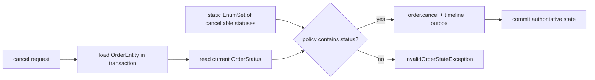

# Specialized And Concurrent Java Collections Internals

<DocLabels items={[
  {label: 'Advanced', tone: 'advanced'},
  {label: 'Collection selection', tone: 'intermediate'},
  {label: 'Concurrency trade-offs', tone: 'production'},
]} />

<DocCallout type="tip" title="Choose from semantics before performance">
Identity, enum universe, ordering, weak reachability, snapshot iteration, and concurrency
are different contracts. Pick the contract first, then measure the implementation.
</DocCallout>

## Identity, Enum And Weak-Key Maps

`IdentityHashMap` compares keys with `==` and uses identity hashes. It is useful
for topology-preserving graph algorithms, cycle detection and proxy tables where
object identity is explicitly the key. It violates the normal `Map` expectation
of logical equality and must not back ordinary domain lookup.

`EnumMap` stores keys from one enum universe in a compact ordinal-indexed form.
Iteration follows declaration order, null keys are rejected, and operations avoid
general hashing. Renaming/reordering enum constants can still affect external
contracts even when the map itself remains valid.

`EnumSet` represents one enum universe as compact bit vectors. Membership and
set operations avoid per-element nodes, making it a good fit for stable local
policies such as allowed state transitions. Like `EnumMap`, it rejects nulls and
must not be treated as a persistent wire representation of enum ordinals.

`WeakHashMap` holds keys through weak references. An entry can disappear after a
key loses other strong reachability and GC processes its reference. Collection is
nondeterministic; values can accidentally retain keys directly or indirectly.
It is not a bounded cache. For metadata associated with classes, `ClassValue`
often provides a lifecycle-aware alternative without manually pinning class loaders.

## Shopverse Cancellation Policy

`OrderServiceImpl` uses an `EnumSet<OrderStatus>` for the statuses from which a
customer may cancel an order. The set is process-local, immutable by convention,
and consulted only after the current entity is loaded inside a transaction; the
database-backed order remains the authority across service replicas.



```java
private static final EnumSet<OrderStatus> CUSTOMER_CANCELLABLE_STATUSES =
        EnumSet.of(
                OrderStatus.ORDER_CREATED,
                OrderStatus.PENDING_INVENTORY,
                OrderStatus.INVENTORY_RESERVED,
                OrderStatus.PAYMENT_PROCESSING,
                OrderStatus.PAYMENT_FAILED);

private void ensureCancellable(OrderEntity order) {
    if (!CUSTOMER_CANCELLABLE_STATUSES.contains(order.getStatus())) {
        throw new InvalidOrderStateException(
                "Order cannot be cancelled from status: " + order.getStatus());
    }
}
```

This is preferable to a `HashSet<OrderStatus>` because the domain is a single,
closed enum universe. The set answers a policy question; it does not make the
subsequent state transition atomic, so the surrounding transaction and entity
transition rules still carry that responsibility.

## Sequenced Collections

Java 21 introduced common encounter-order operations through `SequencedCollection`,
`SequencedSet` and `SequencedMap`: first, last and reversed views. A reversed view
is generally backed by the original collection; mutation and concurrency semantics
remain those of the implementation. API reviewers must distinguish snapshot,
unmodifiable view and live reversed view.

## Copy-On-Write And Skip Lists

`CopyOnWriteArrayList` publishes a new array for each mutation. Readers traverse
stable snapshots without locking; iterators never reflect later writes. It fits
small listener/configuration lists with extremely rare writes. Large or frequent
writes amplify copying, allocation and stale-snapshot duration.

`ConcurrentSkipListMap` maintains probabilistic multi-level links for expected
O(log n) sorted access and range views. It trades greater pointer/allocation cost
for concurrent navigation. Its iterators are weakly consistent, and comparator
consistency remains essential.

## Queue Choice

| Need | Candidate | Critical constraint |
|---|---|---|
| bounded producer-consumer | `ArrayBlockingQueue` | fixed capacity, explicit fairness option |
| linked bounded handoff | `LinkedBlockingQueue` | set capacity; nodes allocate |
| direct rendezvous | `SynchronousQueue` | no storage; producer meets consumer |
| nonblocking FIFO | `ConcurrentLinkedQueue` | unbounded; `size()` traverses |
| delayed availability | `DelayQueue` | unbounded and non-durable |
| priority handoff | `PriorityBlockingQueue` | unbounded; iteration is not priority order |

Thread-safe does not mean overload-safe. A queue must have capacity, rejection,
durability, retry and shutdown policies. `size()` on concurrent structures is
often observational and must not authorize business actions.

## Tricky Interview Questions

<ExpandableAnswer title="Why can WeakHashMap retain an entry?">

Its value or another graph may strongly retain the key.

</ExpandableAnswer>

<ExpandableAnswer title="Is a reversed sequenced view a copy?">

Usually no; it is a backed view.

</ExpandableAnswer>

<ExpandableAnswer title="Why is IdentityHashMap dangerous for value objects?">

Equal objects remain different keys.

</ExpandableAnswer>

<ExpandableAnswer title="Is CopyOnWriteArrayList always lock-free?">

Reads are snapshot-based; writes coordinate and copy.

</ExpandableAnswer>

<ExpandableAnswer title="Can an unbounded blocking queue provide backpressure?">

No; it converts overload into latency and memory growth.

</ExpandableAnswer>


## Official References

- [`IdentityHashMap`](https://docs.oracle.com/en/java/javase/25/docs/api/java.base/java/util/IdentityHashMap.html)
- [`EnumSet`](https://docs.oracle.com/en/java/javase/25/docs/api/java.base/java/util/EnumSet.html)
- [`WeakHashMap`](https://docs.oracle.com/en/java/javase/25/docs/api/java.base/java/util/WeakHashMap.html)
- [`SequencedCollection`](https://docs.oracle.com/en/java/javase/25/docs/api/java.base/java/util/SequencedCollection.html)
- [`ClassValue`](https://docs.oracle.com/en/java/javase/25/docs/api/java.base/java/lang/ClassValue.html)

## Recommended Next

Continue with [ConcurrentHashMap OpenJDK Internals](./JAVA-CONCURRENT-HASHMAP-OPENJDK.md).
