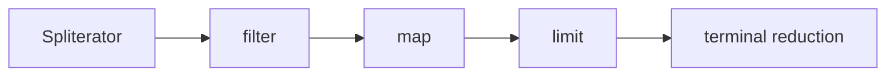

# Java Stream Pipeline, Spliterator And Collector Internals


A stream is a single-use computation description. Intermediate operations link
pipeline stages; a terminal operation builds/wraps a sink chain and drives source
traversal. Values generally flow through fused stages one element at a time.



## Lazy Fusion Scenario

```java
var result = values.stream()
    .filter(v -> { log("filter", v); return v > 0; })
    .map(v -> { log("map", v); return v * 2; })
    .findFirst();
```

No work occurs before `findFirst`; traversal stops after the first matching mapped
value. `peek` is for observation/debugging, not a guaranteed business callback.

## Stateless And Stateful Stages

`map`, `filter` and `peek` are stateless per element. `sorted` and `distinct`
typically require global/buffered state. `limit`/`skip` are stateful and ordering
can make parallel coordination expensive. Operation flags propagate facts such as
ordered, sized, distinct or sorted, enabling optimizations.

## Spliterator

`tryAdvance` processes one element; `forEachRemaining` drains; `trySplit` partitions.
Characteristics must be truthful:

- `ORDERED`: encounter order exists.
- `SIZED`/`SUBSIZED`: exact size for this/all splits.
- `SORTED`/`DISTINCT`: semantic guarantees.
- `IMMUTABLE`/`CONCURRENT`: mutation/traversal behavior.

A poor split that repeatedly returns tiny or imbalanced partitions destroys parallel
performance. Linked structures usually split less effectively than arrays.

## Collector Contract

A collector supplies mutable result containers, accumulates elements, combines
partial containers and finishes the result. Parallel correctness requires an
associative combination compatible with the identity. `CONCURRENT` does not make
an unsafe accumulator safe; its characteristics and source ordering govern use.

```java
Map<String, Long> totals = orders.stream().collect(Collectors.toMap(
    Order::customerId, Order::amount, Long::sum));
```

Without the merge function, duplicate keys throw. The merge policy is a business
decision, not boilerplate.

## Resource And Failure Semantics

Streams backed by I/O must be closed, usually with try-with-resources. Checked
exceptions do not fit standard functional signatures; choose abort-with-cause,
typed partial-result, or explicit loop. Parallel failure does not undo side effects
already performed by sibling tasks.

## Tricky Interview Questions

<ExpandableAnswer title="Does every intermediate operation allocate a collection?">

No; stages are normally fused.

</ExpandableAnswer>

<ExpandableAnswer title="Why is a stream single-use?">

Its pipeline/source consumption state is not reusable.

</ExpandableAnswer>

<ExpandableAnswer title="Can peek be omitted by optimization?">

Do not assign required side effects to it.

</ExpandableAnswer>

<ExpandableAnswer title="Why does subtraction fail as parallel reduction?">

It is not associative.

</ExpandableAnswer>

<ExpandableAnswer title="What happens with duplicate toMap keys?">

It throws unless a merge policy is supplied.

</ExpandableAnswer>


## Official References

- [Stream package](https://docs.oracle.com/en/java/javase/25/docs/api/java.base/java/util/stream/package-summary.html)
- [`Spliterator`](https://docs.oracle.com/en/java/javase/25/docs/api/java.base/java/util/Spliterator.html)
- [`Collector`](https://docs.oracle.com/en/java/javase/25/docs/api/java.base/java/util/stream/Collector.html)

## Recommended Next

Continue with [Parallel Stream Internals](./JAVA-PARALLEL-STREAM-INTERNALS.md).
