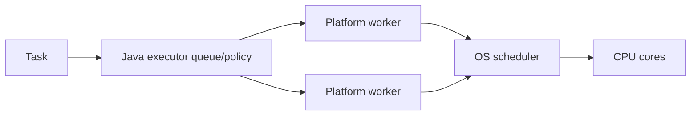

# Java Thread Creation, Scheduling And Context Switching

## Creating A Platform Thread Manually

```java
Thread worker = Thread.ofPlatform()
        .name("inventory-reconcile-1")
        .daemon(false)
        .unstarted(() -> inventoryService.reconcile());

worker.setUncaughtExceptionHandler((thread, error) ->
        logger.error("worker_failed thread={}", thread.getName(), error));
worker.start();
worker.join();
```

`start()` asks the JVM and operating system to schedule a new platform thread;
calling `run()` directly is an ordinary synchronous method call on the current
thread. A `Thread` instance can be started only once. `join()` blocks the caller
until the target terminates and establishes visibility of actions completed by
the joined thread.

Manual threads are useful for learning, very small standalone programs, or a
deliberately long-lived dedicated activity with explicit lifecycle ownership.
They are usually the wrong unit for request/task execution because creation is
costly, limits are scattered, failures are harder to aggregate, and shutdown,
metrics, naming, queueing, and backpressure must all be rebuilt.

## Runnable, Callable And Future

| Abstraction | Result | Checked failure | Execution owner |
|---|---|---|---|
| `Runnable` | none | cannot declare one | thread or executor |
| `Callable<T>` | `T` | may throw | executor |
| `Future<T>` | eventual `T` | `get` wraps task failure | executor submission |
| `CompletableFuture<T>` | eventual/composable `T` | completion stage carries failure | caller-selected/default executor |

Separate the task from the execution mechanism. That makes the same business
operation testable synchronously and executable by a bounded pool, virtual
thread, or scheduler.

## What Schedules A Thread?

The JVM maps a platform thread closely to an OS thread. The OS scheduler chooses
which runnable platform threads execute on CPU cores. Java thread priority is
only a hint and must never be a correctness mechanism.

Virtual threads add another scheduling layer: the JVM scheduler mounts runnable
virtual threads on carrier platform threads, while the OS schedules carriers.



## Time Slicing And Context Switching

A scheduler can preempt a runnable thread after a time quantum so another can
run. Policies and quantum sizes are OS details, not Java guarantees. A context
switch saves enough execution state—registers, program counter, stack context,
and scheduling metadata—to resume one thread later and restore another.

Switches have costs: scheduler work, disrupted CPU caches and translation
lookaside buffers, and lost locality. Too many runnable platform threads can
reduce throughput even when CPU utilization looks high. Blocking switches are
sometimes unavoidable; excessive runnable-thread competition is often fixed by
bounded pools, less shared contention, batching, or simpler task structure.

## Concurrency Versus Parallelism

| Concept | Meaning | One-core possibility |
|---|---|---:|
| concurrency | multiple tasks make overlapping progress | yes, by interleaving |
| parallelism | multiple tasks execute at the same instant | no |
| asynchronous API | caller need not wait immediately for completion | yes |

Concurrency is a program structure; parallelism is an execution property.
Creating 1,000 threads does not guarantee parallelism. CPU-bound parallelism is
limited near available cores, while high I/O concurrency can be useful because
many tasks wait rather than consume CPU.

## Sleep, Join And Interruption

`sleep` pauses the current thread without releasing intrinsic locks. `join`
waits for another thread. Both are interruptible. Interruption is cooperative:
blocking operations throw `InterruptedException`, while CPU loops must check the
flag and exit or propagate cancellation deliberately.

```java
try {
    worker.join(Duration.ofSeconds(5));
    if (worker.isAlive()) worker.interrupt();
} catch (InterruptedException e) {
    Thread.currentThread().interrupt();
    worker.interrupt();
}
```

## Tricky Interview Questions

1. What happens when `run()` is called instead of `start()`? No new thread is created.
2. Does `join()` terminate a thread? No; it waits for termination.
3. Can concurrency occur on one core? Yes.
4. Is thread priority portable scheduling control? No.
5. Why can extra runnable threads reduce throughput? Context switching and cache disruption add overhead.

## Official References

- [`Thread` API](https://docs.oracle.com/en/java/javase/25/docs/api/java.base/java/lang/Thread.html)
- [Thread scheduling tutorial](https://docs.oracle.com/javase/tutorial/essential/concurrency/runthread.html)
- [Virtual Threads, JEP 444](https://openjdk.org/jeps/444)

## Recommended Next

Continue with [Executors And Thread-Pool Engineering](./JAVA-EXECUTORS-THREAD-POOLS.md).
