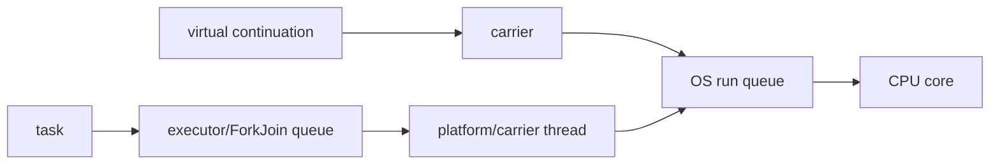

# Java Thread Scheduling, Time Slicing And Context Switching

## Scheduling Layers

Java application tasks may first wait in an executor queue. A worker/platform
thread becomes runnable; the OS scheduler assigns runnable native threads to CPU
cores. Virtual threads add a JVM scheduler that mounts continuations on carrier
platform threads. ForkJoin workers additionally schedule tasks through local
deques and stealing. These layers solve different problems.

## Time Slicing

An OS may preempt a runnable thread after a quantum, but Java specifies no quantum,
round-robin guarantee or priority fairness. `Thread.yield()` is only a hint. Correct
programs use synchronization/coordination, never timing assumptions.

## Context Switch Cost

A switch preserves registers, program counter, stack/scheduling context and loads
another thread. It also disrupts cache and TLB locality. Voluntary switches follow
blocking/parking; involuntary switches follow preemption. Thousands of runnable
CPU threads cause competition; thousands of parked virtual threads need not imply
the same native scheduling cost, though their heap/task state still consumes memory.

## Concurrency Versus Parallelism

- One core can interleave concurrent tasks without parallel execution.
- Multiple cores can execute CPU tasks simultaneously.
- An async API can complete later without running in parallel at the call site.
- A parallel bulk operation can synchronously block the caller until completion.

## Diagnostic Scenarios

1. High CPU plus many RUNNABLE threads: profile stacks and context switching.
2. Low CPU plus many WAITING threads: inspect queues/dependencies, not scheduler priority.
3. Scheduler pool with one long periodic task: later tasks are delayed.
4. Fixed-rate task longer than period: executions do not magically gain capacity; policy/pool size governs backlog.
5. Virtual threads blocked on connection pool: the scarce resource is connections.

Use JFR thread park, monitor, CPU and virtual-thread events; OS tools provide native
switch/run-queue evidence. Java `Thread.State.RUNNABLE` does not prove a thread is
currently executing on a core.

## Tricky Interview Questions

<ExpandableAnswer title="Can priority guarantee execution order?">

No.

</ExpandableAnswer>

<ExpandableAnswer title="Is context switching only caused by time slices?">

No; blocking and scheduling events also switch.

</ExpandableAnswer>

<ExpandableAnswer title="Can concurrency exist on one core?">

Yes.

</ExpandableAnswer>

<ExpandableAnswer title="Does a virtual thread have a permanent carrier?">

No.

</ExpandableAnswer>

<ExpandableAnswer title="Why can a scheduled task silently stop repeating?">

An uncaught exception can suppress later executions.

</ExpandableAnswer>

## Official References

- [`Thread`](https://docs.oracle.com/en/java/javase/25/docs/api/java.base/java/lang/Thread.html)
- [`ScheduledExecutorService`](https://docs.oracle.com/en/java/javase/25/docs/api/java.base/java/util/concurrent/ScheduledExecutorService.html)
- [JEP 444](https://openjdk.org/jeps/444)

## Recommended Next

Continue with [ForkJoinPool Deep Dive](./JAVA-FORKJOINPOOL-DEEP-DIVE.md).
