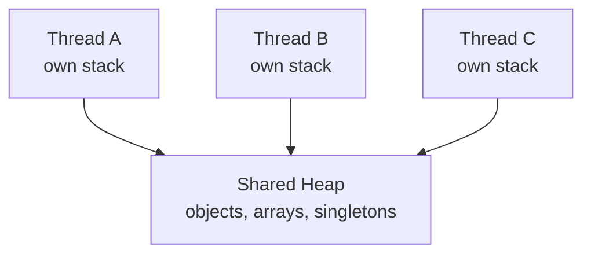
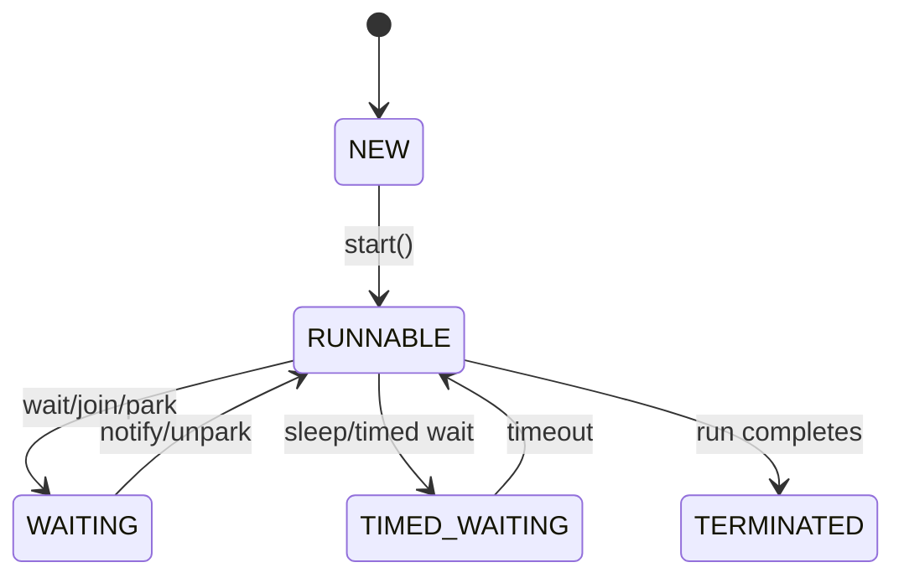

# Java Threading Model

Java code runs on threads. A thread has its own call stack and shares heap
objects with other threads in the same JVM.



The main danger is shared mutable state. If two threads read and write the same
object without a happens-before relationship, the result can be stale,
interleaved, or lost.

## Platform Threads

Traditional Java threads map closely to operating-system threads.

```java
Thread thread = Thread.ofPlatform()
        .name("payment-worker")
        .start(() -> paymentService.reconcile());
```

Use platform threads for CPU-heavy work and cases where a small bounded pool is
appropriate.

## Executor Services

Application code should usually submit work to an executor rather than create
raw threads everywhere.

```java
ExecutorService executor = Executors.newFixedThreadPool(16);
Future<Report> report = executor.submit(reportService::build);
```

Thread pools provide reuse and resource limits. Always size pools according to
CPU, blocking behavior, and downstream capacity.

### CPU-Bound Versus I/O-Bound Pools

| Work type | Example | Pool guidance |
|---|---|---|
| CPU-bound | encryption, compression, large calculations | near CPU core count |
| blocking I/O | JDBC, REST calls, file calls | larger, but bounded by downstream capacity |
| scheduled jobs | cleanup, expiry scanner | small dedicated pool |
| virtual-thread request work | blocking HTTP/JDBC with cheap threads | still limit DB/HTTP pools |

More threads do not create more database connections or more payment-provider
capacity. Thread count must respect downstream limits.

## Thread Lifecycle



## Priority

```java
thread.setPriority(Thread.NORM_PRIORITY);
```

Thread priority is only a hint to the scheduler. Do not rely on it for
correctness or production QoS.

## Common Failures

| Failure | Cause | Fix |
|---|---|---|
| Race condition | multiple threads update shared state unsafely | lock, atomic type, immutable state, database constraint |
| Deadlock | threads wait on locks in opposite order | consistent lock ordering, timeouts, smaller critical sections |
| Starvation | work never gets CPU/resource | fair locks, bounded queues, better pool sizing |
| Thread exhaustion | too many blocked threads | timeouts, backpressure, virtual threads where suitable |

## Deadlock Example

```java
synchronized (accountA) {
    synchronized (accountB) {
        transfer(accountA, accountB);
    }
}
```

If another thread locks `accountB` first and then waits for `accountA`, both
threads can block forever. Use a stable lock order, such as lower account ID
first.

## Race Condition Example

```java
if (stock >= quantity) {
    stock -= quantity;
}
```

Two threads can both pass the check before either subtracts. In business
systems, protect this with transactions, row locks, optimistic locking, or
atomic conditional updates.

## Visibility Problem Example

```java
class Worker {
    private boolean running = true;

    void stop() {
        running = false;
    }

    void run() {
        while (running) {
            doWork();
        }
    }
}
```

Another thread may call `stop`, but the worker thread may not see the updated
value promptly because there is no visibility guarantee. Use `volatile`,
locking, interruption, or higher-level concurrency utilities:

```java
private volatile boolean running = true;
```

`volatile` fixes visibility for this flag. It does not make compound operations
such as `count++` atomic.

## Wait, Notify, And Higher-Level Alternatives

Low-level `wait`/`notify` is error-prone:

```java
synchronized (lock) {
    while (!condition) {
        lock.wait();
    }
}
```

Prefer higher-level utilities when possible:

- `BlockingQueue` for producer/consumer;
- `CountDownLatch` for waiting until N tasks finish;
- `Semaphore` for limiting concurrent access;
- `CompletableFuture` for async composition;
- `ExecutorService` for task execution;
- `ReentrantLock` when timed/fair locking is needed.

## Thread Dump Debugging

When a Java service hangs or has high latency, capture thread dumps:

```bash
jcmd <pid> Thread.print
jstack <pid>
```

Look for:

- many threads blocked on the same lock;
- database calls without timeout;
- HTTP calls without timeout;
- deadlock section in the dump;
- common-pool starvation;
- scheduler threads running long tasks.
