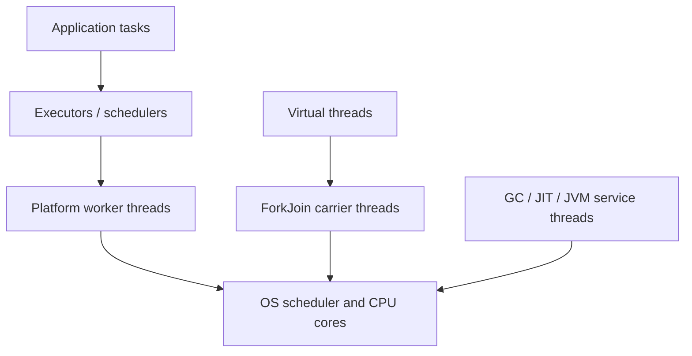

# Java Threads, Concurrency And JVM Thread Model

“The Java thread” is not one thing. A running service contains application
threads, executor and scheduler workers, and JVM-managed service threads. They
compete for CPU but have different ownership and failure policies.

## Thread Families

| Family | Created/owned by | Typical responsibility | Key operational risk |
|---|---|---|---|
| main thread | JVM launcher, then application | bootstrap and invoke `main` | assuming it remains the only application thread |
| request/application threads | server/framework/application | execute business tasks | blocking, unbounded concurrency, context leakage |
| scheduler workers | `ScheduledExecutorService`, Spring scheduler, framework | run delayed or periodic tasks | one long task delays later tasks; duplicate work across nodes |
| GC worker threads | garbage collector | trace, evacuate, compact, or reclaim memory | allocation pressure and pause/concurrent-cycle CPU |
| JIT compiler threads | JVM compiler | compile hot bytecode into optimized machine code | warm-up and compilation CPU |
| JVM service threads | JVM | reference handling, signals, monitoring and housekeeping | confusing service threads with application leaks |
| virtual threads | application, scheduled by JVM | cheap thread-per-task blocking workflows | pinning and overwhelming downstream resources |

There is no single universal “scheduler thread.” OS schedulers place platform
threads on CPU cores; Java executors own worker threads; the virtual-thread
scheduler maps virtual threads onto carrier platform threads.



## What Happens At Startup

The launcher creates the initial application thread and calls `main`. Class
initialization may start framework threads; executors create workers lazily or
eagerly; the JVM maintains GC, compiler, reference-handler, and service threads.
When `main` returns, the process remains alive while any non-daemon thread is
alive. Daemon threads alone do not keep the JVM running.

## Scheduled Work

```java
try (ScheduledExecutorService scheduler =
         Executors.newScheduledThreadPool(2)) {
    scheduler.scheduleWithFixedDelay(
        inventoryService::reconcileSafely,
        0, 30, TimeUnit.SECONDS);
}
```

Fixed-rate scheduling targets a clock cadence; fixed-delay waits after one run
finishes. Catch and report task failures because an uncaught exception can stop
future executions of that periodic task. Across multiple service replicas, a
local scheduler runs on every replica; use database work claims, leases, or a
distributed scheduler when work must run once globally.

## Learning Order

1. [Threading Model](./JAVA-THREADING-MODEL.md): states, thread families, deadlock, visibility.
2. [Thread Creation And Scheduling](./JAVA-THREAD-CREATION-SCHEDULING.md): manual threads, OS scheduling, time slicing, context switching, concurrency and parallelism.
3. [Executors And Thread Pools](./JAVA-EXECUTORS-THREAD-POOLS.md): core/max workers, idle timeout, queues, saturation, rejection, sizing and pool types.
4. [Multithreading](./JAVA-MULTITHREADING.md): tasks, cancellation and explicit locks.
5. [Thread Coordination](./JAVA-THREAD-COORDINATION.md): monitors, wait/notify, join and producer-consumer.
6. [Java Memory Model](./advanced-internals/JAVA-MEMORY-MODEL.md): happens-before and safe publication.
7. [AQS And Virtual Thread Internals](./advanced-internals/CONCURRENCY-AQS-VIRTUAL-THREADS.md): queues, CAS, carriers and pinning.
8. [Concurrency Architecture Review](./JAVA-CONCURRENCY-DESIGN-REVIEW.md): invariants, publication, admission, cancellation and lifecycle evidence.
9. [CompletableFuture](./JAVA-COMPLETABLE-FUTURE.md): asynchronous composition, joining and failure handling.
10. [Virtual Threads Guide](./features-8-to-26/JAVA-VIRTUAL-THREADS.md): production usage and limits.

## Diagnose The Right Thread Family

Use `jcmd <pid> Thread.print` or JFR and group threads by name, state, stack,
lock owner, and CPU. Many waiting request threads often indicate downstream
latency; a busy scheduler suggests long scheduled work; high GC CPU points to
allocation/heap pressure rather than an application lock; carrier pinning needs
virtual-thread events and stack inspection.

## Tricky Interview Questions

1. Does returning from `main` always stop the JVM? No, not while non-daemon threads remain.
2. Does a scheduled pool guarantee one cluster-wide execution? No.
3. Is a virtual thread an OS thread? No; it mounts on carrier platform threads.
4. Does GC run on the main thread? Collectors normally use JVM-managed workers; application threads may assist in some collector paths.
5. Can more threads increase database throughput indefinitely? No; connections, locks, CPU, and storage are bounded.

## Official References

- [`Thread` API](https://docs.oracle.com/en/java/javase/25/docs/api/java.base/java/lang/Thread.html)
- [`ScheduledExecutorService` API](https://docs.oracle.com/en/java/javase/25/docs/api/java.base/java/util/concurrent/ScheduledExecutorService.html)
- [Virtual Threads, JEP 444](https://openjdk.org/jeps/444)
- [JDK Flight Recorder](https://docs.oracle.com/en/java/javase/25/jfapi/flight-recorder-runtime-guide.html)

## Recommended Next

Start with [Java Threading Model](./JAVA-THREADING-MODEL.md).
