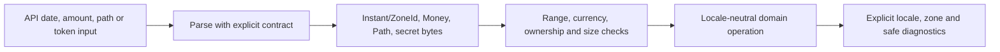

# Java Time, Numeric Correctness And Security Boundaries

<DocLabels items={[
  {label: 'Intermediate', tone: 'intermediate'},
  {label: 'Correctness boundary', tone: 'production'},
  {label: 'Security-sensitive', tone: 'advanced'},
]} />

<DocCallout type="mistake" title="Never infer missing domain context">
A timestamp without zone intent, an amount without currency, or a path without an
authorized root is incomplete input—not permission to use a machine default.
</DocCallout>



The boundary converts ambiguous strings into types once. Domain logic should not infer
a time zone, currency, locale, path root, or security policy from presentation text.

Use `Instant` for a timeline point, `LocalDateTime` for a wall-clock value without
zone, `OffsetDateTime` when an offset is part of the contract, and `ZonedDateTime`
when region rules matter. DST creates gaps and overlaps; converting a local time
can adjust or be ambiguous. Persist timeline events in an unambiguous instant and
retain zone where future civil-time intent matters. Inject `Clock` in tests.
`Duration` measures time-based amounts; `Period` is date-based and behaves through
calendar rules. Document database precision and JSON offset/zone contracts.

`BigDecimal.equals` includes scale while `compareTo` compares numerical value.
Construct decimals from strings for exact decimal intent, define scale and
rounding at domain boundaries, and model money with currency plus amount. Use
`Math.addExact`/related operations where primitive overflow must fail rather than
wrap.

## Shopverse Deadline And Money Example

```java
record Money(Currency currency, BigDecimal amount) {
    Money {
        Objects.requireNonNull(currency, "currency");
        Objects.requireNonNull(amount, "amount");
        amount = amount.setScale(currency.getDefaultFractionDigits(),
                RoundingMode.UNNECESSARY);
    }
}

boolean reservationExpired(Instant expiresAt, Clock clock) {
    return !clock.instant().isBefore(expiresAt);
}

var fixedClock = Clock.fixed(
        Instant.parse("2026-07-13T10:15:30Z"), ZoneOffset.UTC);
assert reservationExpired(Instant.parse("2026-07-13T10:15:30Z"), fixedClock);
```

Injecting `Clock` makes the boundary deterministic. The money constructor rejects
unexpected precision instead of silently rounding a payment amount. A separate domain
operation must also reject arithmetic across different currencies.

For a DST-sensitive delivery promise, persist the intended `ZoneId` with the local
schedule. Resolve gaps/overlaps deliberately and store the resulting instant used for
execution.

Security review includes:

- `SecureRandom`, not predictable PRNGs, for security tokens;
- hostname verification and supported TLS policy rather than trust-all managers;
- hardened XML factories with external entities/DTDs disabled;
- normalized/real-path authorization beneath an allowed root;
- no shell command concatenation from user data;
- bounded regex complexity and input size;
- strict native-deserialization filtering or safer formats;
- minimal reflective/module opening;
- no secrets/PII in strings, exceptions, logs, heap dumps or JFR exports.

Diagnostic artifacts are production data. Heap dumps can contain credentials and
customer objects; JFR can contain paths, class names, thread names and event data.
Encrypt, access-control, retain briefly and audit their handling.

## Tricky Interview Questions

<ExpandableAnswer title="Why can one local time map to zero or two instants?">

DST gaps and overlaps.

</ExpandableAnswer>

<ExpandableAnswer title="Why can equal monetary values fail BigDecimal.equals?">

Scale participates.

</ExpandableAnswer>

<ExpandableAnswer title="Does converting a password to String preserve wipeability?">

No; immutable copies can remain until GC.

</ExpandableAnswer>


## Official References

- [Java time](https://docs.oracle.com/en/java/javase/25/docs/api/java.base/java/time/package-summary.html)
- [`BigDecimal`](https://docs.oracle.com/en/java/javase/25/docs/api/java.base/java/math/BigDecimal.html)
- [Java secure coding guidelines](https://www.oracle.com/java/technologies/javase/seccodeguide.html)

## Recommended Next

Apply these checks during the [Concurrency Architecture Review](./JAVA-CONCURRENCY-DESIGN-REVIEW.md).
