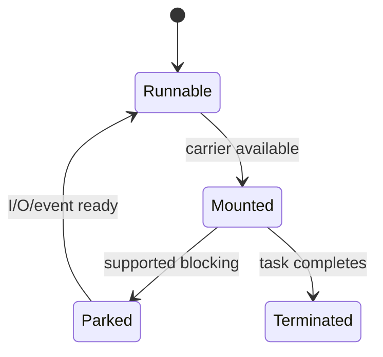

# Virtual Threads And Structured Concurrency For Architects

## Runtime Model

A virtual thread is a Java `Thread` scheduled by the JVM rather than permanently
mapped to one OS thread. Its continuation can mount on a carrier platform thread,
run, park during supported blocking, unmount, and later resume on any carrier.
This preserves readable thread-per-request code while avoiding one platform stack
per blocked request.



Parallel CPU execution remains bounded by carriers/cores. Cheap threads permit
more concurrency; they do not make CPU, heap, database connections or rate limits
cheap.

## Pinning And JDK Evolution

Pinning means a virtual thread cannot unmount while blocked, occupying its carrier.
Native/foreign calls and some monitor interactions have historically pinned;
monitor behavior has evolved across JDK releases, so document the deployed JDK
instead of repeating versionless rules. Use JFR virtual-thread pinning/submission
events and stacks. Do not replace every `synchronized` block based on folklore.

## Thread Locals, Scoped Values And Context

Millions of virtual threads multiplied by large thread-local state can consume
substantial heap. Framework context also risks accidental lifetime and inheritance.
Scoped values provide immutable, bounded-context propagation for structured code
in supporting JDKs. Record preview/final status for the exact release and avoid
exposing preview types in stable public APIs.

## Structured Concurrency

Structured concurrency binds child-task lifetime to a lexical scope. The owner
forks related work, joins according to a policy, propagates failure/cancellation,
and cannot accidentally abandon children beyond the scope.

```java
// API names/status vary by JDK; compile with the selected release/preview policy.
try (var scope = new StructuredTaskScope.ShutdownOnFailure()) {
    var user = scope.fork(() -> userClient.load(id));
    var orders = scope.fork(() -> orderClient.load(id));
    scope.join().throwIfFailed();
    return new Dashboard(user.get(), orders.get());
}
```

Cancellation is cooperative and does not roll back side effects. Child operations
need deadlines, interruption support and idempotency. `CompletableFuture` remains
valuable for graph-style asynchronous APIs; reactive streams provide demand and
stream composition; structured concurrency is strongest for request-scoped child
tasks with hierarchical lifetimes.

## Spring, JDBC And Admission

Spring can execute request/task work on virtual threads in supported versions,
but application behavior must be tested: filters, security/MDC context, transaction
boundaries and libraries may assume platform-thread reuse. JDBC remains blocking,
which virtual threads handle well, but a 30-connection pool still permits roughly
30 concurrent database operations. Use semaphores/pools/rate limits at scarce
resources rather than pooling virtual threads.

## Load Lab

Compare a bounded platform pool and virtual-thread-per-task executor using the
same blocking stub, CPU task and JDBC pool. Record throughput, p95/p99, carrier
CPU, runnable/parked counts, pinning events, heap, connection wait and timeouts.
Repeat under downstream saturation; otherwise the comparison is meaningless.

## Official References

- [JEP 444: Virtual Threads](https://openjdk.org/jeps/444)
- [OpenJDK structured concurrency project](https://openjdk.org/jeps/505)
- [`Thread` API](https://docs.oracle.com/en/java/javase/25/docs/api/java.base/java/lang/Thread.html)

## Recommended Next

Run the virtual-thread lab in [Senior Labs](./JAVA-SENIOR-LABS-INTERVIEW.md).
