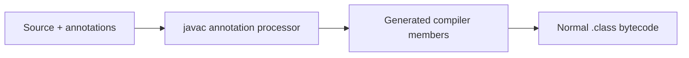

# Lombok Guide

Lombok is a compile-time annotation processor that generates accessors,
constructors, builders, loggers, equality, hash, and string methods. Generated
members exist in bytecode; Lombok does not use runtime proxies and should not be
a runtime dependency.

## Gradle

```groovy
dependencies {
    compileOnly 'org.projectlombok:lombok'
    annotationProcessor 'org.projectlombok:lombok'
    testCompileOnly 'org.projectlombok:lombok'
    testAnnotationProcessor 'org.projectlombok:lombok'
}
```

Shopverse follows this pattern. IDE annotation processing helps navigation, but
Gradle is authoritative.



`delombok` produces equivalent Java source for debugging, tools, or migration.

## Important Annotations

| Annotation | Generates | Main caution |
|---|---|---|
| `@Getter`/`@Setter` | Accessors | Setters can violate invariants/expose mutation |
| `@NoArgsConstructor` | Empty constructor | Forced defaults can violate non-null state |
| `@RequiredArgsConstructor` | Constructor for final/`@NonNull` fields | Good for Spring constructor injection |
| `@AllArgsConstructor` | All-field constructor | Unclear order and unwanted ID/audit arguments |
| `@Data` | Accessors, constructor, equality, hash, string | Avoid on JPA entities/sensitive graphs |
| `@Value` | Immutable class shape | Contained collections can still be mutable |
| `@Builder` | Fluent builder | Defaults/required fields/constructors need care |
| `@SuperBuilder` | Inheritance-aware builder | Experimental; entire hierarchy participates |
| `@With` | Shallow copy with changed field | Not a deep copy |
| `@EqualsAndHashCode` | Equality/hash | Mutable fields, inheritance, entity identity |
| `@ToString` | String method | Secrets, cycles, lazy relations |
| `@NonNull` | Generated entry null check | Not Bean Validation or DB constraint |
| `@Slf4j` | Static SLF4J `log` field | Never log secrets/PII |
| `@SneakyThrows` | Hidden checked exception declaration | Conceals API failure contract |
| `@Cleanup` | Close in generated finally | Prefer try-with-resources |
| `@Synchronized` | Private JVM lock | Not a distributed lock |
| `@UtilityClass` | Static utility shape | Can conceal missing object design |

## Constructors And Spring

```java
@Service
@RequiredArgsConstructor
class CheckoutService {
    private final OrderRepository orderRepository;
    private final PaymentClient paymentClient;
}
```

Spring uses the single constructor; `@Autowired` is unnecessary. Any explicit
constructor can prevent Lombok from generating an expected one, so do not stack
constructor annotations blindly.

## `@Data`, `@Value`, And Records

`@Data` includes setters for non-final fields plus generated equality/string.
`@Value` makes fields private/final and the class final by default, but does not
deep-copy mutable values. For new immutable DTOs, prefer Java records when their
language-level semantics fit.

```java
@Value
@Builder(toBuilder = true)
class CreateOrderCommand {
    String customerId;

    @Singular
    List<OrderLine> lines;

    @Builder.Default
    Instant requestedAt = Instant.now();
}
```

Builder rules:

- A field initializer is not automatically a builder default; use
  `@Builder.Default` intentionally.
- `@Singular` creates singular/add-all/clear collection methods.
- Builders can omit required fields; validate in constructor/factory.
- Put `@Builder` on a chosen constructor when construction policy matters.
- `toBuilder=true` and `@With` make shallow copies.
- Prefer composition before `@SuperBuilder` inheritance.

## Equality And JPA Entities

Generated equality over mutable fields breaks hash collections when values
change. In inheritance, decide `callSuper` explicitly.

Avoid `@Data` on JPA entities because generated methods can trigger lazy loads,
recurse through bidirectional relations, include mutable fields, change after ID
assignment, or expose large/sensitive graphs.

```java
@Entity
@Getter
@NoArgsConstructor(access = AccessLevel.PROTECTED)
public class Product {
    @Id @GeneratedValue
    private Long id;

    @Column(nullable = false)
    private String sku;

    protected Product(String sku) {
        this.sku = Objects.requireNonNull(sku);
    }
}
```

Implement entity equality explicitly using a stable natural key or carefully
designed identifier policy.

## Strings, Logging, And Nulls

```java
@ToString
final class LoginRequest {
    private String username;
    @ToString.Exclude private char[] password;
}
```

Exclusion helps, but safest is not logging whole security objects. Exclude lazy
relationships and back-references.

`@Slf4j` generates a `private static final Logger log`. Use parameterized logging
and safe identifiers. `@NonNull` generates a runtime null check; it does not
replace `@NotBlank`, API validation, database constraints, or static analysis.

## Use Sparingly

- `@SneakyThrows` hides checked failures from callers.
- `@Cleanup` is less clear than try-with-resources.
- `@Synchronized` coordinates one JVM only.
- `@UtilityClass` makes everything static and can hurt design/testability.
- Experimental annotations need version and configuration governance.

Example `lombok.config`:

```properties
config.stopBubbling = true
lombok.addLombokGeneratedAnnotation = true
lombok.sneakyThrows.flagUsage = warning
lombok.experimental.flagUsage = warning
```

Confirm keys with the pinned Lombok version.

## Shopverse Recommendations

- Keep `compileOnly` plus `annotationProcessor` scopes.
- Prefer `@RequiredArgsConstructor` for Spring services.
- Prefer records for straightforward immutable DTOs.
- Avoid `@Data` and automatic relationship methods on entities.
- Use `@Slf4j` under structured/sensitive logging rules.
- Write explicit factories/constructors for domain invariants.
- Compile in CI and use `delombok` when generated behavior is unclear.

## Related Guides

- [Java Records](./features-8-to-26/JAVA-RECORDS.md)
- [JPA Entity Mapping](../spring/jpa/JPA-BASICS-ENTITY-MAPPING.md)
- [Structured Logging](../observability/STRUCTURED-LOGGING.md)

## Official References

- [Lombok Features](https://projectlombok.org/features/)
- [Lombok Data](https://projectlombok.org/features/Data)
- [Lombok Builder](https://projectlombok.org/features/Builder)
- [Lombok Value](https://projectlombok.org/features/Value)
