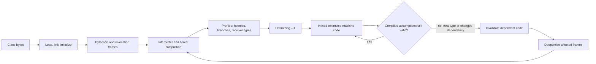

# JVM Execution Internals

<DocLabels items={[
  {label: 'Advanced', tone: 'advanced'},
  {label: 'JVM diagnostics', tone: 'production'},
  {label: 'JFR + javap', tone: 'shopverse'},
]} />

<DocCallout type="production" title="Optimization is workload evidence">
JIT compilation, inlining, and deoptimization are adaptive runtime decisions. Confirm
them with JFR and compiler evidence before changing code or JVM flags.
</DocCallout>

## Class Lifecycle

Loading creates a `Class` representation from bytes. Linking verifies bytecode,
prepares static storage/defaults, and resolves symbolic references eagerly or
lazily. Initialization executes static initializers and assigned static values
once, under JVM synchronization, immediately before defined active uses.

The bootstrap loader loads core runtime classes, the platform loader loads
platform modules, and application/custom loaders load application code. Class
identity is `(binary name, defining loader)`, so equal names from different
loaders are different types. Parent delegation protects core classes; plugin
systems sometimes use child-first loading and must control linkage/leaks.

Initialization failures are sticky for that class loader. Deadlocks can arise
when static initialization across classes/threads acquires conflicting locks.

## Bytecode And Frames

Each invocation has a frame containing local-variable slots, operand stack,
constant-pool reference, and return/exception state. Bytecode pushes operands,
invokes operations, and stores results. `invokevirtual`, `invokeinterface`,
`invokestatic`, `invokespecial`, and `invokedynamic` express different dispatch.

Useful inspection:

```bash
javap -c -v -p com.example.OrderService
```

Look for boxing, synthetic bridge methods, exception tables, lambda call sites,
and dispatch—not for a one-to-one mapping from source lines to instructions.

## JIT Compilation

The JVM interprets/compiles based on profiles. Tiered compilation gathers data
and promotes hot methods. Optimizations include inlining, constant propagation,
loop optimization, escape analysis, scalar replacement, lock elimination, and
speculative devirtualization.

Optimized code relies on assumptions. When a new class or profile invalidates an
assumption, the JVM deoptimizes and resumes in a less optimized form. Warmup,
code-cache pressure, compilation threads, and profile pollution affect results.

Escape analysis may keep object state in registers/stack-like scalar form, but
Java does not promise stack allocation. Observe allocation rather than assuming it.

## Execution And Optimization Loop

The important loop is not simply "interpret, then compile." Runtime profiles let
the JIT optimize for the types and branches it has observed, while dependency
tracking lets the JVM retreat safely when those assumptions stop being true.



## Memory Areas

- heap stores ordinary objects/arrays;
- per-thread stacks store frames;
- metaspace stores class metadata in native memory;
- code cache stores compiled code;
- direct buffers and JNI allocate native memory;
- TLABs let threads allocate cheaply from local heap regions.

Container sizing must include heap plus metaspace, code cache, thread stacks,
direct buffers, GC structures, agents, libraries, and sidecars.

## Safepoints And Diagnostics

Some VM operations need threads at safepoints: parts of GC, deoptimization,
biased/monitor operations in relevant JDKs, class redefinition, and diagnostics.
Time-to-safepoint and operation duration are different. JFR exposes compilation,
allocation, class loading, locks, GC, and safepoint-related evidence.

## Shopverse Diagnostic: Checkout Slows After A Pricing Deployment

Suppose `PricingService.price()` is hot and its `PricePolicy` call site has seen
only `StandardPricePolicy`. The JIT can inline that monomorphic call behind a
type guard. A deployment introduces several promotion policy implementations;
checkout p99 rises although database time and request volume stay flat.

Capture a representative steady-state window rather than reasoning from source
shape alone:

```bash
jcmd <pid> JFR.start name=checkout-jit settings=profile duration=120s filename=checkout-jit.jfr
javap -c -v -p io.shopverse.pricing.PricingService
```

Correlate JFR `Compilation`, `Deoptimization`, `Execution Sample`, class-loading,
and safepoint events with the checkout latency window. Repeated deoptimizations
in `PricingService` plus multiple observed `PricePolicy` receiver types support
the profile-instability hypothesis. Long time-to-safepoint with a short VM
operation points elsewhere, and allocation samples implicate a different cost.
Only after identifying the dominant evidence should the team reshape the hot
dispatch path, reduce deployment-time class churn, or leave the design intact;
repeat the same capture to verify p99, CPU, and deoptimization rate.

## Lab

Compile a class with interface dispatch, lambda, generic override, and synchronized
block. Inspect it with `javap`; run with JFR; compare cold and warm execution;
change implementation types to trigger different profiles. Explain observations
without treating microseconds from one run as a benchmark.

## Recommended Next Page

[Java Memory Model And Safe Publication](./JAVA-MEMORY-MODEL.md)

## Tricky Interview Questions

<ExpandableAnswer title="Why can virtual dispatch be fast?">

The JIT can inline an observed target behind a guard. The runtime preserves polymorphic
correctness and deoptimizes if the assumption stops being valid.

</ExpandableAnswer>

<ExpandableAnswer title="Why does deoptimization occur?">

A compiled optimization depended on an assumption that became invalid, such as a new
loaded subtype changing a formerly monomorphic call site.

</ExpandableAnswer>

<ExpandableAnswer title="Does source allocation prove heap allocation?">

No. Escape analysis may scalar-replace an object or eliminate its allocation. Confirm
allocation with profiling evidence rather than counting `new` expressions.

</ExpandableAnswer>

## Official References

- [JVMS Chapter 5 — Loading, Linking, And Initializing](https://docs.oracle.com/javase/specs/jvms/se25/html/jvms-5.html)
- [JVMS §2.6 — Frames](https://docs.oracle.com/javase/specs/jvms/se25/html/jvms-2.html#jvms-2.6)
- [`javap` tool specification](https://docs.oracle.com/en/java/javase/25/docs/specs/man/javap.html)
- [Java Flight Recorder API](https://docs.oracle.com/en/java/javase/25/jfapi/)
