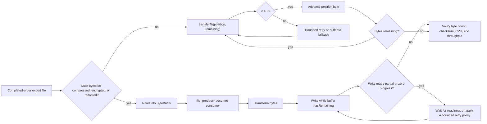

# NIO, Zero-Copy, And JMH Benchmarking

<DocLabels items={[
  {label: 'Advanced', tone: 'advanced'},
  {label: 'Executable lab', tone: 'intermediate'},
  {label: 'Performance evidence', tone: 'production'},
]} />

<DocCallout type="mistake" title="A microbenchmark is not a production result">
JMH controls JVM measurement hazards, but it cannot reproduce the filesystem, network,
container throttling, payload distribution, or concurrency of production by itself.
</DocCallout>

Channels move bytes; buffers hold state through capacity, position, limit, and
mark. After writing to a buffer, `flip()` prepares it for reading; `compact()`
preserves unread bytes for another fill. Reads/writes can be partial—loop according
to protocol and readiness without busy-spinning.

Heap buffers are GC-managed arrays. Direct buffers can reduce copies in native I/O
but cost more to allocate, consume native memory, and have cleaner lifecycle
implications. Pool only with strict ownership, limits, leak detection, and wiping
where sensitive data is involved.

Selectors multiplex many nonblocking channels on fewer threads but require state
machines, interest-operation management, fair work limits, and careful cancellation.
Blocking I/O with virtual threads is often simpler when connection count and
downstream capacity are bounded. Asynchronous channels use platform-specific
facilities/executors and do not eliminate backpressure.

File-channel transfer operations may enable kernel-assisted zero-copy, reducing
user-space copies and CPU. TLS, transformation, platform/filesystem behavior, and
small transfers can prevent or negate the benefit. Measure the actual path.

## Shopverse Order-Export I/O Path



`transferTo` is a capability to test, not a promise of a specific kernel path.
Both branches still need progress accounting and an end-to-end correctness check.

### Executable transfer diagnostic

This standalone diagnostic creates a deterministic Shopverse order export when no
input file exists, copies it with `transferTo`, handles zero progress with a direct-
buffer fallback, and verifies the result. Save it as
`ShopverseOrderExportCopy.java`.

```java
import java.io.BufferedWriter;
import java.io.IOException;
import java.io.InputStream;
import java.nio.ByteBuffer;
import java.nio.channels.FileChannel;
import java.nio.charset.StandardCharsets;
import java.nio.file.Files;
import java.nio.file.Path;
import java.security.MessageDigest;

import static java.nio.file.StandardOpenOption.CREATE;
import static java.nio.file.StandardOpenOption.READ;
import static java.nio.file.StandardOpenOption.TRUNCATE_EXISTING;
import static java.nio.file.StandardOpenOption.WRITE;

public final class ShopverseOrderExportCopy {
    private static final int BUFFER_BYTES = 64 * 1024;

    public static void main(String[] args) throws Exception {
        Path source = Path.of(args.length > 0 ? args[0] : "orders.ndjson");
        Path target = Path.of(args.length > 1 ? args[1] : "orders-copy.ndjson");
        createFixtureIfMissing(source);

        long started = System.nanoTime();
        long copied = transferFully(source, target);
        double seconds = (System.nanoTime() - started) / 1_000_000_000.0;
        boolean verified = MessageDigest.isEqual(sha256(source), sha256(target));

        System.out.printf(
                "bytes=%d elapsed=%.3fs throughput=%.1f MiB/s sha256=%s%n",
                copied, seconds, copied / 1_048_576.0 / seconds,
                verified ? "match" : "MISMATCH");
        if (!verified) throw new IllegalStateException("copy verification failed");
    }

    private static long transferFully(Path source, Path target) throws IOException {
        try (FileChannel in = FileChannel.open(source, READ);
             FileChannel out = FileChannel.open(target, CREATE, WRITE, TRUNCATE_EXISTING)) {
            long position = 0;
            int zeroProgress = 0;
            while (position < in.size()) {
                long transferred = in.transferTo(position, in.size() - position, out);
                if (transferred > 0) {
                    position += transferred;
                    zeroProgress = 0;
                } else if (++zeroProgress >= 3) {
                    long copied = bufferedFallback(in, out, position);
                    if (copied == 0) throw new IOException("copy made no progress");
                    position += copied;
                    zeroProgress = 0;
                } else {
                    Thread.onSpinWait();
                }
            }
            out.force(false);
            return position;
        }
    }

    private static long bufferedFallback(FileChannel in, FileChannel out, long position)
            throws IOException {
        ByteBuffer buffer = ByteBuffer.allocateDirect(BUFFER_BYTES);
        int read = in.read(buffer, position);
        if (read < 0) return 0;
        buffer.flip();
        while (buffer.hasRemaining()) out.write(buffer);
        return read;
    }

    private static byte[] sha256(Path path) throws Exception {
        MessageDigest digest = MessageDigest.getInstance("SHA-256");
        try (InputStream input = Files.newInputStream(path)) {
            byte[] block = new byte[BUFFER_BYTES];
            for (int read; (read = input.read(block)) >= 0; ) {
                if (read > 0) digest.update(block, 0, read);
            }
        }
        return digest.digest();
    }

    private static void createFixtureIfMissing(Path path) throws IOException {
        if (Files.exists(path)) return;
        try (BufferedWriter writer = Files.newBufferedWriter(
                path, StandardCharsets.UTF_8, CREATE, WRITE)) {
            for (int id = 1; id <= 200_000; id++) {
                writer.write("{\"orderId\":\"ord-" + id
                        + "\",\"status\":\"COMPLETED\",\"totalCents\":"
                        + (1_000 + id % 50_000) + "}");
                writer.newLine();
            }
        }
    }
}
```

```bash
javac ShopverseOrderExportCopy.java
java ShopverseOrderExportCopy
java -Xlog:os+container=info ShopverseOrderExportCopy orders.ndjson second-copy.ndjson
```

Run enough independent iterations to observe variance, record JDK/OS/filesystem,
and compare CPU as well as elapsed time. This is an integration diagnostic; move
a small, isolated copy primitive into JMH only when warmup, forks and profilers are
required, and validate the final decision under production-shaped load.

## JMH Correctness

JMH manages warmup, measurement, forks, generated harnesses, and result collection.
It cannot choose a representative workload for you.

- use multiple forks to isolate JVM state;
- warm until compilation/profile behavior is representative;
- consume results or return them to prevent dead-code elimination;
- use `@State` scope matching sharing semantics;
- separate setup from measured work;
- use parameters for realistic sizes/distributions;
- inspect allocation and generated code when conclusions depend on them;
- never infer production latency from a nanosecond microbenchmark alone.

Constant folding, loop optimization, branch predictability, cache warmth, turbo/
power management, GC, OS noise, and accidental contention distort results. Report
JDK, flags, hardware, OS, forks, warmup, measurement, distribution, and uncertainty.

## Labs

1. Implement framed channel reads that handle partial headers and payloads.
2. Compare heap/direct buffers for production-shaped transfer sizes.
3. Compare file copy versus `transferTo` while recording CPU and throughput.
4. Write a deliberately broken JMH benchmark, identify elimination/folding, fix it,
   and compare with an application-level load test.

## Official References

- [Java Language Specification](https://docs.oracle.com/javase/specs/jls/se25/html/)
- [Java Virtual Machine Specification](https://docs.oracle.com/javase/specs/jvms/se25/html/)
- [Java SE 25 API](https://docs.oracle.com/en/java/javase/25/docs/api/)
- [FileChannel API](https://docs.oracle.com/en/java/javase/25/docs/api/java.base/java/nio/channels/FileChannel.html)
- [OpenJDK JMH](https://openjdk.org/projects/code-tools/jmh/)

## Tricky Interview Questions

<ExpandableAnswer title="Why can a benchmark report impossible speed?">

The compiler may remove unused work, fold constants, or optimize a shape unlike the
intended operation. Consume results and inspect generated code or profilers when a score
is suspicious.

</ExpandableAnswer>

<ExpandableAnswer title="Does direct memory count against the Java heap?">

No, but it counts against process and container memory. Native buffers can therefore
produce an OOM kill while heap occupancy looks healthy.

</ExpandableAnswer>

<ExpandableAnswer title="Why must non-blocking writes loop?">

A write may make partial or zero progress. Completion is defined by the buffer having no
remaining bytes, with readiness/backoff logic preventing a busy spin.

</ExpandableAnswer>

## Recommended Next Page

Continue with [JVM Profiling, Garbage Collection, And Native Images](../JVM-PROFILING-GC-NATIVE.md).
