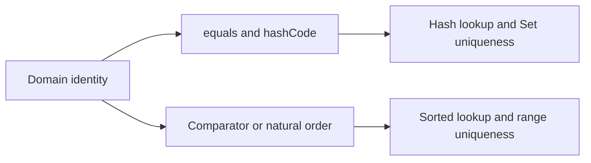
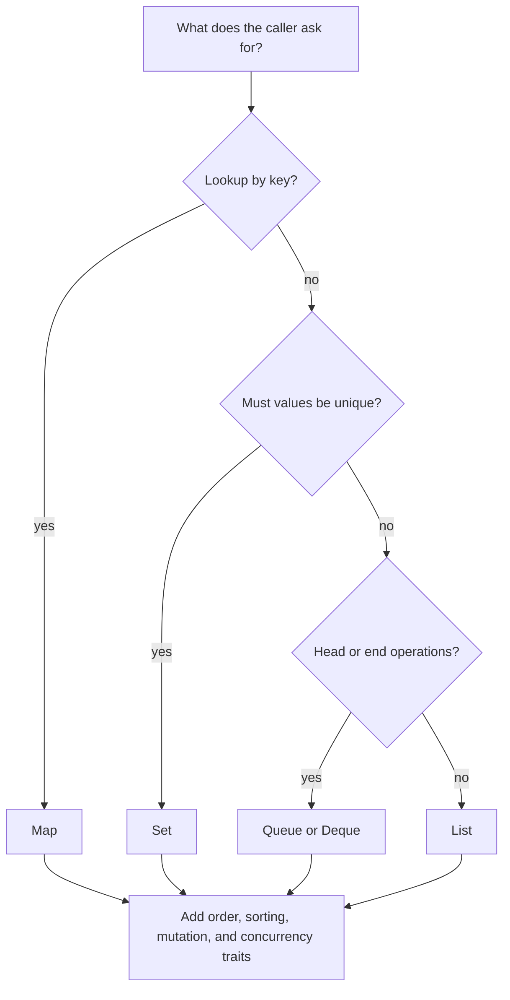

# Collection Contracts And Selection

A collection choice is an API contract. Decide what callers may observe before
considering capacity or internal layout.

## Ask Six Questions

| Question | Why it changes the type |
|---|---|
| Are duplicates meaningful? | a `List` retains them; a `Set` collapses equal values |
| Is access positional or key-based? | positional access suggests `List`; keyed lookup suggests `Map` |
| Which order is promised? | insertion, sorted, priority, and unspecified order require different contracts |
| Who may mutate it? | private working state, a backed view, and a published snapshot have different ownership |
| Can multiple threads mutate it? | synchronization and iterator semantics become part of correctness |
| Can the collection grow without a bound? | queues and caches need an explicit memory/backpressure decision |

## What Each Interface Promises

| Interface | Observable contract | It does not promise |
|---|---|---|
| `List<E>` | sequence, positional access, duplicates | uniqueness or cheap middle changes |
| `Set<E>` | no two elements are equal under its equality rule | index access or encounter order |
| `Map<K,V>` | at most one value per key | a `Collection`, key order, or atomic multi-key work |
| `Queue<E>` | access through a head selected by queue policy | always FIFO or sorted iteration |
| `Deque<E>` | insertion/removal at both ends | indexed access |

Prefer interface types at boundaries:

```java
private final List<OrderItem> items = new ArrayList<>();

public List<OrderItem> items() {
    return List.copyOf(items);
}
```

The field remains free to change implementation. The return value also states
that callers receive a snapshot they cannot structurally mutate.

## Equality And Ordering Are Domain Decisions

Hash sets and hash-map keys use `equals` and `hashCode`. Sorted sets and maps
use comparator equality: when `compare(a, b) == 0`, the structure treats the
values as the same key even if `a.equals(b)` is false. Define domain identity
before storing custom objects.



Use immutable IDs or records as keys when possible. Continue to
[Hash Collections Deep Dive](../JAVA-HASH-COLLECTIONS-DEEP-DIVE.md) and
[Comparable And Comparator Deep Dive](../JAVA-COMPARABLE-COMPARATOR-DEEP-DIVE.md)
for the mechanics and edge cases.

## Encounter Order Is A Promise

- `HashSet` and `HashMap` do not promise an encounter order.
- `LinkedHashSet` and `LinkedHashMap` preserve encounter order.
- `TreeSet` and `TreeMap` expose comparator or natural sort order.
- `PriorityQueue` exposes the least/highest-priority head, but its iterator is
  not a sorted traversal.

Do not select an ordered implementation merely to make an unstable test pass.
Either make order part of the API contract or assert without order.

## Queue Method Contracts

Queue operations come in exception-throwing and special-value pairs:

| Operation | Throws on failure | Returns a special value |
|---|---|---|
| insert | `add` | `offer` returns `false` |
| remove head | `remove` | `poll` returns `null` |
| inspect head | `element` | `peek` returns `null` |

For in-memory single-threaded FIFO/LIFO work, start with `ArrayDeque`. For
producer-consumer coordination, select a deliberately bounded `BlockingQueue`
and define timeout, rejection, shutdown, and retry behavior. Thread-safe but
unbounded is not operationally safe.

## Selection Flow



## Shopverse Contract Examples

- A checkout request carries a `List` of line items because it is a sequence;
  duplicate-product validation is a separate business rule.
- Inventory image MIME types and controller sort allowlists use `Set.of(...)`
  because the operation is membership, not traversal by position.
- Cart merge needs product-ID lookup and deterministic response order, so a
  `LinkedHashMap<Long, CartItem>` is a useful temporary index.
- Cancellable order states are a subset of `OrderStatus`, making `EnumSet` a
  precise contract for the fixed enum universe.

## Boundary Review

Before accepting or returning a collection, document:

- whether null elements, keys, or values are permitted;
- whether order and duplicates are meaningful;
- whether the value is live, copied, or immutable;
- whether element objects can still mutate;
- whether concurrent access is supported;
- the expected maximum cardinality.

Continue with [List, Set, And Map Choices](./LIST-SET-MAP-CHOICES.md), or return
to the [Collections umbrella](../JAVA-COLLECTIONS.md).

