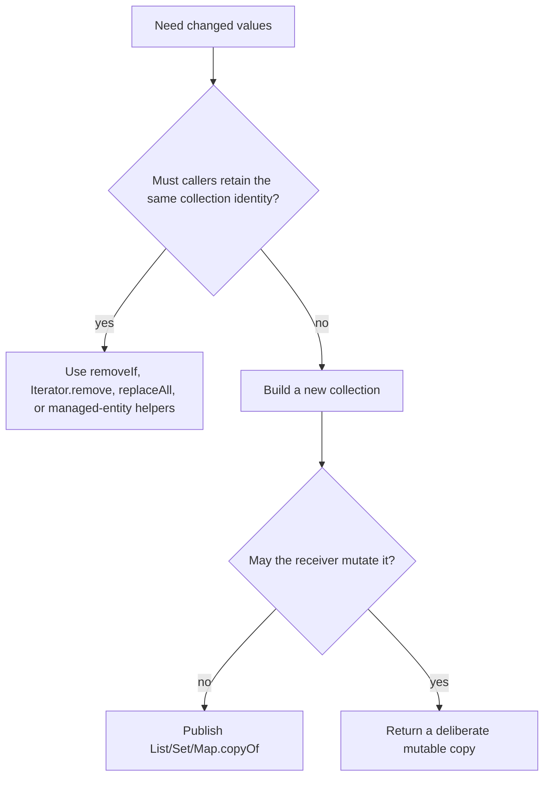

# Safe Collection Mutation

Safe mutation starts with ownership. A private working collection, a JPA-managed
association, a read-only view, an immutable snapshot, and shared concurrent
state require different operations.

## Pick The Supported Operation

| Intent | Preferred operation |
|---|---|
| remove matching values | `removeIf(predicate)` |
| remove during traversal with custom logic | `Iterator.remove()` |
| replace each list value | `List.replaceAll(operator)` |
| accumulate a value by key | `Map.merge` |
| create a value only when missing | `Map.computeIfAbsent` |
| produce a new result | stream/map/filter into a new collection |
| replace published state | construct fully, then publish an immutable snapshot |

Do not structurally modify an ordinary collection through a second path while
its iterator is traversing it:

```java
// Unsafe: the enhanced for-loop owns an iterator.
for (CartItem item : items) {
    if (item.getProductId().equals(productId)) {
        items.remove(item);
    }
}
```

Use the collection's bulk operation when it expresses the intent:

```java
items.removeIf(item -> item.getProductId().equals(productId));
```

Or use the iterator for stateful traversal:

```java
for (Iterator<CartItem> it = items.iterator(); it.hasNext(); ) {
    if (shouldRemove(it.next())) {
        it.remove();
    }
}
```

`ConcurrentModificationException` is best-effort bug detection, not a thread
safety mechanism. Absence of the exception does not make concurrent mutation
correct.

## Transform In Place Or Build A Result?



`Stream.toList()` returns an unmodifiable list. When later mutation is part of
the contract, request a mutable result explicitly:

```java
List<Order> editable = orders.stream()
        .filter(Order::isActive)
        .collect(Collectors.toCollection(ArrayList::new));
```

## Snapshot, View, And Element Mutation

```java
List<Role> snapshot = List.copyOf(roles);
List<Role> view = Collections.unmodifiableList(roles);
```

- `snapshot` does not reflect later structural changes to `roles`.
- `view` rejects mutation through that reference but reflects changes made
  through the backing list.
- neither operation deep-copies `Role`; a mutable element can still change.

At service and DTO boundaries, immutable snapshots are usually easier to reason
about than backed views. Make a defensive copy of mutable elements when the
boundary also requires element isolation.

## Map Updates Express Intent

Avoid separate lookup and update when one map operation describes the change:

```java
quantitiesByProduct.merge(productId, requestedQuantity, Integer::sum);

eventsByOrder.computeIfAbsent(orderNumber, ignored -> new ArrayList<>())
        .add(event);
```

For an ordinary map these methods make code clearer. For `ConcurrentHashMap`,
they also provide atomicity for that single-key map operation. Keep the mapping
function short and free of recursive updates; an invariant spanning multiple
keys, a database row, or another service still needs coordination at that wider
boundary.

## Never Mutate Hash Identity While Stored

Changing a field used by `equals` or `hashCode` can strand an object in the
wrong bucket:

```java
Set<CartKey> keys = new HashSet<>();
keys.add(key);
key.setCustomerId(otherCustomer); // lookup/removal may now fail
```

Prefer an immutable key:

```java
record CartKey(String customerId, Long productId) {}
```

JPA entities with generated identifiers need an explicit equality strategy;
do not place a transient entity in a hash collection and then let persistence
silently change the identity used by that collection.

## Shopverse Managed Collections

Shopverse cart replacement mutates the collection owned by the managed `Cart`
inside a transaction:

```java
cart.getItems().clear();
request.items().forEach(item -> cart.getItems().add(toEntity(cart, item)));
```

Preserving the managed collection instance lets the ORM observe association
changes according to its mapping. Entity helper methods should maintain both
sides of bidirectional relationships when the model has them; do not replace a
persistent wrapper casually with a new list.

## Concurrent Iteration Semantics

| Collection family | Typical iterator behavior |
|---|---|
| ordinary `ArrayList` / `HashMap` | fail-fast on some structural interference |
| `CopyOnWriteArrayList` | immutable snapshot from iterator creation |
| `ConcurrentHashMap` | weakly consistent; may reflect some concurrent updates |

Weakly consistent does not mean transactionally consistent. If a report must
represent one point in time, create a snapshot under the appropriate ownership
or consistency boundary.

## Review Checklist

- Identify the collection owner and every alias before mutating.
- Use the iterator or bulk operation that owns structural changes.
- State whether a returned value is live, copied, immutable, or mutable.
- Keep hash-key identity stable.
- Use atomic concurrent-map methods only for single-key atomicity.
- Preserve ORM-managed collection identity when required by the mapping.
- Test order, duplicates, null policy, and mutation behavior as API contracts.

For collision, iterator, and concurrent-hash mechanics, continue to
[Hash Collections Deep Dive](../JAVA-HASH-COLLECTIONS-DEEP-DIVE.md) and
[ConcurrentHashMap OpenJDK Internals](../JAVA-CONCURRENT-HASHMAP-OPENJDK.md).
Return to the [Collections umbrella](../JAVA-COLLECTIONS.md).
