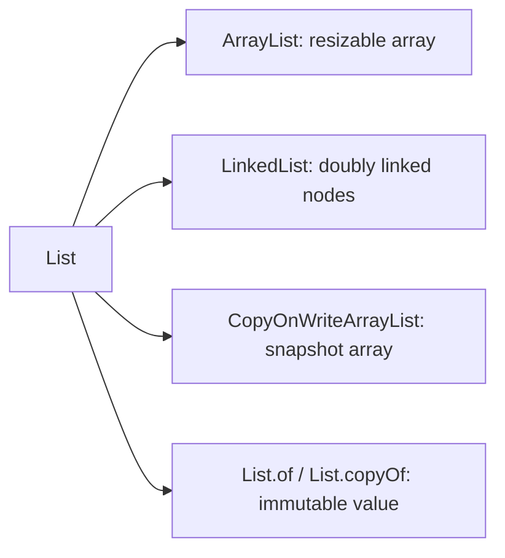

# Java List Collections Overview

<DocLabels items={[{label: 'Collection family', tone: 'foundation'}, {label: 'Ordered + indexed', tone: 'intermediate'}]} />

A `List` preserves encounter order, allows duplicates, and addresses elements
by zero-based position. The contract does not say how elements are stored.

## Implementation Map

| Implementation | Storage | Best use | Avoid when |
|---|---|---|---|
| `ArrayList` | contiguous `Object[]` | general-purpose append, traversal, indexed access | frequent removal from the front |
| `LinkedList` | doubly linked node per element | rare cases with an existing iterator at the mutation point | random access, cache-sensitive traversal, stack/queue work |
| `CopyOnWriteArrayList` | volatile array replaced on every write | tiny, read-mostly listener/config lists | writes are frequent or the list is large |
| `List.of` / `List.copyOf` | implementation-specific immutable storage | safe boundary values and constants | callers require mutation or null elements |

## Important `List` Methods

| Operation | Meaning |
|---|---|
| `add(e)` / `add(i, e)` | append or insert at an index |
| `get(i)` / `set(i, e)` | read or replace by position |
| `remove(i)` / `remove(value)` | remove by index or equality |
| `indexOf`, `lastIndexOf` | linear equality search |
| `subList(from, to)` | backed range view, not normally a copy |
| `listIterator()` | bidirectional traversal and supported mutation |
| `replaceAll`, `sort` | mutate elements or encounter order |

## Selection Rule

Start with `ArrayList`. Choose another list only for a measured or contractual
reason. Use `ArrayDeque` for stack/queue behavior and `List.copyOf` when the
result should be an immutable snapshot.

## Dedicated Internals

<TopicCards items={[
  {title: 'ArrayList internals', href: '/java/collections/list/ARRAYLIST-INTERNALS', description: 'Backing array, lazy default capacity, 1.5x growth, shifting, iterators, and sizing.', icon: 'layers', tags: ['Default list']},
  {title: 'LinkedList internals', href: '/java/collections/list/LINKEDLIST-INTERNALS', description: 'Node layout, traversal direction, deque operations, allocation, and locality.', icon: 'network', tags: ['Doubly linked']},
  {title: 'CopyOnWriteArrayList internals', href: '/java/collections/list/COPYONWRITEARRAYLIST-INTERNALS', description: 'Snapshot reads, write locking, whole-array copies, and visibility.', icon: 'security', tags: ['Concurrent', 'Read-mostly']},
]} />

## Official Reference

- [`List`](https://docs.oracle.com/en/java/javase/25/docs/api/java.base/java/util/List.html)
