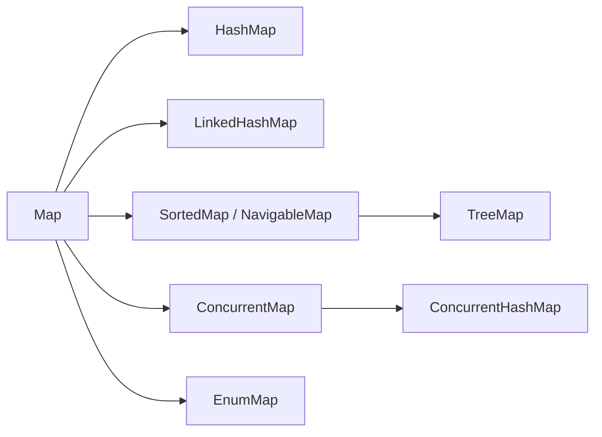

# Java Map Collections Overview

<DocLabels items={[{label: 'Separate hierarchy', tone: 'foundation'}, {label: 'Key-value lookup', tone: 'intermediate'}]} />

A `Map<K,V>` associates one value with each unique key. It is not a subtype of
`Collection`; its `keySet`, `values`, and `entrySet` methods expose collection
views backed by the map.

## Implementation Map

| Implementation | Storage/order | Typical cost | Best use |
|---|---|---|---|
| `HashMap` | bucket array, unspecified order | average O(1) | ordinary key lookup |
| `LinkedHashMap` | hash table + linked encounter order | average O(1) | deterministic iteration or access-order cache basis |
| `TreeMap` | red-black tree, sorted keys | O(log n) | ranges and nearest-key navigation |
| `ConcurrentHashMap` | concurrent hash table | average O(1) | atomic per-key operations across threads |
| `EnumMap` | enum-ordinal indexed array | O(1) | values keyed by one enum universe |
| `Map.copyOf` | immutable implementation | implementation-specific | safe immutable snapshot |

## Important `Map` Methods

Prefer `getOrDefault`, `putIfAbsent`, `computeIfAbsent`, `compute`, and `merge`
over multi-step lookup/update code. On `ConcurrentHashMap`, these methods provide
documented per-key atomicity; they do not make invariants across several keys or
external systems atomic.

## Dedicated Internals

<TopicCards items={[
  {title: 'HashMap', href: '/java/collections/map/HASHMAP-INTERNALS', description: 'Buckets, hashes, load factor, resizing, tree bins, keys, and null handling.', icon: 'brain', tags: ['Default map']},
  {title: 'LinkedHashMap', href: '/java/collections/map/LINKEDHASHMAP-INTERNALS', description: 'Encounter/access order, linked entries, and LRU-style eviction hooks.', icon: 'route', tags: ['Ordered map']},
  {title: 'TreeMap', href: '/java/collections/map/TREEMAP-INTERNALS', description: 'Red-black tree rotations, comparator identity, and navigable range views.', icon: 'network', tags: ['Sorted map']},
  {title: 'EnumMap', href: '/java/collections/map/ENUMMAP-INTERNALS', description: 'Compact ordinal-indexed storage for one enum key universe.', icon: 'gauge', tags: ['Enum keys']},
  {title: 'ConcurrentHashMap', href: '/java/JAVA-CONCURRENT-HASHMAP-OPENJDK', description: 'CAS insertion, bin coordination, cooperative resize, visibility, and atomic methods.', icon: 'security', tags: ['Concurrent map']},
]} />

Specialized maps such as `IdentityHashMap`, `WeakHashMap`, and
`ConcurrentSkipListMap` are routed through
[Specialized And Concurrent Collections](../../JAVA-SPECIALIZED-COLLECTIONS-INTERNALS.md)
because their identity, reachability, or concurrency contracts matter more than
general-purpose lookup.

## Official Reference

- [`Map`](https://docs.oracle.com/en/java/javase/25/docs/api/java.base/java/util/Map.html)
