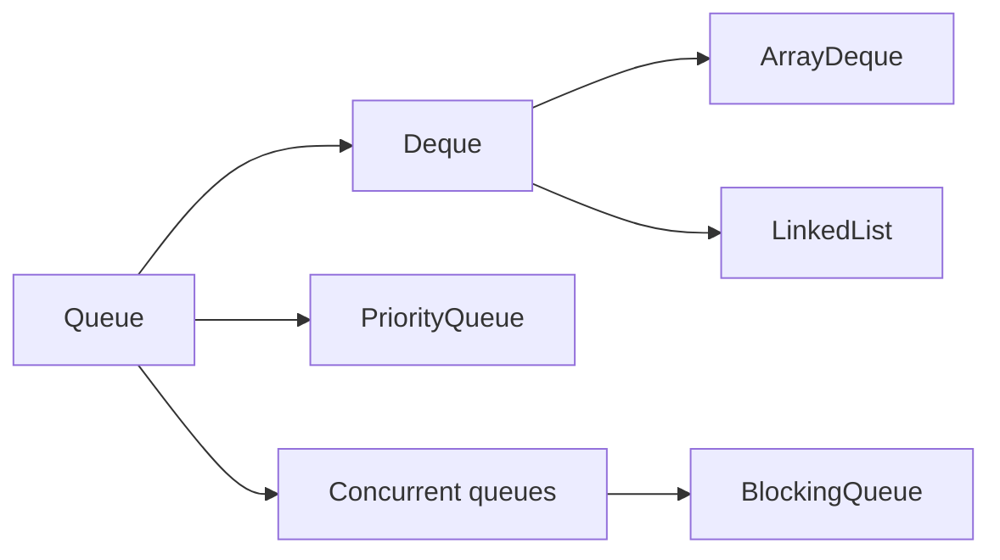

# Java Queue and Deque Collections Overview

<DocLabels items={[{label: 'Collection family', tone: 'foundation'}, {label: 'Work processing', tone: 'production'}]} />

`Queue` exposes head-based processing. `Deque` extends it with operations at
both ends, supporting FIFO queues and LIFO stacks without `Stack`.

## Method Pairs

| Intent | Exception form | Special-value form |
|---|---|---|
| insert | `add` | `offer` |
| remove head | `remove` | `poll` |
| inspect head | `element` | `peek` |
| blocking insert | `put` | timed `offer` |
| blocking remove | `take` | timed `poll` |

Prefer `offer`/`poll` for capacity-aware processing. For a deque, use explicit
`addFirst`, `offerLast`, `pollFirst`, and `peekLast` names where direction matters.

## Implementation Map

| Need | Start with | Critical constraint |
|---|---|---|
| local FIFO/LIFO/deque | `ArrayDeque` | not thread-safe; rejects null |
| smallest element by priority | `PriorityQueue` | iteration is not priority order |
| bounded producer-consumer | `ArrayBlockingQueue` | fixed capacity; optional fairness |
| linked blocking queue | `LinkedBlockingQueue` | set a capacity or it is effectively unbounded |
| lock-free-style FIFO | `ConcurrentLinkedQueue` | unbounded; `size()` traverses |
| zero-capacity handoff | `SynchronousQueue` | producer and consumer must rendezvous |

Thread safety is not backpressure. Production queues need explicit capacity,
timeout, rejection, retry, shutdown, and—when required—durability policies.

## Dedicated Internals

<TopicCards items={[
  {title: 'ArrayDeque', href: '/java/collections/queue/ARRAYDEQUE-INTERNALS', description: 'Circular array, head/tail indices, growth, wrap-around, stack and queue methods.', icon: 'route', tags: ['Default deque']},
  {title: 'PriorityQueue', href: '/java/collections/queue/PRIORITYQUEUE-INTERNALS', description: 'Binary heap storage, sift-up/down, capacity growth, and comparator behavior.', icon: 'gauge', tags: ['Heap priority']},
  {title: 'Specialized and concurrent queues', href: '/java/JAVA-SPECIALIZED-COLLECTIONS-INTERNALS', description: 'Blocking, concurrent, delayed, handoff, and priority queue selection.', icon: 'network', tags: ['Concurrency', 'Backpressure']},
]} />

## Official References

- [`Queue`](https://docs.oracle.com/en/java/javase/25/docs/api/java.base/java/util/Queue.html)
- [`Deque`](https://docs.oracle.com/en/java/javase/25/docs/api/java.base/java/util/Deque.html)
